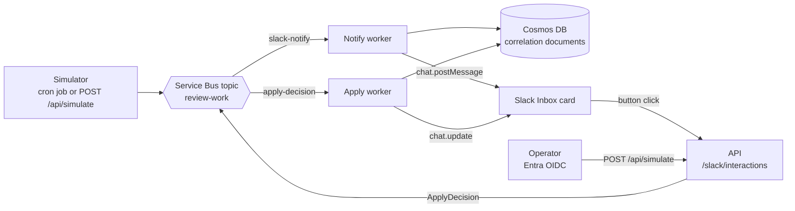
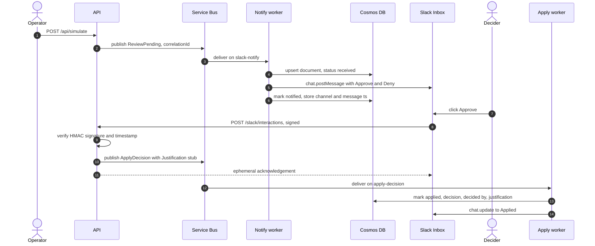
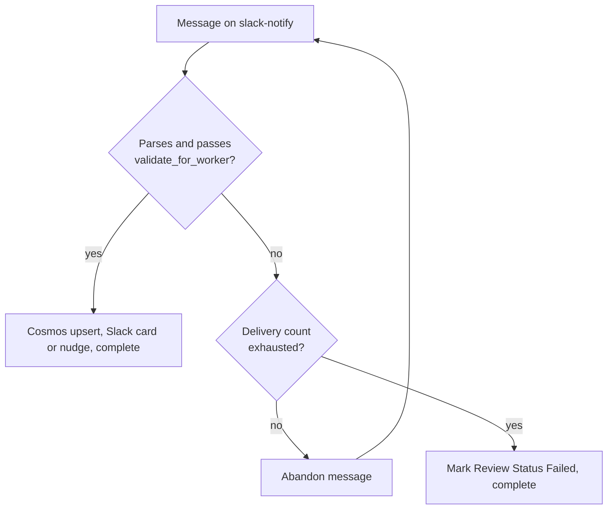
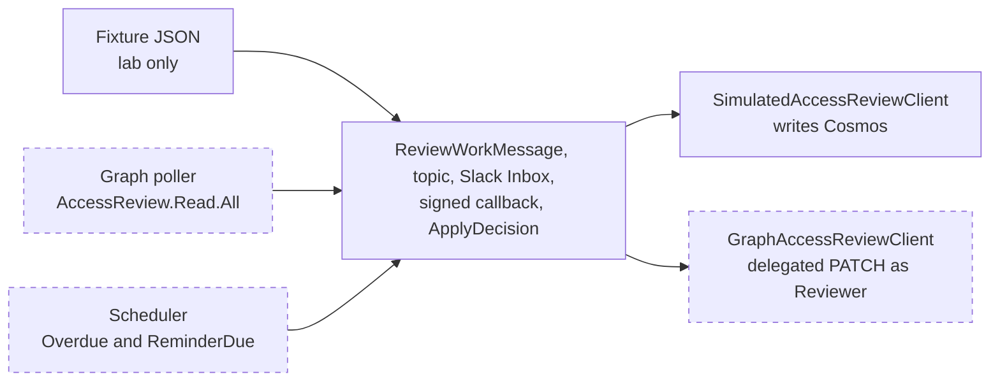

# Stop mailing MyAccess into the void: access reviews that settle in Slack

An Access Review is a one-bit question wrapped in a lot of ceremony: does this Principal still need this Resource, yes or no? Microsoft Entra will schedule the review, identify the Reviewer, and send the notification email. But that email often lands in an inbox already flooded with messages. The reminder gets skimmed, the work week moves along, and the review window expires without anyone logging into MyAccess. The compliance control exists on paper, but the actual decision never gets made.

The idea behind this project is to bring the question directly to where people already spend their working day. A Review Event becomes a message on a queue, a worker picks it up, and a concise Slack card appears with the Principal, the Resource, the due date, and a pair of Approve and Deny buttons. A single click returns through a signed callback, recorded cleanly against a Correlation ID. MyAccess remains the underlying Control Plane, while Slack serves as the active Inbox where review work gets settled.

Working through this in a lab brings an honest constraint. The test tenant behind this project has no standing population of real users, no recurring compliance audits, and no actual managers waiting to review direct reports. Every Review Event shown here was triggered through fixtures, and every applied decision writes to Cosmos DB rather than modifying live privileges in Microsoft Graph. Building the system this way keeps it safe to explore, straightforward to reset, and practical to demonstrate.


## Why the lab runs on fixtures

Creating an Access Review in Entra is simple enough, but testing against one quickly runs into a wall of elapsed time. Even when configuring the shortest possible review window of a single day, waiting for the lifecycle engine to advance, generate instances, and surface review events makes rapid iteration painful. If you are tied to a quarterly schedule, testing cycles stretch into months. Compounding the calendar problem, you need Microsoft Entra ID P2 or Governance licensing, real security groups or applications, and assigned reviewers who can legitimately act on them. You cannot poll for events when a tenant is sitting idle.

There is also the matter of consequences. Applying a live decision alters actual permissions. A denied guest gets dropped from an external team, or an engineer loses access to a project role. Running experiments in a production tenant risks breaking someone's day, while running them in an empty lab tenant lacks the richness needed to prove the architecture.

Working with local fixtures sidesteps the waiting game and provides reliable determinism. The same set of review events arrives on demand, edge cases and poison payloads fail consistently, and test runs remain completely repeatable. The goal is to keep the synthetic data realistic. Each fixture is modeled directly on the JSON payload Microsoft Graph emits for an access review decision item, allowing the downstream pipeline to process work without needing to know whether the event originated from an active audit or a test file. Only the boundaries of the system, the event producer and the review client, are aware of the difference.

## One pipeline, two subscriptions

The messaging backbone centers on a single Azure Service Bus topic named `review-work`, split across two independent subscriptions. The `slack-notify` subscription routes incoming review events to a notification worker, while the `apply-decision` subscription delivers completed reviewer actions to an apply worker. Both workers are hosted on Azure Container Apps and scaled with KEDA, allowing the environment to scale down to zero when idle and keeping running costs negligible.



Cosmos DB acts as the durable ledger for the workflow. Each record is indexed by a unique Correlation ID that tracks an item from its initial publication through to final resolution, giving full visibility into the lifecycle of every request. For lab maintenance, documents carry a thirty-day time-to-live so the collection stays tidy over time without manual cleanup. In a regulated enterprise deployment, that TTL would be replaced with an immutable compliance retention policy.

## A fixture that looks like Graph

To exercise the different states of a review, the simulator draws from sample payloads in `config/simulated-events/`. These cover the standard lifecycle events the worker expects to encounter, including pending reviews, overdue warnings, upcoming reminders, and an intentionally malformed message designed to test error handling. Here is the pending fixture.

```json
{
  "eventType": "ReviewPending",
  "correlationId": "ara-sim-pending-001",
  "definitionId": "00000000-0000-4000-8000-000000000101",
  "instanceId": "00000000-0000-4000-8000-000000000201",
  "decisionItemId": "00000000-0000-4000-8000-000000000301",
  "principalDisplayName": "Alex Reviewer",
  "principalUpn": "alex.reviewer@contoso.lab",
  "resourceDisplayName": "Privileged Helpdesk Operators",
  "resourceType": "group",
  "reviewerUpn": "sam.approver@contoso.lab",
  "dueDateTime": "2026-09-27T17:00:00Z",
  "recommendation": "Approve",
  "notes": "Simulated pending decision. No live Entra access review exists."
}
```

The identifier hierarchy at the top mirrors the Graph API closely. A decision item in Entra is addressed hierarchically by its definition ID, instance ID, and decision item ID. Including that full triple in the fixtures ensures that when the system is eventually connected to live Graph endpoints, the core message schema remains untouched. Each fixture also carries an explicit disclaimer in its `notes` property that surfaces on the Slack card, providing a clear visual reminder that the card originates from a test environment rather than a live production tenant.

Incoming payloads are validated against a Pydantic model upon arrival, followed by a dedicated check that verifies whether the message is fit for processing by the background worker.

```python
def validate_for_worker(self) -> None:
    if self.force_poison:
        raise ValueError("forcePoison=true: intentional failure fixture")
    if not self.correlation_id.strip():
        raise ValueError("correlationId is required")
    if not self.decision_item_id.strip():
        raise ValueError("decisionItemId is required")
```

The `force_poison` attribute here provides an explicit switch to verify how the worker behaves when a message fails validation.

## Injecting the first event

In day-to-day operation, a scheduled Container Apps job can cycle through the test fixtures every six hours, but when presenting a walkthrough or testing a new feature, waiting on a timer is impractical. To support quick iteration, the API provides an authenticated `POST /api/simulate` endpoint protected by Entra ID OIDC tokens. Calling this endpoint lets an operator publish fixtures onto the topic immediately, with parameters to target specific scenarios or optionally include the poison message. Keeping the management surface lean avoids the need for a secondary dashboard or a separate queue inspection tool; operators can trace active work directly in Cosmos DB or through application logs using the Correlation ID.

```powershell
Invoke-RestMethod -Method POST "https://<api-fqdn>/api/simulate" `
  -Headers @{ Authorization = "Bearer $token" } `
  -ContentType "application/json" `
  -Body '{"include_poison": false}'
```

A test invocation confirms that the healthy fixtures were pushed to the topic while keeping the poison fixture safely excluded.


The filter responsible for isolating the poison message is intentionally explicit. Ensuring that invalid payloads only travel through the pipeline when deliberately requested prevents confusing error spikes during routine functional tests.

```python
for work in load_all_fixtures(settings.fixtures_path):
    if work.force_poison and not body.include_poison:
        continue
    publish_review_work(settings, work)
    published.append(work.correlation_id)
```

<!-- screenshot-todo: images/aca_job_execution_history.png | Container Apps job execution history showing the six-hourly simulator run succeeding -->

## The card in Slack

Within moments of an event landing on the topic, the notification worker validates the payload, creates a tracking record in Cosmos DB with a status of Received, and renders a Block Kit card into the designated Slack channel before updating the record to Notified. The resulting card provides the reviewer with the context they need to make an informed choice: the user requesting access, their principal name, the target resource and its type, the expiration deadline, the system recommendation, and the tracking ID, accompanied by clear action buttons.

In this lab configuration, messages are directed to a shared channel defined by `SLACK_CHANNEL_ID`. In a full deployment, these notifications would be routed as direct messages to each individual reviewer. Because a development Slack workspace lacks enterprise SSO integration with Entra ID, the lab uses a lightweight identity map to associate Entra reviewer identities with corresponding Slack accounts. In an enterprise environment where Slack integrates directly with Entra through single sign-on, this mapping layer drops away because the reviewer identity matches naturally across both platforms.

When constructing the interactive buttons, Slack allows an arbitrary string to be passed within the `value` field. Placing the Correlation ID and the intended decision directly inside that value payload avoids the need to maintain temporary server-side session state between message delivery and user interaction.

```python
{
    "type": "button",
    "action_id": "ara_approve",
    "text": {"type": "plain_text", "text": "Approve"},
    "style": "primary",
    "value": slack_action_value(work.correlation_id, "Approve"),
},
```

The sample cards illustrate how the layout adapts across different resource types, including security groups, enterprise applications, and PIM eligible directory roles. Presenting varying system recommendations, such as suggesting denial for an overdue request, offers reviewers helpful context rather than leaving them with a blank prompt.

If an ongoing review is updated or republished, the worker refreshes the existing card in place rather than creating duplicate messages in the channel. Reminders and overdue notices update the timestamp and message body while preserving the ongoing conversation thread, and completed reviews remain locked against further changes.

## Trusting the button

When a user selects an action button in Slack, the platform issues an HTTP `POST` to the interactive Request URL configured in the app settings. Within Azure, this corresponds to the `/slack/interactions` route exposed by the Container Apps API service.


Because this endpoint is accessible over the public internet, verifying the authenticity of incoming requests is essential. Slack secures each interaction by signing the request payload with an HMAC-SHA256 signature calculated from the request timestamp and body. Upon receiving the call, the API retrieves the shared signing secret from Azure Key Vault, recomputes the expected hash, and validates it using a constant-time comparison to prevent timing attacks. Requests with expired timestamps are discarded immediately to protect against replay attempts.

```python
basestring = f"v0:{timestamp}:{body_text}".encode("utf-8")
digest = hmac.new(
    signing_secret.encode("utf-8"),
    basestring,
    hashlib.sha256,
).hexdigest()
expected = f"v0={digest}"
if not hmac.compare_digest(expected, signature):
    raise SlackSignatureError("Slack signature mismatch")
```

Once the request is verified, the API takes an intentionally asynchronous approach. Slack requires an HTTP response within three seconds, which can be challenging to guarantee during database cold starts or transient network slowdowns. Rather than processing the decision inline, the API immediately publishes an `ApplyDecision` event back to the Service Bus topic and responds with a brief ephemeral confirmation. This hands off the database updates and external API calls to background workers that can run reliably with built-in retry handling.



## Applying the Decision without touching Graph

The transition between the lab environment and an eventual production implementation is cleanly isolated behind a single interface abstraction. Upstream components such as the message queues, notification formatting, signature verification, and correlation tracking operate identically regardless of the underlying backend. Only the execution logic inside `apply_decision` changes.

```python
class IAccessReviewClient(ABC):
    @abstractmethod
    def apply_decision(
        self,
        *,
        correlation_id: str,
        decision: DecisionAction,
        decided_by: str,
        justification: str,
    ) -> None: ...


class SimulatedAccessReviewClient(IAccessReviewClient):
    """Updates Cosmos. Does not call Microsoft Graph."""

    def apply_decision(
        self, *, correlation_id, decision, decided_by, justification
    ) -> None:
        self._store.mark_applied(
            correlation_id,
            decision=decision.value,
            decided_by=decided_by,
            justification=justification,
        )
```

In this project, the container configuration activates `SimulatedAccessReviewClient`. Alongside it, a `GraphAccessReviewClient` provides an explicit stub for production integration, laying out the required interface while preventing unintended calls during development. Once the apply worker finishes updating the state, it updates the original Slack card in place, confirming the recorded decision directly in the channel.


The footer on the updated card maintains transparency by noting that the action was simulated, callback was sent to the API, Cosmos DB was updated, and live Graph endpoints were not contacted. This ensures that any screenshots or activity logs taken during testing are clearly marked.

The corresponding transaction history is preserved in Cosmos DB, where querying by Correlation ID surfaces the complete lifecycle of the request.


A typical record shows the journey from initial intake with a status of `received`, through notification delivery with the associated channel and timestamp (`notified`), to final resolution as `applied` with the decision, actor, justification, and completion timestamp. The overdue example highlights how overrides are handled cleanly: while the system recommendation was to deny access, the reviewer chose to approve it. Because the recommendation and reviewer decision are stored as distinct fields alongside the user justification, the audit record preserves the full context of why the policy override occurred.

## Signing in with real Entra

While Slack interactions rely on HMAC signatures rather than user authentication tokens, the administrative API requires proper identity verification. When authorization bypass is disabled, calling `POST /api/simulate` requires an operator to present a valid OAuth bearer token requesting the `access_as_user` scope. The API validates the token issuer, audience, and scope before permitting any test events to be queued.

A single Entra application registration accommodates this requirement. The API publishes the `access_as_user` scope using an Application ID URI derived from its client ID, complying with default Entra tenant policies that disallow arbitrary domain strings. Slack operates independently as a bot application using its own credentials, rather than serving as an identity provider. Because SAML single sign-on is typically unavailable in free developer workspaces, the lab identity map provides a practical bridge during development while keeping full SSO integration as the intended production standard.


## No keys between Azure resources

Communication between the Azure components is governed entirely by user-assigned managed identities. Both Cosmos DB and Service Bus have local key authentication explicitly disabled, removing connection strings and shared keys from configuration files and application settings. The Azure Container Registry runs with admin credentials disabled, and secrets such as Slack integration tokens are pulled directly from Azure Key Vault at startup using identity-based access.

Application code handles connection logic cleanly with minimal branching. A local configuration toggle allows components to connect to local emulators during development, while deployment to Azure flows naturally through `DefaultAzureCredential`.

```python
def _client(settings: Settings) -> ServiceBusClient:
    if settings.use_service_bus_emulator:
        return ServiceBusClient.from_connection_string(
            settings.service_bus_connection_string
        )
    return ServiceBusClient(
        fully_qualified_namespace=settings.service_bus_fully_qualified_namespace,
        credential=DefaultAzureCredential(),
    )
```

The Cosmos DB client adopts this exact approach. Avoiding environment-specific branching ensures that the container images tested locally run identically when deployed to the cloud.


## When a message is poison

Reliable event-driven systems need clear patterns for dealing with unprocessable data. The poison fixture provides a syntactically valid JSON message that explicitly sets `forcePoison: true`. When the notification worker evaluates this flag during validation, it raises an exception, allowing teams to test dead-lettering and failure handling deliberately rather than troubleshooting unexpected anomalies during an outage.

The worker follows a straightforward lifecycle contract: successfully process and complete the message, or abandon it to allow Service Bus to attempt redelivery. Once redelivery attempts reach the configured threshold, matching the subscription's `maxDeliveryCount`, the worker records a terminal status of Failed in Cosmos DB before completing the message. This guarantees that every request reaches an observable end state rather than silently disappearing into a dead-letter queue without context.

```python
try:
    work = parse_review_work(raw)
    handle_notify(store, slack, work, settings)
    receiver.complete_message(message)
except Exception:
    if should_mark_failed(
        delivery_count=message.delivery_count,
        max_delivery_count=settings.service_bus_max_delivery_count,
    ):
        record_terminal_failure(store, work=work, correlation_id=correlation_id)
        receiver.complete_message(message)
    else:
        receiver.abandon_message(message)
```



Carrying the Correlation ID across all log messages and database updates makes investigating failures straightforward. Running a quick KQL query in Log Analytics provides a clear chronological trace of how the message was handled.

```kusto
ContainerAppConsoleLogs_CL
| where Log_s has "ara-sim-poison-001"
| project TimeGenerated, ContainerName_s, Log_s
| order by TimeGenerated asc
```


## What carries over to a real tenant

Much of the architectural foundation is already designed to transition directly to a production tenant. The Service Bus topics, subscription separation, retry mechanics, Slack Block Kit templates, cryptographic validation, and managed identity configurations remain unchanged. The primary differences involve replacing the synthetic endpoints at either end of the pipeline and moving from lab-based identity mapping to enterprise single sign-on.



On the ingestion side, simulated fixtures would be replaced by a worker polling Microsoft Graph for active decision items under `AccessReview.Read.All`, coupled with a scheduler to trigger reminder and overdue notifications based on expiration dates. This focuses specifically on Entra Access Reviews, keeping the integration independent of Access Package workflows and avoiding assumptions about upcoming Event Grid event availability. Because the test fixtures already structure records around definition, instance, and decision item identifiers, mapping real Graph payloads onto the internal message schema requires little adjustment.

On the application side, the interaction with Graph involves an important security nuance. Updating an access review decision requires an HTTP `PATCH` against the decision item path, which exclusively supports delegated user permissions rather than application permissions. Additionally, Microsoft Graph enforces that the authenticated user must be assigned as an authorized reviewer on that specific review instance. A background managed identity cannot approve access on an individual's behalf. Transitioning to production therefore requires seamless single sign-on so the reviewer in Slack corresponds to the authenticated reviewer in Entra, capable of acquiring the necessary delegated token alongside any required justification notes.

```http
PATCH /identityGovernance/accessReviews/definitions/{definitionId}/instances/{instanceId}/decisions/{decisionItemId}
Content-Type: application/json

{ "decision": "Approve", "justification": "Still on the payroll team" }
```

Moving to a live environment also introduces organizational and operational considerations. Licensing requirements come into play, requiring Entra ID P2 or Governance licenses for participating users. Token validation on administrative endpoints should expand to verify signature authenticity against tenant keys in addition to checking claims. The database TTL policy would need adjustment to satisfy organizational compliance and record retention guidelines, and notifications would move from shared channels to targeted direct messages.

While this lab implementation focuses on a simulated foundation, it demonstrates that meeting reviewers within their primary collaboration tools provides a practical, low-friction approach to identity governance. Closing the remaining gap simply comes down to connecting the pipeline's edges to live Microsoft Graph services and dropping the slack identity map in favor of SSO Identity.

## Run it yourself

Running the project locally does not require an active Azure subscription. Cosmos DB and Service Bus can run locally inside Docker emulators, while the API and background workers execute directly on your workstation. If you prefer to test without configuring a live Slack bot token, the notification worker gracefully falls back to logging the formatted Block Kit JSON to the terminal. Step-by-step guidance for setting up the environment, including exercises for testing failure scenarios and retries, is available in the [README](../README.md).
