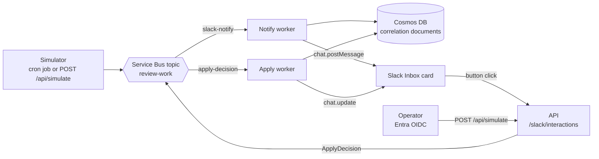
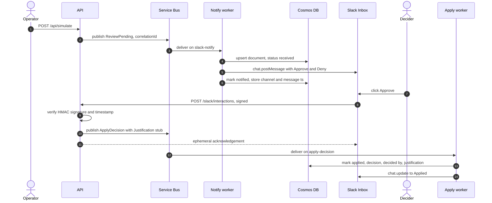
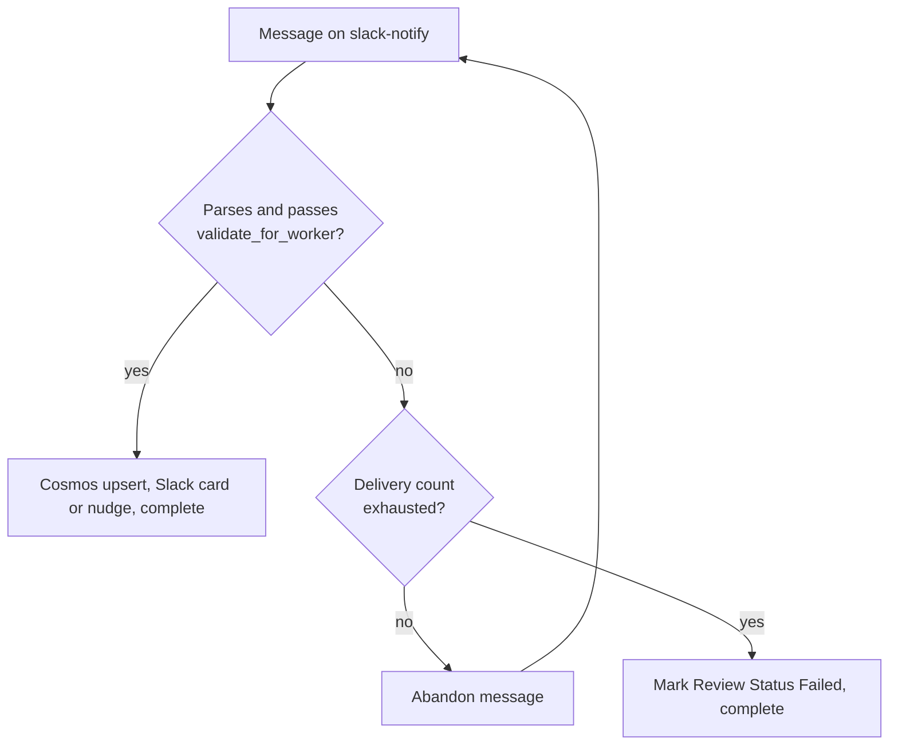
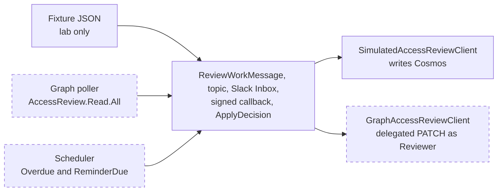

# Stop mailing MyAccess into the void: access reviews that settle in Slack

An Access Review is a one-bit question wrapped in a lot of ceremony. Does this Principal still need this Resource, yes or no? Microsoft Entra will happily schedule the review, find the Reviewer and send the email, and then the email lands in an inbox that is already on fire. The reminder gets skimmed, the week moves on, and the review instance ages out while nobody opens MyAccess. The control exists on paper. The Decision never gets made.

The premise of this project is simple: take the question to where Reviewers already spend their day. A Review Event becomes a message on a queue, the queue feeds a worker, the worker posts a Slack card with the Principal, the Resource, the due date and Approve and Deny buttons, and one click flows back through a signed callback to be recorded against a Correlation ID. MyAccess stays the Control Plane. Slack becomes the Inbox, the only surface where Review Work is decided.

There is one catch, and it shapes everything that follows. The Entra tenant behind this build is a lab. It has no production users, no standing recertification program and no real Reviewers. So every Review Event you will see in this post was injected on purpose, and every Apply lands in Cosmos DB instead of Microsoft Graph. That is not a shortcut. It is a deliberate design choice, and the rest of the post is about making it a good one.


## Why the lab runs on fixtures

Real Access Reviews are expensive to come by. They need Microsoft Entra ID P2 or Entra ID Governance licensing, a review definition scoped to a real group or application, Reviewers who actually hold the Reviewer role, and a schedule that may only fire once a quarter. You cannot poll for Review Events that a tenant never produces, and you would not want a demo to wait three months for the next instance.

The second problem is more serious. Applying a real Decision removes real access. A denied guest loses a group membership. An experiment that goes sideways in a production tenant is an incident, and an experiment in an empty lab tenant proves nothing about the thing you are trying to build.

Fixtures solve both problems and add a third benefit. They are deterministic. The same three Review Events arrive every time, the same poison payload fails the same way, and a screenshot taken today matches the one taken next month. The trick is to make the fakes faithful. Each fixture is a JSON document shaped like the data Graph exposes for a Decision Item, so the pipeline never learns that the source is synthetic. Only the edges know: the Producer that emits Review Events and the client that Applies Decisions.

## One pipeline, two subscriptions

The whole system is a single Service Bus topic called `review-work` with two subscriptions. The `slack-notify` subscription carries Review Events to the notify worker. The `apply-decision` subscription carries clicks back to the apply worker. Both workers run on Azure Container Apps and scale to zero with KEDA, so an idle lab costs close to nothing.



Cosmos DB is the memory of the system. Every document is keyed by a Correlation ID that follows Review Work from publish to Decision, which is what makes the whole flow traceable later. Documents carry a 30 day TTL, so the lab cleans up after itself. That TTL is demo hygiene, not a compliance retention policy.

## A fixture that looks like Graph

The simulator reads its events from `config/simulated-events/`. There is one fixture per Review Event the notify path needs to handle: Pending, Overdue, ReminderDue, and a deliberately broken payload for the failure path. Here is the Pending one.

```json
{
  "eventType": "ReviewPending",
  "correlationId": "ara-sim-pending-001",
  "definitionId": "00000000-0000-4000-8000-000000000101",
  "instanceId": "00000000-0000-4000-8000-000000000201",
  "decisionItemId": "00000000-0000-4000-8000-000000000301",
  "principalDisplayName": "Alex Reviewer",
  "principalUpn": "alex.reviewer@contoso.lab",
  "resourceDisplayName": "Privileged Helpdesk Operators",
  "resourceType": "group",
  "reviewerUpn": "sam.approver@contoso.lab",
  "dueDateTime": "2026-09-27T17:00:00Z",
  "recommendation": "Approve",
  "notes": "Simulated pending decision. No live Entra access review exists."
}
```

The three identifiers at the top are the interesting ones. A real Decision Item is addressed by definition, then instance, then decision item, and that triple is exactly what a Graph `PATCH` needs later. The fixtures carry them from day one, which means the day a real tenant arrives, nothing about the message contract has to change. Every fixture also announces what it is in its `notes` field, and that note travels all the way to the Slack card, so nobody can mistake lab Review Work for a live Access Review.

A Pydantic model validates the shape on the way in, and a second method decides whether the worker should accept it.

```python
def validate_for_worker(self) -> None:
    if self.force_poison:
        raise ValueError("forcePoison=true: intentional failure fixture")
    if not self.correlation_id.strip():
        raise ValueError("correlationId is required")
    if not self.decision_item_id.strip():
        raise ValueError("decisionItemId is required")
```

Hold on to that `force_poison` flag. It turns up again in the failure path.

## Injecting the first event

A Container Apps job replays the fixtures every six hours, but nobody wants to wait for cron during a demo. The API exposes `POST /api/simulate`, protected by Entra OIDC, which lets an Operator publish fixtures on demand. It accepts an optional fixture name and a flag that decides whether the poison payload comes along. There is no second human UI and no pending-queue API. Operators inspect open Review Work in Cosmos or logs by Correlation ID.

```powershell
Invoke-RestMethod -Method POST "https://<api-fqdn>/api/simulate" `
  -Headers @{ Authorization = "Bearer $token" } `
  -ContentType "application/json" `
  -Body '{"include_poison": false}'
```

The response is the receipt. Three Correlation IDs went onto the topic, and the poison fixture stayed home.


The filter that keeps the poison payload out of normal runs is a single condition in the endpoint, and it matters more than it looks. A bad message should only ever reach the queue when someone asks for it.

```python
for work in load_all_fixtures(settings.fixtures_path):
    if work.force_poison and not body.include_poison:
        continue
    publish_review_work(settings, work)
    published.append(work.correlation_id)
```

<!-- screenshot-todo: images/aca_job_execution_history.png | Container Apps job execution history showing the six-hourly simulator run succeeding -->

## The card in Slack

Within a few seconds the notify worker has validated each message, written a correlation document to Cosmos with Review Status Received, posted a Block Kit card to the shared lab channel, and marked the document Notified. The card is the whole product. It names the Principal and their UPN, the Resource and its type, the due date, the Recommendation and the Correlation ID, and it ends with two buttons.

The lab posts to a shared `SLACK_CHANNEL_ID`. That is scaffolding. Production intent is Inbox delivery to the Reviewer. The lab also resolves every Entra Reviewer through a Lab Identity Map to the same Slack user id, because the Slack developer sandbox cannot do workspace SSO. Production end-state is SSO Identity, where Slack is SSO'd to Entra so Decider and Reviewer are the same person without a stub map.

The part worth reading is how the buttons carry their context. Slack will send back whatever string you put in the button `value`, so the value encodes the Correlation ID and the Decision. No lookup table, no session state.

```python
{
    "type": "button",
    "action_id": "ara_approve",
    "text": {"type": "plain_text", "text": "Approve"},
    "style": "primary",
    "value": slack_action_value(work.correlation_id, "Approve"),
},
```

Look at the three cards in the screenshot above and you can see the fixtures doing their job. One is a group, one is an application and one is a PIM eligible directory role, so the same card layout is exercised against the Resource types a real tenant would throw at it. The Recommendations differ too. The overdue card recommends Deny, and that detail pays off in a moment.

When the same open Review Work is republished, the notify path refreshes metadata instead of stacking orphan cards. Overdue and ReminderDue Review Events nudge the existing Inbox card while status is still Notified. Applied Review Work is never reopened.

## Trusting the button

Clicking Approve makes Slack send an HTTP `POST` to the Request URL configured on the app's Interactivity page. In Azure that URL is simply the API's `/slack/interactions` route on its Container Apps hostname.


That endpoint is a public URL that queues an Apply when called, so it cannot take anyone's word for who is calling. Slack signs every request with HMAC-SHA256 over a version prefix, a timestamp and the raw body. The API recomputes the signature with the signing secret from Key Vault and compares in constant time. A stale timestamp is rejected as well, which closes the replay window.

```python
basestring = f"v0:{timestamp}:{body_text}".encode("utf-8")
digest = hmac.new(
    signing_secret.encode("utf-8"),
    basestring,
    hashlib.sha256,
).hexdigest()
expected = f"v0={digest}"
if not hmac.compare_digest(expected, signature):
    raise SlackSignatureError("Slack signature mismatch")
```

Once the signature checks out, the API does something that looks lazy and is actually the whole point. It does not Apply anything synchronously. Slack expects an acknowledgement within three seconds, and a Cosmos write plus a card update can wander past that on a cold start. So the API publishes an `ApplyDecision` message (including a lab-stub Justification) to the same topic and replies with a short ephemeral note. The slow work happens elsewhere, on its own schedule, with Service Bus retries behind it.



## Applying the Decision without touching Graph

This is the seam where the lab and the real world part ways, and it is a single interface. Everything upstream of it, the queue, the card, the signature check and the Correlation ID, is identical in both worlds. Only the implementation behind `apply_decision` differs.

```python
class IAccessReviewClient(ABC):
    @abstractmethod
    def apply_decision(
        self,
        *,
        correlation_id: str,
        decision: DecisionAction,
        decided_by: str,
        justification: str,
    ) -> None: ...


class SimulatedAccessReviewClient(IAccessReviewClient):
    """Updates Cosmos. Does not call Microsoft Graph."""

    def apply_decision(
        self, *, correlation_id, decision, decided_by, justification
    ) -> None:
        self._store.mark_applied(
            correlation_id,
            decision=decision.value,
            decided_by=decided_by,
            justification=justification,
        )
```

The lab wires up `SimulatedAccessReviewClient`. A `GraphAccessReviewClient` sits beside it as an intentionally unimplemented stub that raises if anyone tries to use it, so the production path is marked on the map without being reachable. When the apply worker finishes, it rewrites the original card so the Decider sees the outcome where they clicked.


The footer on each card is the honest part: simulated Apply, Cosmos updated, Graph not called. If someone screenshots this channel for a status report, the card itself says what happened and what did not.

The other half of the evidence is in Cosmos. Open the overdue document in Data Explorer and the whole lifecycle is on one page.


The document started life with Review Status `received`, picked up a Slack channel and message timestamp when the card was posted (`notified`), and ended with `applied`, a Decision, a Decider, a Justification stub and a timestamp. Look closely at the Decision. The system Recommendation was Deny for this guest on the payroll API, and the Decider clicked Approve. That is exactly the kind of override an auditor wants to see preserved, and the data model records it without any special handling because Recommendation, Decision and Justification are separate fields.

## Signing in with real Entra

The Slack Inbox path never touches Entra. The Operator API does, and this is the one place the lab refuses to fake anything when bypass is off. An Operator obtains a bearer token for the API's `access_as_user` scope and calls `POST /api/simulate`. The API checks issuer, audience and scope before it accepts the inject.

One app registration is enough for that story. The API exposes the `access_as_user` scope under an Application ID URI built from its client ID, because bare strings are rejected by the default tenant identifier-URI policy. Slack remains an OAuth app with a bot token and a signing secret, not an identity provider. Workspace SSO is paid SAML and out of reach in the developer sandbox, which is why Lab Identity Map exists and SSO Identity stays the documented production end-state.

<!-- screenshot-todo: images/entra_api_expose_scope.png | Entra API app registration, Expose an API, showing the access_as_user scope -->

<!-- screenshot-todo: images/entra_aadsts50011_redirect_mismatch.png | Browser showing AADSTS50011 for a redirect URI mismatch, the most common first-run failure when acquiring Operator tokens -->

## No keys between Azure resources

Every connection between Azure services in this stack uses a user assigned managed identity. Cosmos DB and Service Bus both have local auth disabled, so there is no connection string or account key to leak. The container registry has its admin user off. There is no storage account, and there are no Functions or WebJobs keys. Container Apps settings carry endpoints and names only, and the Slack secrets are read from Key Vault at runtime through the same identity.

The code reflects that with a single branch. The emulator path exists so the whole system runs locally in Docker, and everything else falls through to `DefaultAzureCredential`.

```python
def _client(settings: Settings) -> ServiceBusClient:
    if settings.use_service_bus_emulator:
        return ServiceBusClient.from_connection_string(
            settings.service_bus_connection_string
        )
    return ServiceBusClient(
        fully_qualified_namespace=settings.service_bus_fully_qualified_namespace,
        credential=DefaultAzureCredential(),
    )
```

The Cosmos store follows the same pattern. Because the code never branches on "am I in Azure", the same container image runs unchanged on a laptop and in the cloud.

<!-- screenshot-todo: images/aca_environment_revisions_uami.png | Container Apps revisions with the user assigned managed identity attached -->

<!-- screenshot-todo: images/azure_access_control_and_local_auth_disabled.png | Access control blade listing the identity's data plane roles, next to the Disabled local authentication setting on Cosmos DB and Service Bus -->

## When a message is poison

A pipeline that only handles good input has not been tested. The poison fixture is a payload that parses cleanly but carries `forcePoison: true`, so the notify worker's validation rejects it, and it exists so the failure path is something you exercise on purpose instead of discovering at 2 a.m.

The worker's contract is small. Process the message and complete it, or abandon it and let Service Bus retry. When delivery count reaches the configured maximum, the worker marks Review Status Failed and completes the message so the Correlation ID has a terminal Review Status instead of vanishing into silence.

```python
try:
    work = parse_review_work(raw)
    handle_notify(store, slack, work, settings)
    receiver.complete_message(message)
except Exception:
    if should_mark_failed(
        delivery_count=message.delivery_count,
        max_delivery_count=settings.service_bus_max_delivery_count,
    ):
        record_terminal_failure(store, work=work, correlation_id=correlation_id)
        receiver.complete_message(message)
    else:
        receiver.abandon_message(message)
```



Because the Correlation ID rides on every log line and every message, finding the story of one bad event is a single query against the container logs.

```kusto
ContainerAppConsoleLogs_CL
| where Log_s has "ara-sim-poison-001"
| project TimeGenerated, ContainerName_s, Log_s
| order by TimeGenerated asc
```

<!-- screenshot-todo: images/service_bus_topic_subscriptions_dlq.png | Service Bus topic with the slack-notify and apply-decision subscriptions -->

<!-- screenshot-todo: images/log_analytics_correlation_trace.png | Log Analytics KQL result tracing one correlation ID across API, notify worker and apply worker -->

## What carries over to a real tenant

Most of this system is already production-shaped. The topic, the two subscriptions, the retry and Failed behavior, the Slack card, the signature check, the correlation documents and the managed identity wiring all survive the move to a live tenant. What changes is the Producer at one end and the Apply edge at the other, plus identity that the lab can only stub.



On the Producer side, fixtures give way to a Graph poller that lists open Decision Items with application `AccessReview.Read.All`, plus a scheduler that derives Overdue and ReminderDue from due dates. This stays on Access Reviews. It is not Access Package eventing, and it does not assume Microsoft Graph Event Grid partner delivery for Decision Items unless that resource is actually supported later. Because the fixtures already carry the definition, instance and Decision Item IDs, the mapping onto `ReviewWorkMessage` is a straight copy rather than a redesign.

On the Apply side, the story is more demanding than the lab suggests. The Graph call that records a Decision is a `PATCH` against the Decision Item under its definition and instance. That endpoint supports delegated permissions only, with no application permission at all, and the caller must be a listed Reviewer on the instance. A managed identity cannot Approve on a Reviewer's behalf. A real `GraphAccessReviewClient` therefore needs SSO Identity (or equivalent) so the Decider is the Reviewer, then a delegated token for that person, and it should send the Justification when the Access Review requires one. Lab Identity Map only bridges Reviewer to Slack for lab delivery. It does not authorize Graph Apply.

```http
PATCH /identityGovernance/accessReviews/definitions/{definitionId}/instances/{instanceId}/decisions/{decisionItemId}
Content-Type: application/json

{ "decision": "Approve", "justification": "Still on the payroll team" }
```

The remaining differences are smaller but worth naming. Licensing becomes real: Access Reviews need Entra ID P2 or Entra ID Governance for the people involved. The lab's token check validates issuer, audience and scope on the claims, and production should additionally verify the token signature against the tenant's signing keys. The Cosmos TTL should be revisited, because an audit trail that evaporates after 30 days is a demo feature, not a compliance one. Shared-channel delivery gives way to Reviewer-targeted Inbox delivery. And the "Simulated apply" footer on the Slack card goes away, replaced by the actual outcome that Graph reports back.

The lab does not prove that Access Reviews can be automated end to end. It proves something narrower and more useful: that the Inbox pattern works. Humans decide where they already live, the bus carries the Review Work, Cosmos remembers the Correlation ID, and managed identity lets every Azure component talk without a shared secret. What remains is replacing two edges with the real thing.

## Run it yourself

The local path needs no Azure subscription. Cosmos and Service Bus run as emulators in Docker, the API and workers run on the host, and without a Slack token the worker logs the Block Kit JSON instead of posting it. The step by step instructions, including the failure and retry drills, are in the [README](../README.md). Get the local run green first, then deploy.
