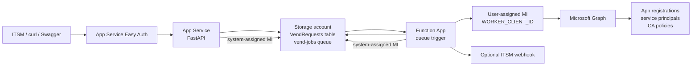
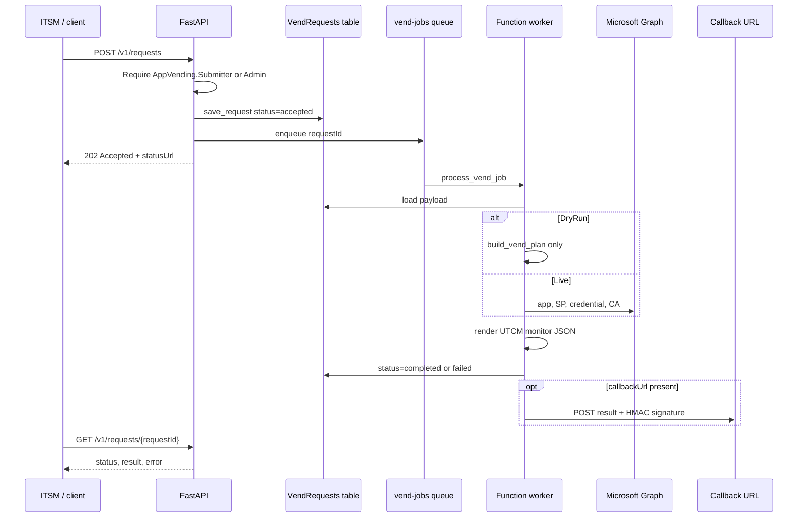
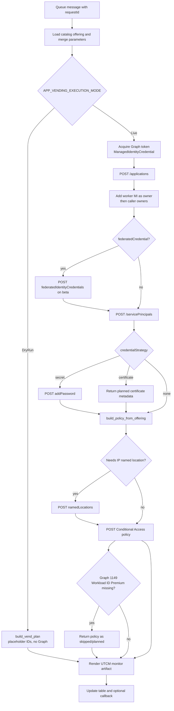

# Application Registration Vending Machine

Governed, catalog-driven provisioning of Microsoft Entra application registrations, credentials, app roles, Conditional Access policies, and UTCM monitor artifacts.

Callers never design Graph payloads. They pick a catalog SKU (`offeringId`), supply instance details, and receive an async `202 Accepted` response. An Azure Functions worker executes a DryRun plan or a Live Microsoft Graph vend, then updates Table Storage and optionally POSTs an ITSM callback.

## Contents

- [What it does](#what-it-does)
- [Architecture](#architecture)
- [Request lifecycle](#request-lifecycle)
- [Live vend pipeline](#live-vend-pipeline)
- [Catalog SKUs](#catalog-skus)
- [API contract](#api-contract)
- [Execution modes](#execution-modes)
- [Repository layout](#repository-layout)
- [File reference](#file-reference)
- [Configuration](#configuration)
- [Local development and testing](#local-development-and-testing)
- [Deploy to Azure](#deploy-to-azure)
- [Live testing](#live-testing)

## What it does

1. An ITSM system or admin client calls `POST /v1/requests` with a catalog SKU and instance details.
2. The FastAPI app authenticates the caller (`AppVending.Submitter` or `AppVending.Admin`), writes the request to Azure Table Storage, enqueues a job, and returns `202 Accepted`.
3. A queue-triggered Azure Function dequeues `vend-jobs`, resolves the offering from `catalog/app-offerings.json`, and either builds a DryRun plan or calls Microsoft Graph.
4. The worker persists the result (or error) and, if `callbackUrl` was supplied, POSTs a completion payload signed with HMAC-SHA256.

Identity for the control plane is provisioned as code. `infra/main.bicep` uses the Microsoft Graph Bicep extension to create the API app registration, app roles, service principal, worker user-assigned managed identity, Graph application permission assignments, Easy Auth, and Azure RBAC. Shared-key storage access and SCM/FTP basic publishing credentials are disabled.

## Architecture



Two identities are used on purpose:

| Identity | Where | Purpose |
|----------|--------|---------|
| System-assigned managed identity | API Web App and Function App | Azure RBAC on Storage (queue/table/blob) and Application Insights |
| User-assigned managed identity | Function App (`WORKER_CLIENT_ID`) | Microsoft Graph only: create owned apps, service principals, secrets, named locations, and Conditional Access policies |

## Request lifecycle



## Live vend pipeline



## Catalog SKUs

Offerings live in [`catalog/app-offerings.json`](catalog/app-offerings.json). Callers may only pass `offeringId` plus instance fields; redirect URIs, app roles, Graph permission names, credential strategy, and Conditional Access templates are owned by the catalog.

| `offeringId` | Platform | Credentials | Conditional Access | Notes |
|--------------|----------|-------------|--------------------|-------|
| `internal-hr-spa` | SPA, authorization code + PKCE | none | `require-compliant-device` (report-only) | `HR.Read` / `HR.Write` app roles |
| `aks-graph-workload` | Web, client credentials + federated credential | certificate (planned; FIC is preferred) | `workload-ip-location-restrict` (report-only) | Requires `aksServiceAccount` and `allowedIpRanges`. Live CA enforcement needs Entra Workload ID Premium; without it the app and FIC still vend and CA is returned as planned/skipped |
| `privileged-payroll-api` | Web, authorization code + PKCE, token v2, `xms_cc` | none | `require-compliant-device-privileged-session` (enabled, 1-hour sign-in frequency) | `Payroll.Read` / `Payroll.Write`. CAE is stamped on the app (`xms_cc` / `cp1`); Graph rejects CAE `strictEnforcement` session controls (error 1138) |

Template placeholders in the catalog use `{{parameters.name}}` and are substituted from the request `parameters` object.

## API contract

| Method | Path | Auth | Description |
|--------|------|------|-------------|
| `GET` | `/health` | none (excluded from Easy Auth) | Liveness probe `{ "status": "ok" }` |
| `POST` | `/v1/requests` | `AppVending.Submitter` or `AppVending.Admin` | Accept a vend request; returns `202` |
| `GET` | `/v1/requests/{requestId}` | same roles | Poll status, result, or error |
| `GET` | `/docs` | same as the site (Easy Auth in Azure) | OpenAPI / Swagger UI |

### `POST /v1/requests` body

```json
{
  "offeringId": "internal-hr-spa",
  "displayName": "HR Internal Portal - Dev",
  "owners": ["00000000-0000-0000-0000-000000000000"],
  "justification": "ServiceNow REQ0012345",
  "callbackUrl": "https://example.invalid/hooks/app-vending",
  "callbackSecret": "optional-hmac-key",
  "parameters": {}
}
```

| Field | Required | Description |
|-------|----------|-------------|
| `offeringId` | yes | Must match an offering in the catalog |
| `displayName` | yes | Entra application display name |
| `owners` | no | Entra object IDs of users or service principals. Invalid IDs are skipped with a warning in Live mode |
| `justification` | yes | Free-text operational reason, stored on the plan |
| `callbackUrl` | no | HTTPS URL to POST when the job finishes |
| `callbackSecret` | no | If set, the worker sends `X-AppVending-Signature` = hex HMAC-SHA256 of the JSON body |
| `parameters` | no | SKU-specific values (for example `aksServiceAccount`, `allowedIpRanges`) |

### `202 Accepted` body

```json
{
  "requestId": "c0a80100-0000-0000-0000-000000000001",
  "status": "accepted",
  "statusUrl": "/v1/requests/c0a80100-0000-0000-0000-000000000001",
  "pollAfterSeconds": 5
}
```

Request `status` values: `accepted`, `completed`, `failed`.

## Execution modes

| Mode | Behavior |
|------|----------|
| `DryRun` (default) | Builds the full Graph payload plan and UTCM artifact. Does not call Microsoft Graph. Result IDs are placeholders such as `dry-run-client-id`. |
| `Live` | Creates the application, service principal, optional secret or federated credential, named location, and Conditional Access policy via Graph using the worker user-assigned managed identity. |

Set `APP_VENDING_EXECUTION_MODE` on both the API and the Function App (the worker is the component that executes Graph).

## Repository layout

```
project-app-vending-machine/
├── api/                          FastAPI ITSM-facing service
│   ├── main.py
│   ├── requirements.txt
│   └── routes/
│       └── requests.py
├── src/app_vending/              Shared library used by API and worker
│   ├── auth.py
│   ├── callback.py
│   ├── catalog.py
│   ├── graph_apps.py
│   ├── graph_ca.py
│   ├── models.py
│   ├── settings.py
│   ├── storage.py
│   ├── utcm.py
│   ├── vend_execute.py
│   └── vend_plan.py
├── worker/                       Azure Functions Python v2 queue worker
│   ├── function_app.py
│   ├── host.json
│   ├── local.settings.sample.json
│   └── requirements.txt
├── catalog/
│   └── app-offerings.json        Governed SKU definitions
├── infra/
│   ├── main.bicep                Azure + Entra resources
│   └── parameters.dev.json
├── samples/
│   ├── requests/                 Example POST bodies
│   └── utcm/                     UTCM monitor templates + generated output
├── scripts/                      Deploy, Graph grant, PKCE token helper
├── .vscode/                      Launch, tasks, Functions settings
├── bicepconfig.json              Microsoft Graph Bicep extensions
├── pyproject.toml                Python package metadata
├── blog.md                       Long-form design article
└── README.md
```

Generated UTCM JSON under `samples/utcm/generated/` is gitignored except for `.gitkeep`. `worker/local.settings.json` is also gitignored; copy it from the sample.

## File reference

Descriptions omit `tests/` and `docs/`.

### Root

| File | Description |
|------|-------------|
| `README.md` | This document |
| `blog.md` | Long-form design article covering the catalog-SKU pattern, Graph Bicep prerequisites, and the vend pipeline |
| `pyproject.toml` | Package name `app-vending-machine`, Python ≥ 3.11, runtime dependencies, optional `[worker]` extra (`azure-functions`), setuptools `src` layout |
| `bicepconfig.json` | Enables Bicep extensibility and registers `microsoftGraphV1` / `microsoftGraphBeta` from MCR |
| `.gitignore` | Azurite data, venvs, `local.settings.json`, generated UTCM JSON, `.python_packages`, egg-info, compiled infra JSON except `parameters.*.json` |

### `api/`

| File | Description |
|------|-------------|
| `api/__init__.py` | Empty package marker |
| `api/main.py` | FastAPI app: title/description, mounts the requests router, exposes `GET /health` |
| `api/requirements.txt` | Editable install of the shared package plus FastAPI and Uvicorn for local runs |
| `api/routes/__init__.py` | Empty package marker |
| `api/routes/requests.py` | `POST /v1/requests` (persist + enqueue, `202`) and `GET /v1/requests/{id}` (404 if missing). Both routes depend on `require_submitter_role` |

### `src/app_vending/`

| File | Description |
|------|-------------|
| `__init__.py` | Package docstring |
| `settings.py` | Resolves project root (local `src/` layout or Azure package root), catalog/UTCM paths, queue/table names, execution mode, storage connection vs. managed identity, worker client ID, Graph tenant, required roles, `AUTH_BYPASS` |
| `models.py` | Pydantic models: `VendRequestBody`, `VendAcceptedResponse`, `VendStatusResponse`, `CallbackPayload` |
| `catalog.py` | Loads `app-offerings.json`, looks up an offering by ID, substitutes `{{parameters.*}}` templates |
| `auth.py` | Reads Easy Auth `X-MS-CLIENT-PRINCIPAL`, or decodes a Bearer JWT payload, or synthesizes roles when `AUTH_BYPASS=true`. Enforces intersection with `REQUIRED_SUBMITTER_ROLES` |
| `storage.py` | Table `VendRequests` and queue `vend-jobs`. Uses Azurite/connection string locally and `DefaultAzureCredential` against the account name in Azure. Create-if-missing, save, enqueue, get, update |
| `callback.py` | POSTs JSON to `callbackUrl` with optional `X-AppVending-Signature`. Failures are logged and do not raise |
| `vend_plan.py` | Builds the Graph-shaped application, service principal, and credential plan from a resolved offering. Maps Graph application permission names to well-known role IDs. Attaches SPA vs web redirect URIs, optional `xms_cc` claims, and federated credential metadata |
| `vend_execute.py` | Orchestrates DryRun vs Live, always renders a UTCM artifact when the offering has `utcmMonitor.baselineRef` |
| `graph_apps.py` | Live Graph client: token via user-assigned MI, create application (claim ownership, owners, FIC), service principal, client secret, IP named location, Conditional Access policy with retries for directory replication. Skips workload CA when Graph 1149 (Workload ID Premium) is returned |
| `graph_ca.py` | Conditional Access payload builders: compliant device, privileged session (sign-in frequency; CAE session control omitted when unsupported), workload IP restriction + named location. Chooses Graph v1.0 vs beta |
| `utcm.py` | Loads a UTCM baseline template, stamps display name and CA state, writes `{offeringId}-{requestId}.monitor.json` |

### `worker/`

| File | Description |
|------|-------------|
| `function_app.py` | Python v2 `FunctionApp` with `@app.queue_trigger` on `vend-jobs`. Loads the payload, calls `process_vend_request`, updates the table, sends callback. On exception, marks the request `failed` and still attempts the callback |
| `host.json` | Functions host v2, Application Insights sampling, extension bundle 4.x, queue `messageEncoding: none` (API enqueues plain JSON, not Base64) |
| `local.settings.sample.json` | Template for local Functions settings: Azurite, DryRun, `AUTH_BYPASS`, catalog/UTCM relative paths, placeholder `GRAPH_TENANT_ID` |
| `requirements.txt` | Editable install of the shared package plus `azure-functions` |
| `.funcignore` | Excludes `.venv` from Functions packaging |

### `catalog/`

| File | Description |
|------|-------------|
| `app-offerings.json` | Versioned catalog of the three SKUs: auth profile, app roles, Graph permissions, credential strategy, CA template, UTCM baseline path |

### `infra/`

| File | Description |
|------|-------------|
| `main.bicep` | Resource group deployment: Storage (shared key disabled), App Insights, Linux Consumption Function plan + app, Linux B1 API plan + app, worker UAMI, Graph application + service principal + app role assignments, Easy Auth, SCM/FTP basic auth disabled, Azure RBAC for system-assigned identities. Outputs hostnames, client IDs, principal IDs, audience, role IDs |
| `parameters.dev.json` | Dev parameter file: `deploymentEnvironment=dev`, placeholder `tenantId`, `executionMode=DryRun`, `assignWorkerGraphPermissions=true` |

### `samples/`

| File | Description |
|------|-------------|
| `requests/README.md` | How to use the sample bodies for DryRun vs Live (owner object IDs, callback URL, AKS parameters, payroll CAE notes) |
| `requests/internal-hr-spa.json` | Sample POST for the HR SPA SKU |
| `requests/aks-graph-workload.json` | Sample POST with `aksServiceAccount` and `allowedIpRanges` |
| `requests/privileged-payroll-api.json` | Sample POST for the payroll API SKU |
| `utcm/hr-compliant-device.monitor.json` | UTCM baseline for the HR compliant-device CA policy |
| `utcm/aks-graph-ip-restrict.monitor.json` | UTCM baseline for the AKS workload IP restriction policy |
| `utcm/payroll-cae-session.monitor.json` | UTCM baseline for the payroll privileged-session policy |
| `utcm/generated/.gitkeep` | Keeps the generated-artifact directory in git |

### `scripts/`

| File | Description |
|------|-------------|
| `Deploy-ApiApp.ps1` | Stages `api/`, `app_vending`, `catalog`, and manylinux Python 3.11 wheels; zip-deploys with `az webapp deploy` (Azure AD). Sets gunicorn + Uvicorn on port 8000 |
| `Deploy-FunctionApp.ps1` | Stages `function_app.py`, `host.json`, `app_vending`, catalog, UTCM templates, and wheels; uploads the zip to a private blob with Azure AD; sets `WEBSITE_RUN_FROM_PACKAGE` |
| `Grant-WorkerGraphPermissions.ps1` | Fallback Graph app-role assignment for the worker UAMI when Bicep cannot grant `Application.ReadWrite.OwnedBy`, `Application.Read.All`, `Policy.Read.All`, `Policy.ReadWrite.ConditionalAccess` |
| `get_token_pkce.py` | Local OAuth 2.0 authorization-code + PKCE helper. Opens a browser, listens on `http://localhost:8400/callback`, prints an access token |

### `.vscode/`

| File | Description |
|------|-------------|
| `extensions.json` | Recommends Azure Functions and Python extensions |
| `settings.json` | Azure Functions Python v2 project: deploy subpath `worker`, runtime `~4`, venv `.venv` |
| `launch.json` | Debug configs: FastAPI on port 8000 (DryRun + `AUTH_BYPASS`), Functions attach, compound "Full stack (API + Worker)" |
| `tasks.json` | Start Azurite, install dependencies, `func host start` |

## Configuration

| Variable | Default | Used by | Purpose |
|----------|---------|---------|---------|
| `APP_VENDING_EXECUTION_MODE` | `DryRun` | API, worker | `DryRun` or `Live` |
| `AzureWebJobsStorage` | `UseDevelopmentStorage=true` when no account name is set | API, worker | Azurite or classic connection string |
| `AzureWebJobsStorage__accountName` | unset | API, worker | Storage account name for identity-based access |
| `AzureWebJobsStorage__credential` | unset (set to `managedidentity` in Bicep) | Azure host | Identity-based Functions storage |
| `STORAGE_ACCOUNT_NAME` | unset | API, worker | Same account name for table/queue SDK clients |
| `AUTH_BYPASS` | `false` | API | Skip JWT/Easy Auth locally; injects required roles |
| `REQUIRED_SUBMITTER_ROLES` | `AppVending.Submitter,AppVending.Admin` | API | Roles that may call `/v1/requests` |
| `OFFER_CATALOG_PATH` | `catalog/app-offerings.json` | worker | Catalog file relative to project/package root |
| `UTCM_OUTPUT_DIR` | `samples/utcm/generated` locally; `/home/data/utcm` in Azure | worker | Where monitor JSON is written |
| `GRAPH_TENANT_ID` | empty (required for Live) | worker | Tenant for Graph token |
| `WORKER_CLIENT_ID` | empty | worker | User-assigned MI client ID for Graph |
| `WORKER_PRINCIPAL_ID` | empty | worker | Optional explicit owner object ID; otherwise resolved from `WORKER_CLIENT_ID` |
| `AZURE_CLIENT_ID` | empty | worker | Fallback for `WORKER_CLIENT_ID` only; do not set globally in Azure or storage would also use the UAMI |
| `PYTHONPATH` | `src` locally | API | Makes `app_vending` importable |

## Local development and testing

### Prerequisites

- Python 3.11+
- [Azurite](https://learn.microsoft.com/azure/storage/common/storage-use-azurite) (queue + table emulator)
- [Azure Functions Core Tools](https://learn.microsoft.com/azure/azure-functions/functions-run-local) v4
- Optional: VS Code with the Python and Azure Functions extensions

### Setup

```powershell
cd project-app-vending-machine
python -m venv .venv
.\.venv\Scripts\Activate.ps1
pip install -e .
pip install -e ".[worker]"
copy worker\local.settings.sample.json worker\local.settings.json
```

### Run (three terminals)

Terminal 1 — Azurite:

```powershell
azurite --location .azurite --debug .azurite/debug.log
```

Or VS Code command **Azurite: Start**.

Terminal 2 — API (Swagger at http://localhost:8000/docs):

```powershell
$env:AUTH_BYPASS = "true"
$env:AzureWebJobsStorage = "UseDevelopmentStorage=true"
$env:APP_VENDING_EXECUTION_MODE = "DryRun"
$env:PYTHONPATH = "src"
uvicorn api.main:app --reload --port 8000
```

Terminal 3 — worker:

```powershell
cd worker
func start
```

Confirm the worker registered `process_vend_job` on queue `vend-jobs`.

VS Code alternative: run task **Start Azurite**, then launch compound **Full stack (API + Worker)**.

### DryRun request

With `AUTH_BYPASS=true`, no Bearer token is required. Placeholder owner IDs are fine because Graph is not called.

```powershell
curl -X POST http://localhost:8000/v1/requests `
  -H "Content-Type: application/json" `
  -d "@samples/requests/internal-hr-spa.json"
```

Expected: HTTP `202` with a `requestId` and `statusUrl`.

Poll until `status` is `completed` or `failed`:

```powershell
curl http://localhost:8000/v1/requests/{requestId}
```

A completed DryRun body includes placeholder IDs, `dryRunPlan` (application, service principal, credential, Conditional Access), and `utcmMonitorArtifact` pointing at `samples/utcm/generated/{offeringId}-{requestId}.monitor.json`.

Repeat with the other samples:

```powershell
curl -X POST http://localhost:8000/v1/requests `
  -H "Content-Type: application/json" `
  -d "@samples/requests/aks-graph-workload.json"

curl -X POST http://localhost:8000/v1/requests `
  -H "Content-Type: application/json" `
  -d "@samples/requests/privileged-payroll-api.json"
```

### Health and unit tests

```powershell
curl http://localhost:8000/health
pytest
```

## Deploy to Azure

Infrastructure uses the Microsoft Graph Bicep extension so Entra objects are created with the Azure resources. The template provisions:

- API app registration with `AppVending.Submitter` and `AppVending.Admin`
- API service principal (enterprise application)
- System-assigned managed identities on the Web App and Function App
- User-assigned managed identity for Graph (`WORKER_CLIENT_ID` / `WORKER_PRINCIPAL_ID`)
- Graph application permission assignments on that identity
- Easy Auth on the Web App, `/health` excluded, unauthenticated clients get `401`
- Storage with shared-key access disabled
- SCM and FTP basic publishing credentials disabled (deploy with Azure AD)

### Prerequisites

- Azure CLI logged into a subscription where you can create a resource group
- Permission to create Entra applications and assign Graph app roles (typically Global Administrator, or Cloud Application Administrator plus Application Administrator)
- Bicep CLI with Graph extension support (`az bicep upgrade`)
- PowerShell 7.4+ for the deploy scripts
- Python 3.11 on the machine that runs the package scripts (they download manylinux wheels)

### 1. Edit parameters

Set `tenantId` in [`infra/parameters.dev.json`](infra/parameters.dev.json) to your Entra tenant ID, or pass it on the command line.

### 2. Deploy infrastructure

```powershell
az group create --name rg-appvend-dev --location australiaeast

az deployment group create `
  --resource-group rg-appvend-dev `
  --template-file infra/main.bicep `
  --parameters @infra/parameters.dev.json `
  --parameters tenantId=<your-tenant-id> executionMode=DryRun
```

Capture outputs:

```powershell
az deployment group show `
  --resource-group rg-appvend-dev `
  --name main `
  --query properties.outputs
```

Useful outputs: `apiAppHostname`, `apiAppName`, `functionAppName`, `apiAppRegistrationClientId`, `apiAudience`, `apiServicePrincipalObjectId`, `submitterRoleId`, `workerIdentityClientId`, `workerIdentityPrincipalId`.

If Graph role assignment fails because the caller cannot grant application permissions, redeploy with assignments off and grant them separately:

```powershell
az deployment group create `
  --resource-group rg-appvend-dev `
  --template-file infra/main.bicep `
  --parameters @infra/parameters.dev.json `
  --parameters tenantId=<your-tenant-id> assignWorkerGraphPermissions=false

./scripts/Grant-WorkerGraphPermissions.ps1 `
  -WorkerPrincipalId <workerIdentityPrincipalId>
```

Azure RBAC on Storage can take a minute to replicate. If the Function host logs 403 against Storage, wait and restart the Function App once.

### 3. Deploy API and worker code

Bicep leaves empty hosts. From the repo root:

```powershell
$rg = "rg-appvend-dev"
$outs = az deployment group show -g $rg -n main --query properties.outputs -o json | ConvertFrom-Json
$apiName = $outs.apiAppName.value
$funcName = $outs.functionAppName.value

./scripts/Deploy-ApiApp.ps1 -ResourceGroupName $rg -ApiAppName $apiName
./scripts/Deploy-FunctionApp.ps1 -ResourceGroupName $rg -FunctionAppName $funcName
```

`Deploy-ApiApp.ps1` zip-deploys with Azure AD (`az webapp deploy`). `Deploy-FunctionApp.ps1` uploads the package blob with `--auth-mode login` and points `WEBSITE_RUN_FROM_PACKAGE` at that private URL (required for Linux Consumption when `AzureWebJobsStorage` uses managed identity). The signed-in user needs **Storage Blob Data Contributor** or **Storage Blob Data Owner** on the storage account; the script attempts to create the Contributor assignment.

Verify the API is up. Easy Auth returns `401` on `/docs` without a token; `/health` is anonymous:

```powershell
curl -i "$($outs.apiAppHostname.value)/health"
```

Confirm `process_vend_job` appears in the Function App **Functions** blade or log stream.

### 4. Assign a caller role

Before calling the deployed API, assign `AppVending.Submitter` (or `AppVending.Admin`) to your user or automation principal on the API enterprise application:

```powershell
$spId = $outs.apiServicePrincipalObjectId.value
$roleId = $outs.submitterRoleId.value
$userId = "<your-user-or-sp-object-id>"

az rest --method POST `
  --uri "https://graph.microsoft.com/v1.0/servicePrincipals/$spId/appRoleAssignedTo" `
  --headers "Content-Type=application/json" `
  --body "{`"principalId`":`"$userId`",`"resourceId`":`"$spId`",`"appRoleId`":`"$roleId`"}"
```

### 5. Switch to Live mode

Keep the first deploy on `DryRun` until the API and worker are healthy, then:

```powershell
az webapp config appsettings set `
  --resource-group rg-appvend-dev `
  --name $funcName `
  --settings APP_VENDING_EXECUTION_MODE=Live

az webapp config appsettings set `
  --resource-group rg-appvend-dev `
  --name $apiName `
  --settings APP_VENDING_EXECUTION_MODE=Live
```

The worker setting is the one that changes Graph behavior.

## Live testing

Live mode creates real Entra objects. Use a non-production tenant or disposable display names, and replace the sample `owners` array with a real user or service principal object ID from that tenant.

### Public client for PKCE

`scripts/get_token_pkce.py` needs a **public** Entra app (not the API registration created by Bicep) with redirect URI `http://localhost:8400/callback`. Grant that client access to the vending API audience (`apiAudience` output, for example `api://appvend-api-dev-xxxxxx/.default`). The signed-in user must already have `AppVending.Submitter` or `AppVending.Admin`.

```powershell
python scripts/get_token_pkce.py `
  --tenant-id <tenant-id> `
  --client-id <public-client-id> `
  --scope api://<api-unique-name>/.default
```

The script prints a Bearer token. Store it for the following calls:

```powershell
$api = $outs.apiAppHostname.value
$token = "<paste-access-token>"
```

### Prepare request JSON

Copy a sample and edit it:

- `owners`: real object ID
- `displayName`: unique name you can find in Entra app registrations
- `callbackUrl`: optional; a temporary [webhook.site](https://webhook.site) URL, or omit the field and poll
- For `aks-graph-workload`, set `parameters.aksServiceAccount` to your Kubernetes subject (`system:serviceaccount:<namespace>:<name>`) and `parameters.allowedIpRanges` to an egress CIDR

### Submit and poll

```powershell
curl -X POST "$api/v1/requests" `
  -H "Authorization: Bearer $token" `
  -H "Content-Type: application/json" `
  -d "@samples/requests/internal-hr-spa.json"
```

```powershell
curl -H "Authorization: Bearer $token" `
  "$api/v1/requests/{requestId}"
```

Unauthenticated calls to `/v1/requests` return `401`. A token without the submitter/admin role returns `403`.

### What a completed Live result contains

| Field | Meaning |
|-------|---------|
| `applicationObjectId` | Entra application object ID |
| `applicationClientId` | Application (client) ID |
| `servicePrincipalObjectId` | Enterprise application object ID |
| `appRoles` | Roles created on the app |
| `credential` | Secret payload (HR/payroll use `none`; AKS certificate strategy is planned metadata) |
| `conditionalAccessPolicy` | Created policy, or skipped/planned body for workload CA without Workload ID Premium |
| `utcmMonitorArtifact` | Path of the generated monitor JSON |

### SKU-specific checks

**`internal-hr-spa`**

- App registration platform is SPA with the catalog redirect URI
- App roles `HR.Read` and `HR.Write`
- Report-only Conditional Access policy requiring a compliant device, named like `CA - {displayName} - Compliant Device`

**`aks-graph-workload`**

- Federated credential issuer/subject from the request parameters
- `User.Read.All` application permission on Microsoft Graph (admin consent is a separate tenant operation)
- Named location for the allowed CIDRs
- Workload CA policy if the tenant is licensed; otherwise `conditionalAccessPolicy.status` is `skipped` with `skipReason`

**`privileged-payroll-api`**

- `requestedAccessTokenVersion` 2 and optional claim `xms_cc` on the access token
- App roles `Payroll.Read` and `Payroll.Write`
- Enabled Conditional Access policy with compliant device and one-hour sign-in frequency
- Clients that call the vended API must still declare the `cp1` client capability when requesting tokens

### Callback

If `callbackUrl` was set, the worker POSTs:

```json
{
  "requestId": "...",
  "status": "completed",
  "offeringId": "internal-hr-spa",
  "executionMode": "Live",
  "result": { }
}
```

When `callbackSecret` is also set, verify `X-AppVending-Signature` as hex HMAC-SHA256 of the raw JSON body.
