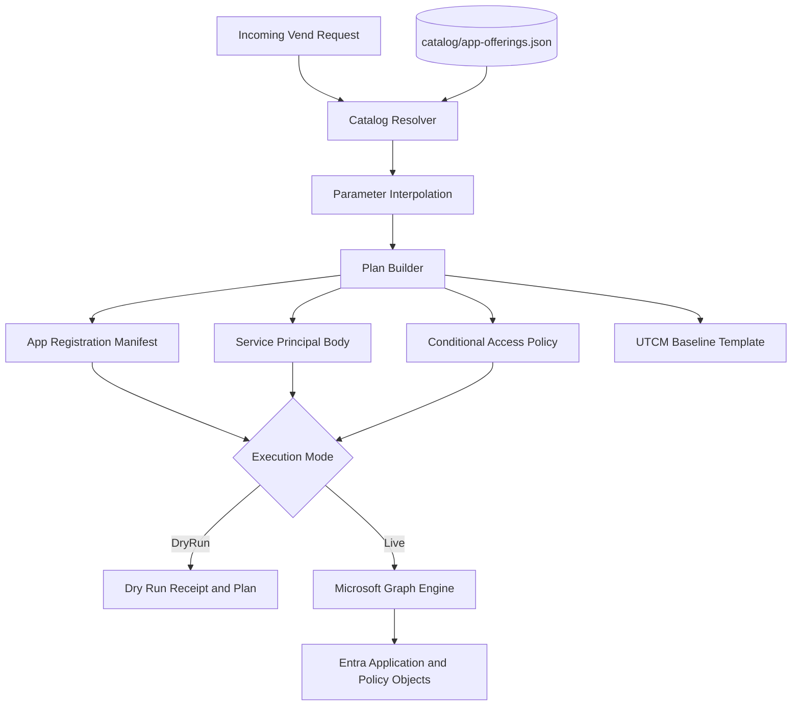
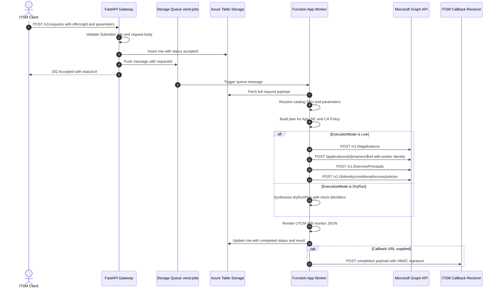

# The Application Registration Vending Machine

It's been been a hot minute between blogs. Since my last blog, I've been studing for the new [Microsoft 365 Certified: Microsoft 365 and AI Services Administrator Associate
(beta) AB-650](https://learn.microsoft.com/en-us/credentials/certifications/ai-services-administrator-associate/?wt.mc_id=credentials_AB650_blog_wwl&practice-assessment-type=certification) Exam (still waiting to hear if I passed 🫤 ), studying for the new [Microsoft Certified: Cloud and AI Security Engineer Associate SC-500](https://learn.microsoft.com/en-us/credentials/certifications/cloud-and-ai-security-engineer-associate/?practice-assessment-type=certification) Exam (I passed! 🎉) and
renewing my [GCP Associate Cloud Engineer](https://cloud.google.com/learn/certification/cloud-engineer) certification for another 12 months.

But now it's back into some practical work! Let's build a vending machine for application registrations! 🚀

Every identity engineer has lived through the same Tuesday afternoon. A ticket lands in the queue asking for a new application registration. The requester wants HR.Read and HR.Write app roles, a redirect URI that might or might not be correct, and somewhere in the ticket notes someone typed "needs MFA" without specifying whether that means user MFA, compliant device, or something else entirely. You open the Entra portal, click through six blades, paste a redirect URI, expose and API or two, add the two app roles by hand, generate a client secret because the team asked for one, and then realize nobody thought about Conditional Access until production week.

Manual directory administration does not scale. When application provisioning happens through ad-hoc portal clicks, security drift is inevitable. Redirect URIs end up wildcarded, client secrets get generated with two-year lifespans and emailed across Slack or Teams, and Conditional Access policies never get assigned to the resulting service principals. Handcrafted identity configurations turn enterprise tenants into unmanageable collections of orphaned credentials and unmonitored endpoints.

## Why a vending machine?

The solution borrows a proven pattern from cloud platform automation: callers never design infrastructure from scratch. Instead, they choose a pre-approved SKU. The SKU encodes the organizational security posture, and the vending service enforces it during provisioning.

An application registration vending machine brings that same operational discipline to Microsoft Entra ID. Callers submit a minimal JSON payload containing an offering ID, a display name, designated owners, an operational justification, and instance-specific parameters. They cannot specify arbitrary Graph permissions, rogue redirect URIs, or loose access controls. Those architecture decisions live inside a governed catalog file that the identity engineering team owns, reviews, and version-controls in Git.

That constraint is the foundation of the entire system. Restricting the caller to catalog-defined offerings makes identity provisioning governable, auditable, and safe to expose directly to enterprise IT service management systems.

## Prerequisites as code, no ClickOps

Most identity automation walkthroughs fall apart before you run a single script. They present an automated provisioning pipeline, but the documentation starts with a dozen manual prerequisites: register an API application by hand, define two app roles, build a managed identity, grant Graph permissions, configure Easy Auth, and manually trigger admin consent. Spending twenty minutes clicking through the Azure portal just to prepare an automation tool undermines the entire philosophy of systems engineering. If the vending machine exists to eliminate handcrafted Entra objects, the infrastructure running the vending machine must not be handcrafted either. To put it another way, the vending machine exists to eliminate ClickOps, the infrastructure running the vending machine must not be ClickOps either.

The Bicep deployment in this repository uses the Microsoft Graph Bicep extension to declare the prerequisite identity plane directly alongside the Azure resource definitions. A single deployment template creates the API application registration, defines the `AppVending.Submitter` and `AppVending.Admin` app roles, provisions the enterprise application, configures a dedicated user-assigned managed identity for Graph operations, enables system-assigned identities for Azure resource role assignments, and assigns the necessary Graph application permissions. Azure App Service Easy Auth on the Web App binds to the generated client ID automatically without requiring anyone to copy GUIDs between portal blades.

```bicep
extension microsoftGraphV1

resource apiAppRegistration 'Microsoft.Graph/applications@v1.0' = {
  displayName: apiAppRegistrationName
  uniqueName: apiAppUniqueName
  signInAudience: 'AzureADMyOrg'
  identifierUris: [ apiAudience ]
  appRoles: [
    {
      allowedMemberTypes: [ 'User', 'Application' ]
      displayName: 'App Vending Submitter'
      id: submitterRoleId
      isEnabled: true
      value: 'AppVending.Submitter'
    }
    // AppVending.Admin follows the same shape
  ]
}

resource workerGraphAppReadWriteOwnedBy 'Microsoft.Graph/appRoleAssignedTo@v1.0' = {
  appRoleId: '18a4783c-866b-4cc7-a460-3d5e5662c884' // Application.ReadWrite.OwnedBy
  principalId: workerIdentity.properties.principalId
  resourceId: microsoftGraphServicePrincipal.id
}
```

Once the Bicep template finishes deploying, the Azure resource group contains a complete, self-contained platform: the API Web App, the Functions background worker, a storage account, Application Insights, hosting plans, and the worker user-assigned managed identity.


Inside the Entra admin center, the API application registration exposes the two custom application roles that govern the ingestion API. These roles are not passive metadata. They are emitted directly into caller security tokens, allowing the API backend to enforce strict role-based access control on every incoming request.


The worker user-assigned managed identity receives Microsoft Graph application permissions with tenant-wide admin consent: `Application.ReadWrite.OwnedBy`, `Policy.Read.All`, and `Policy.ReadWrite.ConditionalAccess`. This forms the precise least-privilege boundary required to vend application registrations, create service principals, and bind application-targeted Conditional Access policies without granting broad directory-wide administrative rights.


## The defense in depth authentication stack

Securing an identity provisioning service demands multiple distinct validation layers. A compromised vending endpoint would allow an attacker to mint arbitrary directory credentials, so the architecture enforces authentication and authorization at the network edge, the application framework, and the cloud data plane.

Incoming requests hit Azure App Service Authentication first. Configured through Bicep using `authsettingsV2`, Easy Auth intercepts incoming HTTP traffic at the platform boundary before any application runtime code executes. Unauthenticated requests are rejected immediately with HTTP 401 Unauthorized, ensuring that unvetted internet traffic never reaches the Python web process.


The API application registration defines a custom OAuth 2.0 delegated scope named `access_as_user` under its unique Application ID URI. Interactive clients obtain user-delegated tokens scoped specifically to this API, while administrative pre-authorization guarantees that callers cannot bypass organization consent controls.


To grant submitter privileges, directory administrators assign the user, caller group, or service principal directly to the `App Vending Submitter` role on the enterprise application service principal. This separates identity governance from software code; permissions are assigned and audited through standard Entra enterprise application access reviews.


When an authorized client authenticates using OAuth 2.0 authorization code flow with PKCE, Entra ID includes the assigned application role directly in the access token. Inspecting the decoded JSON Web Token reveals the `roles` array populated with `AppVending.Submitter` alongside the `scp` scope claim.


Inside the FastAPI application, a lightweight dependency decodes the claims header injected by Easy Auth or checks the validated bearer token. If the caller lacks `AppVending.Submitter` or `AppVending.Admin`, the endpoint terminates the request with HTTP 403 Forbidden.

Data plane storage access operates entirely through Azure role-based access control. Both the API and the background worker Function App use system-assigned managed identities granted `Storage Queue Data Contributor` and `Storage Table Data Contributor` roles, while shared storage account keys are disabled at the ARM resource level. The worker Function App uses its separate user-assigned managed identity exclusively for Microsoft Graph operations via `ManagedIdentityCredential(client_id=WORKER_CLIENT_ID)`, preventing Graph privileges from mixing with internal storage access.

## Inside the provisioning engine

Establishing tight perimeter authentication and data plane controls makes the service resilient, but the real work happens in the engine that converts a caller's request into verified cloud identity resources. The engine avoids messy conditional branching by splitting the provisioning lifecycle into two distinct stages: compiling a catalog offering into an explicit execution plan, and then dispatching that plan across the Microsoft Graph API.

The central source of truth is `catalog/app-offerings.json`. Rather than allowing callers to pass raw Microsoft Graph properties, the catalog establishes immutable profiles for each pattern the organization supports. An offering declares authentication types, allowed redirect URIs, application roles, required Graph permissions, credential strategies, and paired Conditional Access templates. To accommodate per-instance details like an AKS service account subject or corporate CIDR blocks, offering values can contain double-brace template tags.

Inside `src/app_vending/catalog.py`, the engine reads the catalog file, extracts the requested SKU, and runs parameter interpolation. Instead of introducing heavy template dependencies, a simple regular expression finds template tags and substitutes values supplied by the caller, raising an immediate error if a required parameter is missing.

```python
_TEMPLATE_PATTERN = re.compile(r"\{\{parameters\.([a-zA-Z0-9_]+)\}\}")

def merge_parameters(value: Any, parameters: dict[str, Any]) -> Any:
    if isinstance(value, str):
        def replace(match: re.Match[str]) -> str:
            key = match.group(1)
            if key not in parameters:
                raise KeyError(f"Missing required parameter '{key}'.")
            return str(parameters[key])
        return _TEMPLATE_PATTERN.sub(replace, value)
    if isinstance(value, list):
        return [merge_parameters(item, parameters) for item in value]
    if isinstance(value, dict):
        return {key: merge_parameters(item, parameters) for key, item in value.items()}
    return value
```

Once parameters are resolved, the engine hands the data to `src/app_vending/vend_plan.py`. This module acts as the compiler. It maps the offering's platform profile into the exact JSON schemas required by Microsoft Graph. For single-page applications, it places redirect URIs inside the `spa` collection; for web APIs, it places them in `web` and disables implicit grants. It generates fresh UUIDs for application roles, adds requested access token versions and optional claims for Continuous Access Evaluation, and translates human-friendly permission strings such as `User.Read.All` into Microsoft Graph's well-known role GUIDs.

```python
def build_app_registration_plan(
    offering: dict[str, Any],
    display_name: str,
    owners: list[str],
) -> dict[str, Any]:
    auth_profile = offering.get("authProfile", {})
    platform = auth_profile.get("platform", "web")
    redirect_uris = auth_profile.get("redirectUris", [])

    app_roles = [
        {
            "id": str(uuid.uuid4()),
            "displayName": role["displayName"],
            "value": role["value"],
            "allowedMemberTypes": role.get("allowedMemberTypes", ["User"]),
            "description": role.get("description", role["displayName"]),
            "isEnabled": True,
        }
        for role in offering.get("appRoles", [])
    ]

    application = {
        "displayName": display_name,
        "signInAudience": "AzureADMyOrg",
        "owners": owners,
        "appRoles": app_roles,
    }

    if platform == "spa":
        application["spa"] = {"redirectUris": redirect_uris}
    else:
        application["web"] = {
            "redirectUris": redirect_uris,
            "implicitGrantSettings": {"enableIdTokenIssuance": False},
        }

    return application
```

This separation of planning from execution produces a deterministic specification of what needs to happen. The compiler generates plans for the application registration, the companion service principal, credential bindings, and the Conditional Access policy. The pipeline transformation flows cleanly from the initial request through the catalog rules to the final directory state.




Connecting the ingestion API to the backend execution is an Azure Functions worker. The FastAPI route in `api/routes/requests.py` does not touch Microsoft Graph. It validates caller identity via the role check dependency, writes the request record to Azure Table Storage, drops a lightweight message containing the request ID onto the `vend-jobs` storage queue, and hands back HTTP 202.

```python
@router.post("", response_model=VendAcceptedResponse, status_code=status.HTTP_202_ACCEPTED)
def create_vend_request(
    body: VendRequestBody,
    _claims: dict = Depends(require_submitter_role),
) -> VendAcceptedResponse:
    request_id = str(uuid.uuid4())
    payload = body.model_dump(mode="json")
    save_request(request_id, payload, status="accepted")
    enqueue_request(request_id)

    return VendAcceptedResponse(
        requestId=request_id,
        statusUrl=f"/v1/requests/{request_id}",
    )
```

The background Azure Function in `worker/function_app.py` triggers immediately when the queue message arrives. It extracts the request ID, pulls the full payload from Table Storage, and invokes `process_vend_request`. Once execution completes, the worker updates the status table and posts the outcome to the caller's callback URL.

```python
@app.queue_trigger(arg_name="msg", queue_name="vend-jobs", connection="AzureWebJobsStorage")
def process_vend_job(msg: func.QueueMessage) -> None:
    message = json.loads(msg.get_body().decode("utf-8"))
    request_id = message["requestId"]
    payload_raw = get_request_payload(request_id)
    outcome = process_vend_request(payload_raw, request_id=request_id)

    update_request(
        request_id,
        status=outcome["status"],
        result=outcome["result"],
        execution_mode=outcome["executionMode"],
    )

    callback_url = payload_raw.get("callbackUrl")
    if callback_url:
        send_callback(
            callback_url,
            {
                "requestId": request_id,
                "status": outcome["status"],
                "offeringId": outcome["offeringId"],
                "executionMode": outcome["executionMode"],
                "result": outcome["result"],
            },
            callback_secret=payload_raw.get("callbackSecret"),
        )
```

When the service runs in Live mode, `src/app_vending/graph_apps.py` executes the compiled plan against the Microsoft Graph API. Graph operations have a critical security caveat: under the `Application.ReadWrite.OwnedBy` permission, the worker cannot manage an application registration unless the worker's own managed identity principal is listed as an owner. The code creates the application first, waits for directory read consistency, and explicitly adds the worker principal ID to the owners collection before provisioning the companion service principal, adding user owners, or attaching federated credentials. Exponential backoff loops handle Entra's distributed replication lag so transient directory delays do not derail the run.

The interaction between the client, API, queue, worker, directory endpoints, and callback receiver unfolds across a structured sequence.




## The asynchronous ITSM contract

Enterprise IT service management platforms like ServiceNow or Jira Service Management cannot hang on synchronous HTTP calls while a backend system negotiates multiple Graph API transactions. Network timeouts, throttling, and intermittent directory retries make synchronous provisioning fragile. A resilient integration requires an asynchronous accept-and-callback pattern.

The vending API adopts this asynchronous design. When a client calls `POST /v1/requests`, the API validates the incoming JSON body against Pydantic models, persists the request record to Azure Table Storage with an `accepted` status, enqueues the request ID into an Azure Storage Queue named `vend-jobs`, and immediately responds with HTTP 202 Accepted. The response body contains the unique request identifier and a relative status polling URL.


The background Azure Functions worker listens on the `vend-jobs` queue. As soon as a message arrives, the worker dequeues the job, loads the stored request payload, runs the provisioning engine, and updates the Azure Table Storage record with the final object metadata. If the caller provided a `callbackUrl` in the original request, the worker posts the completion payload directly back to the ITSM webhook endpoint, including an optional HMAC signature for payload verification.


Clients unable to host public webhook endpoints can poll `GET /v1/requests/{requestId}` at regular intervals until the record transitions from `accepted` to `completed`. Both integration patterns query the exact same underlying Table Storage entity, keeping the API contract clean and predictable.

## Single-page applications with governed role models

The `internal-hr-spa` catalog offering demonstrates how to vend user-facing web applications that adhere to modern browser security standards. Single-page applications must never possess client secrets because client-side JavaScript code cannot keep secrets confidential.

```json
{
  "offeringId": "internal-hr-spa",
  "displayName": "HR Internal Portal - Prod",
  "owners": ["00000000-0000-0000-0000-000000000001"],
  "justification": "ServiceNow REQ001234",
  "callbackUrl": "https://webhook.site/your-inbox-id",
  "parameters": {}
}
```

When the worker processes this offering, it configures the Entra application registration with a Single-page application platform redirect URI, enabling authorization code flow with PKCE and completely omitting credential generation.


Application roles defined in the catalog are automatically stamped onto the vended app registration. For the HR portal, the worker registers `HR.Read` and `HR.Write`, allowing internal development teams to immediately implement fine-grained authorization within their React or Angular frontend without touching the Entra portal.


Provisioning does not stop at application settings. The vending engine immediately provisions a paired Microsoft Entra Conditional Access policy named `CA - HR Internal Portal - Prod - Compliant Device`. Scoped specifically to the newly created service principal, the policy requires users to authenticate from managed, compliant devices. By default, the policy is vended in `reportOnly` mode (`enabledForReportingButNotEnforced`), giving administrators time to observe sign-in telemetry before turning on hard enforcement.


## Workload identity federation on Kubernetes

Service-to-service authentication in cloud environments has historically relied on long-lived client secrets or certificates stored in Kubernetes secrets stores. Those static credentials create significant operational risk: they expire unexpectedly, disrupt production workloads, and are frequently leaked in logs or source control. Entra Workload ID Federation replaces static credentials by establishing open OIDC trust between Kubernetes service accounts and Entra application registrations.

The `aks-graph-workload` catalog offering codifies this modern architecture. It allows containerized microservices running on Azure Kubernetes Service to authenticate directly against Entra ID and access Microsoft Graph without managing static secrets.

```json
{
  "offeringId": "aks-graph-workload",
  "displayName": "AKS Order Service - Graph Reader",
  "owners": ["00000000-0000-0000-0000-000000000001"],
  "justification": "ServiceNow REQ005678",
  "callbackUrl": "https://webhook.site/your-inbox-id",
  "parameters": {
    "aksServiceAccount": "system:serviceaccount:orders:order-api",
    "allowedIpRanges": "135.235.242.0/24"
  }
}
```

During provisioning, the worker creates a federated identity credential linked to the AKS cluster OIDC issuer. The credential subject maps directly to the Kubernetes service account string supplied in the request parameters, while leaving the certificates and client secrets tabs completely empty.


Along with the federated credential, the vending pipeline creates a workload-scoped Conditional Access policy that restricts token issuance to designated enterprise IP ranges. The completion webhook delivers the full receipt back to the platform team, containing the application IDs, the planned certificate credential strategy, and the created Conditional Access policy metadata.


This separation of concerns keeps identity posture tight. The identity engineering team defines the allowed federated trust models and boundary policies in the catalog, while application teams bind their Kubernetes pods to the vended service account.

## Continuous access evaluation and privileged session ceilings

Standard Entra access tokens have an issuance lifetime of sixty to ninety minutes. If a token is stolen or a user account is compromised during that window, the attacker can use the bearer token until expiration. Continuous Access Evaluation changes this security dynamic. Under CAE, compliant clients and resources support near real-time revocation based on critical security events such as password changes, account termination, or user risk elevations.

Because CAE provides event-driven revocation, identity providers often issue longer token lifetimes to CAE-enabled sessions. For privileged systems such as payroll APIs, relying solely on event triggers can create an unacceptable window if reauthentication is never enforced. The `privileged-payroll-api` offering solves this challenge by pairing CAE configuration with a strict Conditional Access session ceiling.

```json
{
  "offeringId": "privileged-payroll-api",
  "displayName": "Payroll API - Prod",
  "owners": ["00000000-0000-0000-0000-000000000001"],
  "justification": "ServiceNow REQ009001",
  "callbackUrl": "https://webhook.site/your-inbox-id",
  "parameters": {}
}
```

The vended application registration is configured for access token version two and stamped with the optional claim `xms_cc`. This claim signals client capability support (`cp1`), enabling the payroll resource to trigger and process claims challenges when policy conditions change.


To prevent sessions from extending indefinitely, the provisioning engine creates an accompanying Conditional Access policy that enforces a strict one-hour sign-in frequency under its Session controls. The policy targets the specific payroll resource, requires a compliant device, and forces users to reauthenticate periodically.

```json
"sessionControls": {
  "signInFrequency": {
    "isEnabled": true,
    "type": "hours",
    "value": 1,
    "frequencyInterval": "timeBased"
  }
}
```

Configuring sign-in frequency within the Conditional Access policy eliminates the need to maintain legacy directory token lifetime policies. The policy appears directly inside the Entra admin center with its session controls enabled, providing transparent administrative oversight.


## Drift detection with unified configuration management

Provisioning an application and its access policies is only the initial step in the security lifecycle. In active enterprise environments, configurations drift. An administrator might temporarily disable a Conditional Access policy during a critical incident, modify a grant control, or delete an app role, forgetting to restore the baseline afterward.

To prevent configuration erosion, the vending machine generates a Unified Configuration Management monitor artifact at the conclusion of every successful provisioning job. The worker loads a JSON monitor baseline template corresponding to the requested SKU, stamps the generated policy identifier into the document, and persists the artifact into the project repository.

These monitor artifacts are designed for automated compliance pipelines. Scheduled workflows read the generated monitor definitions, query Microsoft Graph to inspect the live policy state, and alert the identity team if the active policy deviates from the original vended configuration. Provisioning and continuous compliance operate as a unified lifecycle.

## Architectural simplicity

The shared Python codebase in `src/app_vending/` prioritizes maintainability by rejecting over-engineered abstractions. The modules consist of focused, top-level functions rather than layered service classes or artificial repository patterns. Pydantic models are used strictly at the API perimeter for request validation and OpenAPI schema generation, while Microsoft Graph interactions use standard `httpx` HTTP calls and official MSAL authentication libraries.

Well-known Microsoft Graph permission GUIDs are stored in a simple dictionary mapping, guaranteeing that Live mode constructs valid `requiredResourceAccess` payloads. If an incoming request includes invalid owner object IDs, the provisioning engine logs a warning and proceeds with application creation rather than failing the entire transaction.

Local testing requires zero cloud spend. Developers can run Azurite for local table and queue emulation, launch the FastAPI API with Uvicorn, and start the background queue worker using Azure Functions Core Tools. Setting execution mode to `DryRun` allows the full request parsing, planning, and callback pipeline to run locally without touching Microsoft Graph. When directory testing is needed, setting execution mode to `Live` connects the worker to an active Entra tenant, transforming abstract catalog definitions into fully governed enterprise identities.

## Closing the ticket on manual identity

Treating identity architecture as a governed platform product changes how teams build and ship software. When developers can pick a pre-approved application pattern that delivers verified redirect URIs, structured app roles, and scoped Conditional Access in seconds, they stop hunting for workarounds. They stop asking for long-lived client secrets or waiting on manual portal reviews because the secure route is already the fastest path forward.

That Tuesday afternoon ticket queue doesn't have to be the price of doing business in enterprise cloud environments. Codifying identity standards into a versioned catalog, guarding the ingestion API with defense-in-depth authorization, and driving Microsoft Graph operations through managed identities transforms identity engineering from a reactive bottleneck into an automated, auditable platform.