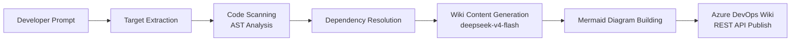

# Documentation Copilot — Project Outline

> The Documentation Copilot is a Foundry Hosted Agent that generates Azure DevOps Wiki entries for Python codebases directly from the developer's IDE. A developer types "update the wiki for `MyFunction` to capture the latest changes", the agent scans the locally cloned repository, extracts function/class metadata via AST analysis, resolves dependencies, generates structured Markdown with Mermaid workflow diagrams, and publishes the result to Azure DevOps Wiki via REST API.
>
> The architecture is a single-agent, single-container design deployed through the **Foundry Toolkit for Visual Studio Code** extension and the **Azure Developer CLI (azd)** with the `microsoft.foundry` and `azure.ai.skills` extensions. The repository is the source of truth; the runtime is Foundry.
>
> This file is the contract. It defines the modules, the data shapes, the boundary between code analysis and LLM generation, what we will prove before we declare the project done, **and the full end-to-end development journey** from `azd ai agent init` through `azd deploy` to status polling and agent invocation. The implementation scaffold is in place; the phased implementation plan is defined below.
>
> **Bootstrap template:** This project adopts the exact same agent creation, testing, and deployment workflow as `project-identity-security-copilot-v2`, adapted for a single-agent documentation use case.

---

## 1. What we are building

The Documentation Copilot bridges the gap between source code and documentation by automating the most tedious part of developer documentation: writing and maintaining Azure DevOps Wiki entries that accurately reflect the current state of the codebase.

### Core workflow



### What the agent does

1. **Accepts natural-language prompts** such as:
   - "update the wiki for `calculate_total` to capture the latest changes"
   - "create a new wiki for `AuthService` class"
   - "document the `parse_config` function"

2. **Scans the locally cloned repository** using Python's `ast` module for static code analysis. Extracts:
   - Functions: name, signature, parameter types, return type, decorators, docstring
   - Classes: name, base classes, decorators, methods, docstring
   - Imports: internal vs external dependency classification

3. **Generates comprehensive Azure DevOps Wiki entries** containing:
   - Module overview (via deepseek-v4-flash)
   - Formatted function and class tables with parameter types
   - Internal and external dependency lists
   - Mermaid workflow diagrams (`classDiagram`, `sequenceDiagram`, `graph TD`) for complex modules

4. **Publishes to Azure DevOps Wiki** via REST API with:
   - PAT-based authentication (Wiki Read & Write scope)
   - ETag-based version tracking for safe concurrent edits
   - Structured page path convention: `API-Reference/{TargetName}/{ModuleName}`

### Key architectural decision: No LLM tool calling

deepseek-v4-flash does **not** support tool calling. The agent architecture handles this by performing all non-LLM work in Python code:

- Code scanning → `ast` module (stdlib, no network)
- Dependency resolution → heuristic prefix matching (stdlib, no network)
- Wiki API calls → `requests` + PAT auth (network, handled before/after LLM)
- Diagram generation → string templating (stdlib, no network)
- The LLM is called only for **prose generation** — turning structured metadata into readable documentation paragraphs.

This mirrors the pattern in the v1 Identity Security Copilot, where retrieval happens in Python before the LLM is asked to reason about evidence.

---

## 2. Repository layout (scaffold)

```text
project-documentation-copilot/
├── OUTLINE.md                                    # this file
├── README.md                                     # quick orientation + azd journey
├── blog.md                                       # narrative walkthrough of the full journey
├── PYTHON-FOR-POWERSHELL.md                      # Python patterns for PowerShell engineers
├── azure.yaml                                    # azd project manifest (services + toolbox + skills)
├── requirements.txt                              # project dependencies
├── .gitignore
├── docs/
│   ├── feasibility-research.md                   # technical feasibility findings
│   ├── azd-journey.md                            # end-to-end azd commands
│   ├── connector-design.md                       # Azure DevOps REST API connector design
│   └── wiki-documentation-schema.md              # wiki entry format specification
├── infra/
│   ├── main.bicep                                # infrastructure-as-code: AI Services, Search, Log Analytics
│   └── parameters.dev.json
├── knowledge/                                    # agent grounding knowledge
│   ├── wiki-format-guide.md                      # wiki page structure reference
│   ├── mermaid-templates.md                      # Mermaid diagram templates (ADO Wiki compatible)
│   └── ado-api-reference.md                      # Azure DevOps REST API quick reference
├── skills/                                       # Foundry Skills
│   ├── wiki-authoring/SKILL.md                   # guidelines for wiki content quality
│   └── code-analysis/SKILL.md                    # guidelines for code analysis accuracy
├── agents/
│   └── documentation-copilot/
│       ├── agent.manifest.yaml                   # Foundry Hosted Agent manifest
│       ├── agent.yaml                            # agent configuration (skills + toolbox)
│       ├── main.py                               # hosted agent HTTP server entry point
│       └── requirements.txt
├── mcp/                                          # Foundry MCP toolbox surfaces
│   ├── code-scanner/
│   │   ├── manifest.json
│   │   └── tools/
│   ├── wiki-publisher/
│   │   ├── manifest.json
│   │   └── tools/
│   └── diagram-generator/
│       ├── manifest.json
│       └── tools/
├── src/                                          # shared library code
│   ├── __init__.py
│   ├── app.py                                    # CLI entry point
│   ├── config.py                                 # AppConfig (environment-driven)
│   ├── requirements.txt
│   ├── rag/
│   │   ├── __init__.py
│   │   └── chat.py                               # LLM-augmented documentation generation
│   ├── scanner/                                  # code analysis module
│   │   ├── __init__.py
│   │   ├── python_parser.py                      # AST-based function/class extraction
│   │   ├── repo_walker.py                        # repository traversal and filtering
│   │   └── dependency_resolver.py                # import analysis and dependency graph
│   ├── wiki/                                     # wiki content generation
│   │   ├── __init__.py
│   │   ├── generator.py                          # wiki entry orchestration pipeline
│   │   ├── mermaid_builder.py                    # Mermaid diagram string generation
│   │   └── formatter.py                          # wiki markdown formatting
│   ├── ado/                                      # Azure DevOps connector
│   │   ├── __init__.py
│   │   ├── client.py                             # ADO Wiki REST API client
│   │   ├── wiki_service.py                       # wiki publish orchestration
│   │   └── auth.py                               # PAT-based authentication
│   ├── foundry/
│   │   ├── __init__.py
│   │   └── project_client.py                     # Foundry project client + completions
│   ├── security/
│   │   ├── __init__.py
│   │   └── masking.py                            # output scrubbing for secrets
│   └── workflow/
│       ├── __init__.py
│       └── provenance.py                         # structured event logging
└── tests/
    ├── __init__.py
    ├── test_python_parser.py                     # AST extraction unit tests
    ├── test_mermaid_builder.py                   # diagram generation tests
    ├── test_wiki_generator.py                    # formatting unit tests
    ├── test_ado_client.py                        # mock-based ADO client tests
    ├── test_chat_routing.py                      # prompt routing and target extraction
    └── test_repo_walker.py                       # repository traversal tests
```

---

## 3. Architecture diagram

```mermaid
graph TB
    subgraph IDE["Developer IDE"]
        PROMPT[User Prompt<br/>"update the wiki for ABC"]
    end

    subgraph AGENT["Documentation Copilot (Foundry Hosted Agent)"]
        CLI[app.py<br/>CLI Entry Point]
        ROUTE[Target Extraction<br/>regex heuristics]
        SCAN[scanner/repo_walker.py<br/>Repository Traversal]
        PARSE[scanner/python_parser.py<br/>AST Analysis]
        DEPS[scanner/dependency_resolver.py<br/>Dependency Graph]

        GEN[wiki/generator.py<br/>Wiki Content Pipeline]
        MB[wiki/mermaid_builder.py<br/>Diagram Generation]
        FMT[wiki/formatter.py<br/>Markdown Formatting]
        LLM[rag/chat.py<br/>LLM Prose Generation]

        PV[workflow/provenance.py<br/>Event Recording]
        MASK[security/masking.py<br/>Output Scrubbing]
    end

    subgraph FOUNDRY["Azure AI Foundry"]
        MODEL[deepseek-v4-flash<br/>Serverless API]
        TOOLBOX[Documentation Toolbox<br/>MCP Surfaces]
        SKILLS[Skills: wiki-authoring, code-analysis]
    end

    subgraph DEVOPS["Azure DevOps"]
        WIKI[Wiki REST API<br/>Pages CRUD]
    end

    PROMPT --> CLI
    CLI --> ROUTE
    ROUTE --> SCAN
    SCAN --> PARSE
    PARSE --> DEPS
    DEPS --> GEN
    GEN --> LLM
    GEN --> MB
    GEN --> FMT
    LLM <--> MODEL
    GEN --> PV
    PV --> MASK
    AGENT --> WIKI
    AGENT --> TOOLBOX
    AGENT --> SKILLS
```

The agent architecture is intentionally single-container: all code analysis, diagram generation, LLM integration, and DevOps API calls happen in-process. This keeps the deployment simple (one `azd deploy`), avoids cross-container authentication complexity, and is well-suited for a documentation use case where latency is acceptable.

---

## 4. Data shapes

### 4.1 Code metadata (extracted by AST)

```python
# src/scanner/python_parser.py

@dataclass(slots=True)
class FunctionInfo:
    name: str
    file_path: str
    line_number: int
    docstring: str | None
    decorators: list[str]
    parameters: list[ParamInfo]
    return_type: str | None

@dataclass(slots=True)
class ClassInfo:
    name: str
    file_path: str
    line_number: int
    docstring: str | None
    decorators: list[str]
    base_classes: list[str]
    methods: list[FunctionInfo]

@dataclass(slots=True)
class ModuleInfo:
    file_path: str
    functions: list[FunctionInfo]
    classes: list[ClassInfo]
    imports: list[str]
```

### 4.2 Wiki content model

```python
# src/wiki/formatter.py

@dataclass(slots=True)
class WikiSection:
    heading: str
    body: str

@dataclass(slots=True)
class WikiEntry:
    title: str
    sections: list[WikiSection]
```

### 4.3 Azure DevOps Wiki API models

```python
# src/ado/client.py

@dataclass(slots=True)
class WikiPage:
    path: str
    content: str
    version: str | None = None

@dataclass(slots=True)
class WikiPageResult:
    path: str
    status: str       # 'created', 'updated', 'unchanged', 'error'
    version: str | None
    error_message: str | None = None
```

### 4.4 Configuration

```python
# src/config.py

@dataclass(slots=True)
class AppConfig:
    azure_ai_project_endpoint: str
    azure_ai_chat_deployment: str   # 'deepseek-v4-flash'
    azure_devops_org_url: str
    azure_devops_project: str
    azure_devops_wiki_id: str
    target_repo_root: Path
```

---

## 5. Agent behaviour

### 5.1 Prompt routing

The CLI entry point (`src/app.py`) accepts natural-language prompts and extracts the target function/class name using regex heuristics:

| Prompt pattern | Extraction |
|---|---|---|
| "update the wiki for `ABC` function" | ABC |
| "create a new wiki for `XYZ` function" | XYZ |
| "document the `MyClass` class" | MyClass |
| "wiki for `handler`" | handler |
| "find the `walk_repository` function" | walk_repository |
| "function `MyParser` needs documentation" | MyParser |

If no target can be extracted, the agent returns a clear error asking the user to specify a `--target`.

### 5.2 Execution modes

| Mode | Flag | Behaviour |
|---|---|---|
| `auto` | `--mode auto` (default) | Scan → Generate → Publish |
| `scan-only` | `--mode scan-only` | Scan → Print findings (no publish) |
| `publish` | `--mode publish` | Force publish even if no changes detected |

### 5.3 Wiki page lifecycle

1. **Check existence:** `AdoWikiClient.get_page(path)` — returns `WikiPage` with `version` if exists, `None` if new.
2. **Generate content:** `wiki/generator.py` builds the full wiki markdown including diagrams.
3. **Create or update:** `AdoWikiClient.create_or_update_page(page)` — uses `If-Match` header when updating.
4. **Provenance record:** `workflow/provenance.py` logs the operation with correlation ID.

---

## 6. MCP toolbox design

Three MCP tool surfaces, exposed as one Foundry MCP toolbox, each mapped to a `src/` module:

| Surface | Backs onto | Tools |
|---|---|---|
| `code-scanner` | `src/scanner/` | `scan_repository`, `resolve_dependencies` |
| `wiki-publisher` | `src/ado/` | `publish_wiki_page`, `get_wiki_page`, `list_wiki_pages` |
| `diagram-generator` | `src/wiki/mermaid_builder.py` | `generate_class_diagram`, `generate_sequence_diagram` |

The toolbox surfaces provide governed access with narrow RBAC scopes. In the single-agent deployment, the agent imports the `src/` modules directly. The MCP toolbox enables future multi-agent or external MCP client integration without architectural change.

---

## 7. Skills design

Two skills, each a `SKILL.md` file in `skills/`:

| Skill | Purpose |
|---|---|
| `wiki-authoring` | Content quality standards, markdown compatibility rules, page path conventions, Mermaid constraints |
| `code-analysis` | Extraction standards, dependency resolution rules, safety constraints, metadata completeness requirements |

Skills are versioned and uploaded to Foundry via `azd ai skill create`. They are attached to the agent at startup and injected into the system prompt. The same skills are discoverable through the MCP toolbox if external clients connect.

---

## 8. Observability, security, and provenance

- **Provenance recording:** `src/workflow/provenance.py` emits structured JSON log lines for every scan, generation, and publish operation, all joined by `correlation_id`.
- **Application Insights:** Provisioned by `azd provision` via `infra/main.bicep`. Provenance events are queryable in the Foundry portal under Transaction Search.
- **Output masking:** `src/security/masking.py` redacts auth headers and token patterns from all output before display or logging.
- **PAT security:** The Azure DevOps PAT is read from `AZURE_DEVOPS_PAT` environment variable only. It is never stored in code, config files, or committed to the repository. The `auth.py` module encodes it in-memory only.
- **AST safety:** Code scanning is purely static (AST-based). No code is executed or imported. The scanner skips virtual environments, build directories, and cache folders.

---

## 9. The full end-to-end development journey (azd)

This section is the contract for **how** the project is built, deployed, and verified. Every step is a command the developer runs. The README and blog both walk this journey.

### 9.1 Prerequisites

- Python 3.13+
- Azure CLI 2.80+ (`az login`)
- Azure Developer CLI 1.25.3+ (`azd version`)
- `azd ext install microsoft.foundry`
- `azd ext install azure.ai.skills`
- Foundry Project Manager + Subscription Owner/User Access Administrator roles
- (Optional) Foundry Toolkit for VS Code

### 9.2 Step 1 — Scaffold (`azd ai agent init`)

```pwsh
azd ai agent init -m "https://github.com/microsoft-foundry/foundry-samples/blob/main/samples/python/hosted-agents/agent-framework/responses/01-basic/agent.manifest.yaml"
```

After the scaffold completes, set the subscription and location:

```pwsh
azd env set AZURE_SUBSCRIPTION_ID <subscription-id>
azd env set AZURE_LOCATION eastus2
```

Replace the sample `main.py` with `agents/documentation-copilot/main.py`. Update `agent.manifest.yaml` with the environment variables listed in the manifest.

### 9.3 Step 2 — Provision (`azd provision`)

```pwsh
azd provision
```

Creates: resource group, Foundry project, deepseek-v4-flash serverless deployment, Log Analytics, Application Insights, per-agent managed identity with Foundry User role.

### 9.4 Step 3 — Upload skills (`azd ai skill create`)

```pwsh
azd ai skill create wiki-authoring --file ./skills/wiki-authoring/SKILL.md --no-prompt -o json
azd ai skill create code-analysis --file ./skills/code-analysis/SKILL.md --no-prompt -o json
azd ai skill list -o table
```

### 9.5 Step 4 — Publish toolbox (`azd ai toolbox publish`)

```pwsh
azd provision
azd ai toolbox publish
```

### 9.6 Step 5 — Test locally

```pwsh
# Terminal 1
azd ai agent run --no-inspector

# Terminal 2
azd ai agent invoke --local "scan-only: find the load_config function"
azd ai agent invoke --local "update the wiki for MyFunction to capture the latest changes"
```

```pwsh
# Or with pytest
pytest tests/ -v
```

### 9.7 Step 6 — Deploy (`azd deploy`)

```pwsh
azd deploy
```

### 9.8 Step 7 — Poll status (`azd ai agent show`)

Wait for `Status: active`.

### 9.9 Step 8 — Invoke deployed agent

```pwsh
azd ai agent invoke "update the wiki for calculate_total to capture the latest changes"
azd ai agent invoke "create a new wiki for AuthService class"
```

### 9.10 Step 9 — Verify

- Foundry Portal: <https://ai.azure.com> → Build → Agents → Open in playground
- Azure DevOps Wiki: verify new pages under `API-Reference/`
- Application Insights: verify `provenance` events present

### 9.11 Step 10 — Tear down

```pwsh
azd down
```

---

## 10. Implementation phases

The scaffold is the deliverable for this pass. Implementation follows the phases below, ordered so the system is testable at each step. Every phase includes a clear verification gate — nothing moves to the next phase until the current gate passes.

---

### Phase 0 — Verify scaffold

**Goal:** Confirm the scaffolded code compiles, imports resolve, and all data-shape contracts are correct.

**Steps:**

1. **Install dependencies**

   ```pwsh
   python -m venv .venv
   .venv\Scripts\Activate.ps1
   pip install -r requirements.txt
   pip install -r src/requirements.txt
   ```

2. **Run scaffold tests**

   ```pwsh
   pytest tests/ -v
   ```

   Expected: 25 passed, 0 failed.

3. **Verify imports resolve end-to-end**

   ```pwsh
   python -c "from src.config import AppConfig; from src.scanner.python_parser import parse_python_file; from src.ado.client import AdoWikiClient; from src.wiki.mermaid_builder import build_class_diagram"
   ```

   Expected: no `ModuleNotFoundError` or `ImportError`.

4. **Verify directory structure matches OUTLINE.md §2**

   ```pwsh
   Get-ChildItem -Recurse -Directory | Select-Object FullName
   ```

   Every folder listed in §2 must exist: `src/scanner/`, `src/wiki/`, `src/ado/`, `src/foundry/`, `agents/documentation-copilot/`, `mcp/code-scanner/`, `skills/wiki-authoring/`, etc.

**Verification gate:** `pytest tests/ -v` passes 25/25. All imports resolve. Directory structure is complete.

---

### Phase 1 — Create Azure infrastructure, managed identity, and credentials

**Goal:** Provision all Azure resources required by the copilot. Configure the agent's platform-assigned managed identity as the primary authentication mechanism to Azure DevOps, with PAT + Key Vault as a local-development fallback.

**Prerequisites:**

- Azure subscription with Contributor + User Access Administrator rights
- Azure CLI 2.80+ (`az login` completed)
- Azure Developer CLI 1.25.3+ with `microsoft.foundry` and `azure.ai.skills` extensions
- An Azure DevOps project with Wiki enabled
- Microsoft Entra ID tenant connected to the Azure DevOps organization
- An Azure DevOps Project Collection Administrator to add the managed identity to the organization (step 7 below)

**Steps:**

1. **Create resource group**

   ```pwsh
   $rg = "rg-documentation-copilot-dev"
   $location = "westus3"
   $kvName = "kv-doccopilot-dev"
   az group create --name $rg --location $location
 
2. **Create Azure AI Foundry project**

   A Foundry project is a sub-resource of a Cognitive Services account. Two steps are required: create the account with a custom domain, then create the project under it.

   **2a — Create the Cognitive Services account with `CustomSubDomainName`** (required before projects can be created):

   ```pwsh
   az cognitiveservices account create `
     --name "cog-doccopilot-dev" `
     --resource-group $rg `
     --kind "AIServices" `
     --sku S0 `
     --location $location `
     --custom-domain "cog-doccopilot-dev01" `
     --yes
   ```

   The `--custom-domain` flag sets the `CustomSubDomainName` property on the account. Without it, `az cognitiveservices account project create` fails with `BadRequest: Account must set CustomSubDomainName before creating projects.`

   Record the account endpoint: `az cognitiveservices account show --name "cog-doccopilot-dev" -g $rg --query "properties.endpoint" -o tsv`

   **2b — Create the Foundry project under the account:**

   ```pwsh
   az cognitiveservices account project create `
     --resource-group $rg `
     --name "cog-doccopilot-dev" `
     --project-name "doccopilot" `
     --location $location `
     --display-name "Documentation Copilot" `
     --description "Foundry project for the Documentation Copilot agent"
   ```

   The project name (`doccopilot`) is distinct from the account name and is used in resource IDs of the form `/subscriptions/.../accounts/cog-doccopilot-dev/projects/doccopilot`. This is the value passed to `--project-id` in step 5.

    After creating the project, record its endpoint (this is what `AIProjectClient` uses, NOT the account endpoint):

    ```pwsh
    $projectEndpoint = az cognitiveservices account project show `
      --name "cog-doccopilot-dev" `
      -g $rg `
      --project-name "doccopilot" `
      --query "properties.projectEndpoint" -o tsv
    Write-Output "Project endpoint: $projectEndpoint"
    # Expected format: https://<account>.services.ai.azure.com/api/projects/doccopilot
    ```

    This endpoint is used as `AZURE_AI_PROJECT_ENDPOINT` in all local testing and deployment commands.

3. **Deploy deepseek-v4-flash model**

   ```pwsh
   az cognitiveservices account deployment create `
     --name "cog-doccopilot-dev" `
     -g $rg `
     --deployment-name "DeepSeek-V4-Flash" `
     --model-name "DeepSeek-V4-Flash" `
     --model-format "DeepSeek" `
     --model-version "2026-04-23" `
     --capacity 1 `
     --sku-name "GlobalStandard"
   ```

   Verify: `az cognitiveservices account deployment show --name "cog-doccopilot-dev" -g $rg --deployment-name "deepseek-v4-flash" --query "properties.provisioningState" -o tsv` → `Succeeded`

4. **Grant the deployment contributor access to the Foundry project**

   ```pwsh
   $projectId = az cognitiveservices account show --name "cog-doccopilot-dev" -g $rg --query id -o tsv
   az role assignment create `
     --assignee '<your-user-object-id> '`
     --role "Cognitive Services OpenAI User" `
     --scope $projectId
   ```

5. **Register the agent with an existing Foundry project**
   Run this now to create the platform-assigned managed identity. The `azd ai agent init` command requires an **AgentManifest template** (with `template:` and `resources:` fields), not our local deployment manifest. Use the official Foundry sample URL (same approach as the v2 template) and pass the **existing Foundry project resource ID** via `--project-id` to skip project creation:

   First, get the Foundry project resource ID (the project created in step 2b — the path must end in `/projects/{name}`):

   ```pwsh
   $projectResourceId = az cognitiveservices account project show `
     --name "cog-doccopilot-dev" `
     -g $rg `
     --project-name "doccopilot" `
     --query id -o tsv
   Write-Output "Project resource ID: $projectResourceId"
   # Expected format: /subscriptions/<sub>/resourceGroups/<rg>/providers/Microsoft.CognitiveServices/accounts/cog-doccopilot-dev/projects/doccopilot
   ```

   Then register the agent against that existing project:

   ```pwsh
   azd ai agent init `
     -m "https://github.com/microsoft-foundry/foundry-samples/blob/main/samples/python/hosted-agents/agent-framework/responses/01-basic/agent.manifest.yaml" `
     --project-id $projectResourceId `
     --deploy-mode code `
     --runtime python_3_13 `
     --entry-point main.py `
     --agent-name "documentation-copilot" 
   ```

   After `azd ai agent init` completes, replace the generated files with our project's versions:
   - Replace `agents/documentation-copilot/main.py` with the scaffolded version
   - Replace `agents/documentation-copilot/agent.manifest.yaml` with the deployment manifest (the `-m` template is only for scaffolding)
   - Update `azure.yaml` to include the `toolbox:` and `skills:` blocks

   ```pwsh
   # Step 5b — Provision infrastructure (creates Foundry agent resource + tags)
   azd provision

   # Step 5c — Deploy agent code
   azd deploy
   ```

   If `azd ai agent init` has already been run previously, you can skip to `azd provision && azd deploy`.

6. **Add the managed identity to Azure DevOps** (performed by a Project Collection Administrator)

   The platform-assigned managed identity must be added as a user in Azure DevOps to obtain access tokens. This is done through the Azure DevOps portal or the `ServicePrincipalEntitlements` REST API.

   **Portal method:**
   - Navigate to Organization Settings → Users → Add users
   - **Search for the managed identity by its display name** (derived from the Foundry agent resource name) or by pasting the object ID
      - (this is very important, adding the managed identity as the object ID does not work)
   - Assign access level: **Basic** (required for API access; Stakeholder does not grant repository or API permissions)
   - Assign project access: select the target project(s) with **Wiki Read & Write** permissions
   - Complete the invitation

   **Programmatic method** (repeatable for CI/CD):

   ```pwsh
   # Requires PAT of the PCA for this call only (or delegated Entra token)
   $pat = Read-Host -AsSecureString "Enter PCA PAT"
   $base64Pat = [Convert]::ToBase64String([Text.Encoding]::UTF8.GetBytes(":$pat"))

   $body = @{
      principal = @{
         displayName = "doc-copilot-agent"
         originId = $agentPrincipalId
         principalType = "application"
      }
   } | ConvertTo-Json

   Invoke-RestMethod -Uri "https://vsaex.dev.azure.com/{org}/_apis/ServicePrincipalEntitlements?api-version=7.1-preview.1" `
     -Method Post `
     -ContentType "application/json" `
     -Headers @{Authorization = "Basic $base64Pat"} `
     -Body $body
   ```

7. **Grant Wiki Write permission** in Azure DevOps

   By default, new users (including service principals) get the same permissions as project contributors. If stricter Wiki permissions are needed:
   - Navigate to Project Settings → Repositories → Wiki
   - Add the managed identity with **Contribute** and **Edit wiki pages** permissions
   - Or use the Azure DevOps CLI or REST API for programmatic assignment

8. **Configure Key Vault access policy for the agent's managed identity**  
   Grant the managed identity access to read the PAT secret (used as fallback during local development):

   ```pwsh
   az keyvault set-policy --name $kvName --object-id $agentPrincipalId --secret-permissions get list
   ```

9. **(Local development only) Store the Azure DevOps PAT in Key Vault**

   Skip this step for production deployments — the managed identity path is the production mechanism. For local development (running outside Foundry, e.g. from a developer workstation), create a PAT:

   ```pwsh
   $pat = Read-Host -AsSecureString "Enter Azure DevOps PAT (Wiki Read & Write scope)"
   az keyvault secret set --vault-name $kvName --name "AzureDevOpsPat" --value $pat
   ```

   The PAT is never written to disk, environment variables, or committed files. It lives only in Key Vault.

10. **Set environment variables for local development**

    Create `.env` (do NOT commit):

      ```env
     AZURE_AI_PROJECT_ENDPOINT=https://cog-doccopilot-dev.services.ai.azure.com/api/projects/doccopilot
     AZURE_AI_CHAT_DEPLOYMENT=deepseek-v4-flash
     AZURE_DEVOPS_ORG_URL=https://dev.azure.com/myorg
     AZURE_DEVOPS_PROJECT=myproject
     AZURE_DEVOPS_WIKI_ID=myproject.wiki
     TARGET_REPO_ROOT=C:\Repo\vsCode
     ```

     Add `.env` to `.gitignore` if not already present.

11. **Verify Azure connectivity**

    ```pwsh
    $env:AZURE_AI_PROJECT_ENDPOINT = $projectEndpoint
    $env:AZURE_DEVOPS_ORG_URL = "https://dev.azure.com/placeholder"
    $env:AZURE_DEVOPS_PROJECT = "placeholder"
    $env:AZURE_DEVOPS_PAT = "placeholder"
    python -c "from src.foundry.project_client import list_deployment_names; from src.config import AppConfig; c=AppConfig.from_env(); print(list_deployment_names(c))"
    ```

    Expected: the output includes `deepseek-v4-flash`. The ADO env vars use placeholder values because this test only checks Foundry connectivity — the ADO connector is tested separately in Phase 4.

**Authentication architecture note:** The Python connector (`src/ado/auth.py`) implements a two-tier auth strategy:

- **Runtime (in Foundry):** `DefaultAzureCredential()` acquires a Bearer token for scope `https://app.vssps.visualstudio.com/.default`. The platform-assigned managed identity is automatically picked up — no secrets needed.
- **Local development:** Falls back to PAT-based Basic auth (fetched from Key Vault or `AZURE_DEVOPS_PAT` environment variable) when no managed identity is available.
- The REST API calls in `src/ado/client.py` use `Authorization: Bearer {token}` when a Bearer token is available, falling back to `Authorization: Basic {base64pat}` otherwise.

This follows Microsoft's [official guidance for service principal and managed identity authentication in Azure DevOps](https://learn.microsoft.com/en-us/azure/devops/integrate/get-started/authentication/service-principal-managed-identity?view=azure-devops).

**Verification gate:** Azure resources exist, deepseek-v4-flash responds to API calls, the managed identity is added to Azure DevOps with Wiki Write permissions, the Key Vault access policy is configured, and local env vars point to real resources.

---

### Phase 2 — Local scanner (code analysis)

**Goal:** Implement and verify the AST-based code scanner against a real repository. The scanner must accurately extract functions, classes, signatures, type annotations, decorators, docstrings, and imports.

**Files to implement:**

- `src/scanner/python_parser.py` — `_CodeVisitor` AST walker
- `src/scanner/repo_walker.py` — directory traversal with exclusion patterns
- `src/scanner/dependency_resolver.py` — import-based dependency graph

**Steps:**

1. **Implement `python_parser.py`**  
   The `_CodeVisitor(ast.NodeVisitor)` class must override:
   - `visit_FunctionDef` — extract `FunctionInfo` (name, file_path, line_number, docstring, decorators, parameters with types and defaults, return_type)
   - `visit_ClassDef` — extract `ClassInfo` (name, base_classes, methods as `FunctionInfo[]`, decorators)
   - `visit_Import` / `visit_ImportFrom` — accumulate import strings
   - Handle `SyntaxError` for parser errors — log warning and skip

2. **Verify parser on the project's own source code**

   ```pwsh
   $env:TARGET_REPO_ROOT = "."
   python -c "
   from src.scanner.repo_walker import walk_repository
   from pathlib import Path
   modules = walk_repository(Path('.') / 'src')
   print(f'Modules found: {len(modules)}')
   for m in modules:
       for f in m.functions:
           print(f'  def {f.name}(...) -> {f.return_type}')
       for c in m.classes:
           print(f'  class {c.name}')
   "
   ```

   Expected: all source modules discovered, functions and classes from the scaffold visible.

3. **Implement `repo_walker.py`**  
   - `walk_repository(root, exclude_patterns)` — recursive `rglob('*.py')`, skip excluded dirs
   - `scan_target(target_name, modules)` — filter modules by function/class name
   - Handle `UnicodeDecodeError` for binary files — skip and log

4. **Implement `dependency_resolver.py`**  
   - Parse import list from each `ModuleInfo`
   - Classify as internal (project namespace) or external (third-party/stdlib)
   - `get_dependencies_for_module()` returns `(internal, external)` tuples

5. **Test scan-only mode end-to-end**

   ```pwsh
   $env:TARGET_REPO_ROOT = "C:\Repo\vsCode"
   python -m src.app --prompt "find the walk_repository function" --mode scan-only
   ```

   Expected output:

   ```text
   --- src/scanner/repo_walker.py ---
     def walk_repository(root: Path, exclude_patterns: set[str] | None = None) -> list[ModuleInfo]
     def scan_target(target_name: str | None | None, modules: list[ModuleInfo]) -> list[ModuleInfo]
   Found 1 matching module(s).
   ```

6. **Edge case tests**
   - Empty repository (no `.py` files): return empty list
   - Repository with only `SyntaxError` files: skip and log, return empty
   - Repository with deeply nested packages: all discovered
   - Target name that doesn't exist: return empty list, no crash
   - Case-sensitive matching: "processData" ≠ "ProcessData"

**Verification gate:** `pytest tests/test_python_parser.py tests/test_repo_walker.py -v` passes. Scan-only mode works against a real repository. Dependency resolver correctly classifies internal vs external imports.

---

### Phase 3 — Wiki generation (content pipeline)

**Goal:** Implement the pipeline that transforms scanned code metadata into Azure DevOps Wiki-compatible markdown with Mermaid diagrams.

**Files to implement:**

- `src/wiki/formatter.py` — `WikiEntry`, `WikiSection`, table formatting
- `src/wiki/mermaid_builder.py` — `classDiagram`, `sequenceDiagram`, `graph TD` generators
- `src/wiki/generator.py` — orchestration: build entry, add sections, format output

**Steps:**

1. **Implement `formatter.py`**  
   - `format_wiki_markdown(entry: WikiEntry) -> str` — renders H1 title + H2 sections
   - `format_input_output_table(params)` — renders a `| Parameter | Type | Description |` table
   - `format_dependency_list(internal, external)` — renders internal/external sections
   - All output must be Azure DevOps Wiki compatible Markdown

2. **Verify formatter output**

   ```pwsh
   python -c "
   from src.wiki.formatter import WikiEntry, WikiSection, format_wiki_markdown
   entry = WikiEntry(
       title='Test Module',
       sections=[
           WikiSection('Functions', '### `foo()`'),
           WikiSection('Workflow Diagrams', '::: mermaid\ngraph TD\n    A --> B\n:::'),
       ],
   )
   print(format_wiki_markdown(entry))
   "
   ```

   Expected:

   ```markdown
   # Test Module

   ## Functions

   ### `foo()`

   ## Workflow Diagrams

   ::: mermaid
   graph TD
       A --> B
   :::
   ```

3. **Implement `mermaid_builder.py`**  
   - `build_class_diagram(classes)` — generates Mermaid `classDiagram` with class boxes and inheritance arrows
   - `build_sequence_diagram(functions)` — generates `sequenceDiagram` with role-inferred participants
   - `wrap_mermaid_diagram(diagram)` — wraps in `::: mermaid` ... `:::` fence
   - Important: use `graph` NOT `flowchart`; use `---->` NOT `-->>`; no HTML tags

4. **Verify diagram output against known constraints**

   ```pwsh
   python -c "
   from src.wiki.mermaid_builder import build_class_diagram, wrap_mermaid_diagram
   from src.scanner.python_parser import ClassInfo, FunctionInfo
   cls = ClassInfo(name='AuthService', file_path='a.py', line_number=1, docstring='Auth', decorators=[], base_classes=['BaseService'], methods=[])
   result = wrap_mermaid_diagram(build_class_diagram([cls]))
   print(result)
   assert 'classDiagram' in result
   assert 'AuthService' in result
   assert 'BaseService <|-- AuthService' in result
   print('Mermaid constraint checks passed')
   "
   ```

5. **Implement `generator.py`**  
   - `generate_wiki_content(module, settings) -> str` — orchestrates the full pipeline:
     1. Build overview from module metadata
     2. Add Module Path section
     3. Resolve and add Dependencies section
     4. Build Functions section with parameter tables for each function
     5. Build Classes section with method tables for each class
     6. Build Mermaid diagrams for complex modules (3+ functions or 2+ classes)
     7. Return formatted markdown

6. **Verify generator against a real module**

   ```pwsh
   python -c "
   from pathlib import Path
   from src.scanner.repo_walker import walk_repository
   from src.wiki.generator import generate_wiki_content
   from src.config import AppConfig
   import os; os.environ['TARGET_REPO_ROOT'] = '.'
   modules = walk_repository(Path('src/scanner'))
   for mod in modules[:1]:
       content = generate_wiki_content(mod, AppConfig.from_env())
       print(content[:500])
       assert content.strip(), 'generate_wiki_content returned empty string'
       assert '# Module:' in content, 'Missing module title heading'
       print(f'--- Module: {mod.file_path} ---')
       print(f'  Functions: {len(mod.functions)}')
       print(f'  Classes:   {len(mod.classes)}')
       # Extract generated section headings
       headings = [line for line in content.splitlines() if line.startswith('## ')]
       print(f'  Sections:  {len(headings)} ({', '.join(h.strip('# ') for h in headings)})')
   "
   ```

**Verification gate:** `pytest tests/test_mermaid_builder.py tests/test_wiki_generator.py -v` passes. Generated wiki content contains all required sections. Mermaid diagrams use Azure DevOps Wiki-compatible syntax.

---

### Phase 4 — Azure DevOps connector (wiki publishing)

**Goal:** Implement the REST API client that creates and updates wiki pages on Azure DevOps, with PAT authentication, ETag-based versioning, and Key Vault integration.

**Files to implement:**

- `src/ado/auth.py` — PAT retrieval from env (dev) / Key Vault (production)
- `src/ado/client.py` — `AdoWikiClient` with GET/PUT/DELETE operations
- `src/ado/wiki_service.py` — `update_wiki_for_target()` orchestration

**Steps:**

1. **Implement `auth.py`**  
   - `get_auth_header() -> dict[str, str]` — reads `AZURE_DEVOPS_PAT` env var, returns Basic auth header
   - For production: add an optional `get_auth_header_from_keyvault(vault_url)` that uses `DefaultAzureCredential` + `SecretClient` to fetch the PAT from Key Vault
   - Never log or print the PAT. The `masking.py` module redacts it from output.

2. **Implement `client.py`**  
   - `AdoWikiClient.__init__(org_url, project, wiki_id)` — stores base URL, creates `requests.Session` with auth and content-type headers
   - `get_page(path) -> WikiPage | None` — GET with `includeContent=true`, returns existing page with ETag version, or `None` for 404
   - `create_or_update_page(page: WikiPage) -> WikiPageResult` — PUT with optional `If-Match` header. Returns `status: 'created'` (201) or `status: 'updated'` (200) or `status: 'error'`
   - `delete_page(path) -> bool` — DELETE, returns `True` if deleted
   - `list_pages(recursion_level) -> list[dict]` — GET with full recursion

3. **Test against a real Azure DevOps wiki using the dev PAT**

   ```pwsh
   $env:AZURE_DEVOPS_ORG_URL = "https://dev.azure.com/myorg"
   $env:AZURE_DEVOPS_PROJECT = "myproject"
   $env:AZURE_DEVOPS_WIKI_ID = "myproject.wiki"
   $env:AZURE_DEVOPS_PAT = "<pat>"
   python -c "
   import os
   from src.ado.client import AdoWikiClient, WikiPage

   org_url = os.environ['AZURE_DEVOPS_ORG_URL']
   project = os.environ['AZURE_DEVOPS_PROJECT']
   wiki_id = os.environ['AZURE_DEVOPS_WIKI_ID']
   client = AdoWikiClient(org_url, project, wiki_id)
   # Create a test page
   result = client.create_or_update_page(WikiPage(path='DocCopilot-Test/test-page', content='# Test\nCreated by DocCopilot.'))
   print(f'Create: {result.status}')
   # Read it back
   page = client.get_page('DocCopilot-Test/test-page')
   print(f'Read: {page is not None}, version={page.version}')
   # Update it
   result = client.create_or_update_page(WikiPage(path='DocCopilot-Test/test-page', content='# Test\nUpdated by DocCopilot.', version=page.version))
   print(f'Update: {result.status}')
   # Clean up
   deleted = client.delete_page('DocCopilot-Test/test-page')
   operation = 'deleted' if deleted else 'not found'
   print(f'Cleanup: {operation}')
   "
   ```

   Expected: Create: created → Read: True, version="abc123" → Update: updated → Cleanup: deleted

4. **Implement `wiki_service.py`**  
   - `update_wiki_for_target(target_name, settings) -> list[str]` — orchestrates:
     1. `walk_repository(settings.target_repo_root)` — get all modules
     2. `scan_target(target_name, modules)` — filter matching modules
     3. For each module: `generate_wiki_content(module, settings)` — get wiki markdown
     4. Build path: `API-Reference/{target_name}/{module_basename}`
     5. Check if page exists (get_page)
     6. `create_or_update_page()` with version if updating, without if creating
     7. Return list of published paths
   - Log every operation with `record_event()` from `src/workflow/provenance.py`

5. **Run the full publish pipeline against a real wiki**

   ```pwsh
   $env:TARGET_REPO_ROOT = "C:\Repo\vsCode\project-documentation-copilot"
   python -m src.app --prompt "update the wiki for parse_python_file" --mode auto
   ```

   Expected: Wiki page created at `API-Reference/parse_python_file/python_parser` with Overview, Module Path, Dependencies, Functions, and Workflow Diagrams sections.

6. **Test error handling scenarios**
   - **Invalid PAT (401):** `WikiPageResult(status='error', error_message='401 Client Error: Unauthorized')` — no crash, clear error message
   - **Page not found:** `get_page()` returns `None` — wiki_service creates new page
   - **Concurrent edit conflict (412):** If ETag mismatch, log warning and retry with fresh version
   - **Empty repository:** `scan_target()` returns empty list — wiki_service returns empty list, no publish attempted

**Verification gate:** `pytest tests/test_ado_client.py -v` passes. Real ADO wiki can be created, read, updated, and deleted via the client. Full `--mode auto` pipeline publishes a wiki page with all required sections.

---

### Phase 5 — Foundry LLM integration

**Goal:** Wire the deepseek-v4-flash model into the generation pipeline so functions and classes receive narrative prose descriptions.

**Files to implement:**

- `src/foundry/project_client.py` — `complete_with_foundry()`, `open_project_client()`, `list_deployment_names()`
- `src/rag/chat.py` — `DOCUMENTATION_SYSTEM_PROMPT`, `generate_function_description()`, `generate_class_description()`, `generate_module_overview()`

**Steps:**

1. **Implement `foundry/project_client.py`**  
   - `open_project_client(settings)` — context manager that opens `AIProjectClient` with `DefaultAzureCredential`
   - `list_deployment_names(settings)` — list all model deployments, verify deepseek-v4-flash is present
   - `complete_with_foundry(system_prompt, user_input, settings) -> str` — single-turn completion via `Responses API`
   - Pre-flight check: the configured deployment exists — raise `RuntimeError` with sorted available deployments if missing

2. **Verify Foundry connectivity**

   ```pwsh
   $env:AZURE_AI_PROJECT_ENDPOINT = $projectEndpoint
   $env:AZURE_AI_CHAT_DEPLOYMENT = "DeepSeek-V4-Flash"
   python -c "
   from src.config import AppConfig
   from src.foundry.project_client import complete_with_foundry
   c = AppConfig.from_env()
   result = complete_with_foundry('You are a test assistant. Reply in one sentence.', 'Say hello.', c)
   print(result)
   "
   ```

   Expected: a single-sentence greeting from the model.

3. **Implement `rag/chat.py`**  
   - `DOCUMENTATION_SYSTEM_PROMPT` — see OUTLINE.md §4 for the full prompt
   - `generate_function_description(func, settings) -> str` — builds a prompt with the function's metadata (name, params, return type, decorators, docstring), calls `complete_with_foundry`, returns prose description
   - `generate_class_description(cls, settings) -> str` — same for classes, including methods table
   - `generate_module_overview(module, settings) -> str` — high-level module summary

4. **Test LLM-augmented generation**

   ```pwsh
   python -c "
   from src.scanner.repo_walker import walk_repository
   from src.scanner.python_parser import parse_python_file
   from src.rag.chat import generate_function_description
   from src.config import AppConfig
   from pathlib import Path
   import os
   module = parse_python_file(Path('src/scanner/python_parser.py'))
   for func in module.functions[:2]:
       desc = generate_function_description(func, AppConfig.from_env())
       print(f'=== {func.name} ===')
       print(desc[:600])
       print()
   "
   ```

   Expected: meaningful, technical descriptions of each function. Not placeholder text. Descriptions reference the function's actual parameters and return type.

5. **Verify prose augmentation in the generator pipeline**
   Ensure `wiki/generator.py` passes code metadata through `rag/chat.py` for the Overview narrative and function descriptions. The generator should call the LLM once per function for its description, and once for the module overview.

6. **Token budget and latency monitoring**
   - Log token usage after each `complete_with_foundry` call: `logger.info('LLM call: %s chars, %d tokens (est.)', len(user_input), len(user_input) // 4)`
   - Track latency: `start = time.perf_counter()` → `duration = time.perf_counter() - start`
   - Budget for a module with 5 functions + 2 classes: ~7 LLM calls, ~15s total latency with deepseek-v4-flash

**Verification gate:** deepseek-v4-flash responds correctly. LLM descriptions are technical, accurate, and reference real metadata. The generator pipeline includes prose from the LLM. Token usage and latency are logged per call.

---

### Phase 6 — Agent packaging and deployment to Foundry

**Goal:** Package the copilot as a Foundry Hosted Agent, deploy via `azd`, and verify it operates correctly in the cloud.

**Files to create/update:**

- `agents/documentation-copilot/main.py` — HTTP server entry point
- `agents/documentation-copilot/agent.manifest.yaml` — deployment config
- `azure.yaml` — azd project manifest

**Steps:**

1. **Implement the agent HTTP server** in `agents/documentation-copilot/main.py`

   ```text
   POST /responses
   Content-Type: application/json

   {"input": "update the wiki for load_config", "mode": "auto"}
   →
   {"status": "success", "target": "load_config", "pages_published": 1, "pages": [...], "correlation_id": "..."}
   ```

   - `do_POST` — parse JSON body, extract `input` and `mode`, call `handle_request()`
   - `handle_request()` — extracts target from prompt, sets `TARGET_REPO_ROOT` from env, runs the scan → generate → publish pipeline
   - `do_GET /health` — returns `{"status": "healthy"}`
   - Listen on `PORT` env var (default 8088)
   - All responses are JSON, wrapped in provenance-correlated envelope

2. **Update `agent.manifest.yaml`**
   - `runtime: python_3_13`
   - `entry_point: ["python", "main.py"]`
   - `dependency_resolution: remote_build`
   - `deploy_mode: code`
   - `environment_variables:` — list all 6 env vars (project endpoint, chat deployment, ADO org, project, wiki ID, target repo root)

3. **Run the agent locally**

   ```pwsh
   # Terminal 1
   $env:PORT = 8088
   python agents/documentation-copilot/main.py

   # Terminal 2
   curl -X POST http://localhost:8088/responses -H "Content-Type: application/json" -d '{"input": "scan-only: find the parse_python_file function", "mode": "scan-only"}'
   curl -X POST http://localhost:8088/responses -H "Content-Type: application/json" -d '{"input": "update the wiki for parse_python_file", "mode": "auto"}'
   curl http://localhost:8088/health
   ```

   Expected: scan-only returns JSON with function metadata. Auto mode creates a wiki page. Health returns `{"status": "healthy"}`.

4. **Run the full azd deployment journey**

   ```pwsh
   # Initialize the agent from the Foundry sample manifest
   # (creates <repo>/documentation-copilot/ with the sample agent files)
   azd ai agent init `
     -m "https://github.com/microsoft-foundry/foundry-samples/blob/main/samples/python/hosted-agents/agent-framework/responses/01-basic/agent.manifest.yaml"

   # Set subscription and region explicitly
   azd env set AZURE_SUBSCRIPTION_ID <subscription-id>
   azd env set AZURE_LOCATION <region>

   # Set application-specific environment variables
   azd env set AZURE_AI_PROJECT_ENDPOINT <your-project-endpoint>
   azd env set AZURE_DEVOPS_ORG_URL https://dev.azure.com/myorg
   azd env set AZURE_DEVOPS_PROJECT myproject
   azd env set AZURE_DEVOPS_WIKI_ID myproject.wiki

   # Provision (creates Foundry project, deepseek-v4-flash, ACR, managed identity, etc.)
   azd provision

   # Deploy
   azd deploy
   ```

   After `azd provision` succeeds, the generated `documentation-copilot/` folder contains the Foundry-provisioned agent. Copy our scaffold's `main.py` over the generated one to replace the sample with our HTTP server implementation:

   ```pwsh
   copy .\agents\documentation-copilot\main.py .\documentation-copilot\main.py
   azd deploy
   ```

5. **Monitor deployment status**

   ```pwsh
   azd ai agent show
   ```

   Poll until `Status: active`. If it stays in `creating` for >10 minutes:

   ```pwsh
   azd ai agent monitor --follow
   ```

   Common failure mode: `dependency_resolution: remote_build` fails on native wheels. Switch to `bundled`:

   ```pwsh
   azd ai agent init --no-prompt --deploy-mode code --dependency-resolution bundled
   azd deploy
   ```

6. **Upload skills**

   ```pwsh
   azd ai skill create wiki-authoring --file ./skills/wiki-authoring/SKILL.md --no-prompt -o json
   azd ai skill create code-analysis --file ./skills/code-analysis/SKILL.md --no-prompt -o json
   azd ai skill list -o table
   ```

   Skills are uploaded to the Foundry project-level skill registry, NOT into the deployment bundle. The bundle's `agent.yaml` binds skills by name to the agent at deploy time. At agent startup, Foundry injects each bound skill's content into the agent's system prompt.

7. **Publish MCP toolbox**

   ```pwsh
   azd provision
   azd ai toolbox publish
   ```

**Verification gate:** Agent starts locally and responds to HTTP requests. `azd deploy` completes successfully. `azd ai agent show` reports `Status: active`. Skills are uploaded and visible. Toolbox is published.

---

### Phase 6.5 — Deployment bundle mechanics

**Goal:** Document what actually ends up in the deployed agent container, because the deployment model is not obvious from the project layout.

**What `azd ai agent init` produced:**

The init command created a `documentation-copilot/` subdirectory at the project root with this layout:

```text
documentation-copilot/
├── azure.yaml                  # azd project manifest (services: documentation-copilot)
├── infra/                      # Bicep for Foundry project, ACR, identity, etc.
└── src/
    └── documentation-copilot/  # ← DEPLOYMENT BUNDLE (zipped by azd deploy)
        ├── main.py             # HTTP server entry point
        ├── agent.yaml          # Foundry agent definition (skills, models, env)
        ├── Dockerfile          # Container build (COPY . user_agent/)
        ├── requirements.txt    # agent-framework + agent-framework-foundry-hosting
        ├── .agentignore        # Files excluded from package
        └── README.md
```

**Critical alignment: the scaffold's `agents/documentation-copilot/` is NOT the deployment bundle.** The bundle is at `documentation-copilot/src/documentation-copilot/`. The scaffold's `agents/documentation-copilot/main.py` is a reference implementation; the actual deployed `main.py` lives in the bundle.

**Three things must be wired correctly for the deployed agent to work:**

1. **The `src/` library must be reachable from inside the container.**  
   The bundle's `main.py` does `from src.workflow.provenance import ...`. The `src/` library lives at the project root, not in the bundle. The current `main.py` has a `sys.path` hack that adds the project root — this works locally but breaks in the deployed container because the Dockerfile's `COPY . user_agent/` only copies the bundle. **Fix options:**
   - **Recommended:** Set `azure.yaml`'s `project:` field to `./` (the project root) so `azd deploy` packages everything including `src/`. Update `agent.yaml`'s `main.py` to use the project root as its CWD.
   - **Alternative:** Add a pre-deploy step that copies `src/` into the bundle directory:
     ```pwsh
     xcopy /E /I /Y src documentation-copilot\src\documentation-copilot\src
     ```
   - **Alternative:** Build `src/` as a wheel, add `pip install ./src` to the bundle's `requirements.txt`, and rename imports to a proper package.

2. **Skills are uploaded to the Foundry registry, not bundled.**  
   The `skills/` folder at the project root is NOT included in the deployment package. The `SKILL.md` files are uploaded via `azd ai skill create` to the project-level skill registry. The bundle's `agent.yaml` `skills:` block binds skills to the agent by name. The `file:` paths in `agent.yaml` are informational metadata for the local repo, not the runtime source of skill content.

3. **Environment variables are wired through `azure.yaml` → `agent.yaml`.**  
   The `azure.yaml` `config.deployments` block tells Foundry which model deployments to create (deepseek-v4-flash). The `agent.yaml` `environment_variables` block declares the runtime env vars (`AZURE_AI_MODEL_DEPLOYMENT_NAME` etc.). Application-specific vars (`AZURE_AI_PROJECT_ENDPOINT`, `AZURE_DEVOPS_ORG_URL`, etc.) must be added to `agent.yaml` `environment_variables` for the deployed agent to access them — they are not in the current scaffold-generated `agent.yaml`.

**Updating the bundle after code changes:**

Since the scaffold's `main.py` may change during development, the bundle's `main.py` must be kept in sync. The simplest workflow:

```pwsh
# After editing agents/documentation-copilot/main.py:
copy /Y agents\documentation-copilot\main.py documentation-copilot\src\documentation-copilot\main.py
azd deploy
```

Or, if the project layout is restructured so the bundle IS the project root (recommended), no copy step is needed — `azd deploy` packages whatever the `project:` field points to.

---

### Phase 7 — Real-world testing and validation

**Goal:** Prove the deployed agent works correctly against production Azure DevOps wikis, covering happy path, edge cases, error handling, and observability.

**Test scenarios:**

1. **Happy path — create new wiki for a function**

   ```pwsh
   azd ai agent invoke "create a new wiki for AdoWikiClient class"
   ```

   Verify in Azure DevOps:
   - Page exists at `API-Reference/AdoWikiClient/client`
   - Contains: Overview, Module Path, Dependencies, Functions table, Workflow Diagrams
   - Mermaid classDiagram shows `AdoWikiClient` with its methods
   - All function signatures match the actual code

2. **Happy path — update existing wiki**

   ```pwsh
   # Make a code change to the target function, then:
   azd ai agent invoke "update the wiki for AdoWikiClient to capture the latest changes"
   ```

   Verify: the wiki page is updated (check ETag changes in response). Content reflects the new code.

3. **Edge case — target not found**

   ```pwsh
   azd ai agent invoke "update the wiki for NonExistentFunction123"
   ```

   Expected response: `{"status": "no_target_found", "pages_published": 0, ...}`. No wiki page created. Logged at WARNING level.

4. **Edge case — ambiguous target (multiple modules)**

   ```pwsh
   azd ai agent invoke "update the wiki for load_config"
   ```

   If `load_config` exists in 2+ modules, the agent creates pages for ALL matching modules. Verify both pages exist with distinct content.

5. **Edge case — empty repository**
   Set `TARGET_REPO_ROOT` to an empty directory. The agent returns `{"status": "success", "pages_published": 0, ...}` with no error.

6. **Error handling — invalid PAT**
   Set `AZURE_DEVOPS_PAT` to an invalid value. The agent returns:

   ```json
   {"status": "error", "message": "Azure DevOps authentication failed. Verify AZURE_DEVOPS_PAT has Wiki Read & Write scope.", "correlation_id": "..."}
   ```

7. **Observability verification**

   ```pwsh
   # After running several test invocations, check Application Insights
   azd ai agent monitor --follow
   ```

   Expected provenance events visible:
   - `agent_request_received` with input text and mode
   - `agent_publish_started` with target name
   - `agent_publish_completed` with number of pages published
   - Correlation IDs join all events for a single request

8. **Performance baselines**
   Measure and record these timings:
   - **Cold start** (first invocation after deploy): < 30s
   - **Hot invocation** (subsequent): < 10s
   - **Code scan** (1000-file repo): < 2s
   - **Wiki publish** (single page): < 3s
   - **LLM prose generation** (per function): < 3s

9. **Wiki content quality checklist**
   For every generated wiki page, manually verify:
   - [ ] No placeholder text ("TODO", "TBD", "implement this")
   - [ ] Function signatures match actual code (parameter names, types, defaults)
   - [ ] Class methods are listed with correct signatures
   - [ ] Dependencies section correctly identifies internal vs external
   - [ ] Mermaid diagrams render correctly in the wiki (open the page in a browser)
   - [ ] Overview description is technically accurate and references the module's actual purpose
   - [ ] Parameter descriptions match the actual parameter behavior
   - [ ] Return type documentation matches the actual return type

10. **Regression test suite**

    ```pwsh
    # Run against the SAME target twice — the second run should update, not create
    azd ai agent invoke "create a new wiki for DependencyEdge"
    azd ai agent invoke "update the wiki for DependencyEdge"
    ```

    First run: `status: created`. Second run: `status: updated`.

**Verification gate:** All test scenarios pass. Wiki pages render correctly in Azure DevOps with all required sections and diagrams. Provenance events are queryable in Application Insights. Performance meets baselines.

---

### Phase 8 — Documentation and blog

**Goal:** Finalize all documentation files, publish `blog.md` with the complete narrative walkthrough, and ensure `docs/` files are accurate.

**Files to finalize:**

- `blog.md` — narrative walkthrough (published)
- `README.md` — quick start guide
- `docs/azd-journey.md` — update with any deviations from the planned journey
- `docs/connector-design.md` — update with production-learned details
- `docs/wiki-documentation-schema.md` — confirm schema is accurate

**Steps:**

1. **Update `blog.md`** with the full narrative covering:
   - Premise (why this project exists, the documentation decay problem)
   - Architecture walkthrough (see blog.md §"The two Azure services")
   - Full build process (each phase with commands and output)
   - Local testing procedures (pytest → scan-only → local agent HTTP)
   - Deployment steps (the complete azd journey)
   - Real-world testing results (include actual JSON responses, wiki page URLs)
   - Performance measurements
   - Failure modes encountered and resolutions

2. **Update `docs/azd-journey.md`** — ensure every command reflects the actual deployment experience. Add any troubleshooting entries discovered during Phase 7.

3. **Finalize `README.md`** — the quick start should take no more than 5 steps from clone to first invocation.

4. **Record a complete end-to-end session** in `blog.md`:
   - Start from a clean `azd down` state
   - Run every command in §9 from the OUTLINE.md
   - Capture the output verbatim (redacting PATs and secrets)
   - Include the wiki page URL as a live reference
   - Time each step and report durations

5. **Review the Definition of Done** in §11 against the actual system behaviour. If any criteria are not met, add a note to `blog.md` documenting the gap and the plan to close it.

**Verification gate:** `blog.md` contains a complete, honest walkthrough with actual commands and output. Every `docs/` file is accurate. The README provides a 5-step quick start that works on a clean machine.

---

## 11. Definition of done

The project is complete when all of the following hold:

- `pytest tests/ -v` passes all scaffolded tests.
- A developer can run `python -m src.app --prompt "update the wiki for Foo" --mode scan-only` and see correct function/class metadata for the target repo.
- A developer can run `python -m src.app --prompt "update the wiki for Foo" --mode auto` and see a new/updated wiki page in Azure DevOps.
- The wiki page contains: Overview, Module Path, Dependencies, Functions/Classes tables, and Mermaid diagrams where applicable.
- The full `azd` journey in §9 runs end-to-end on a clean machine.
- `azd down` cleanly tears down all resources.
- `blog.md` documents the complete journey with actual commands and observed output.

---

## 12. Out of scope

- Multi-agent topology (coordinator + specialists). This project is intentionally single-agent.
- Vector search or AI Search index for knowledge retrieval. The copilot analyzes source code directly, not a pre-built index.
- Web UI or IDE extension. The CLI and Foundry playground are the only entry points.
- Cross-language support (JavaScript, TypeScript, Java, etc.). Python only for v1.
- Streaming responses via SSE. The agent uses `stream: false`.
- Image-based container deployment. Source-code (`code_configuration`) deployment is the chosen path.
