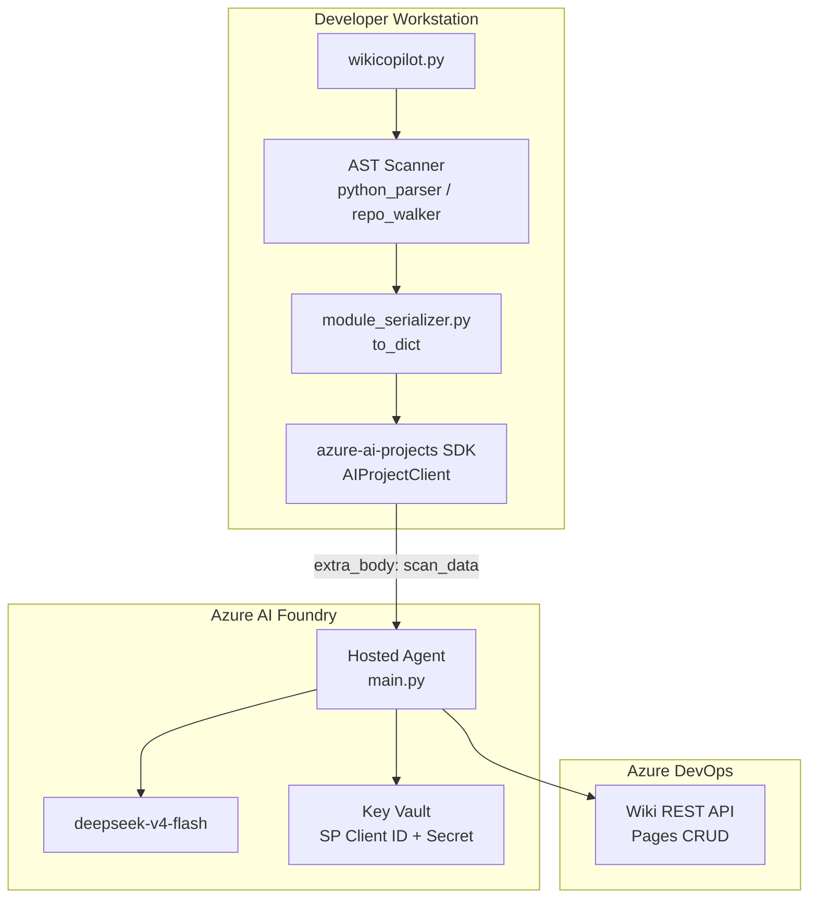

# Documentation Copilot

A two-tier documentation automation system that scans Python source code, generates Azure DevOps Wiki entries with LLM-generated prose and Mermaid diagrams, and publishes them through the Wiki REST API. The local CLI (`wikicopilot.py`) handles file-system scanning. A Foundry Hosted Agent running in Azure handles prose generation, diagram building, and wiki publishing with service principal authentication backed by Key Vault.

---

## Architecture



The local CLI scans the repository, extracts function and class metadata via Python's `ast` module, serialises the results to JSON, and sends them to the Foundry agent through the `azure-ai-projects` SDK. The agent deserialises the scan data, calls `deepseek-v4-flash` for prose descriptions, builds Mermaid diagrams, and publishes the formatted wiki pages to Azure DevOps Wiki. The agent authenticates to ADO using a two-step service principal flow: its platform-assigned managed identity reads the service principal's client ID and secret from Key Vault, then exchanges them for a Microsoft Entra Bearer token via the OAuth 2.0 client credentials grant.

---

## Prerequisites

- Python 3.13+
- Azure CLI 2.80+ (`az login`)
- Azure Developer CLI 1.25.3+ with `microsoft.foundry` and `azure.ai.skills` extensions
- A Foundry project with a `deepseek-v4-flash` model deployment
- An Azure DevOps project with Wiki enabled
- A Key Vault containing `AdoServicePrincipalClientId` and `AdoServicePrincipalSecret`
- The agent's managed identity must have `Key Vault Secrets User` RBAC on the vault
- A service principal (`doc-copilot-ado-sp`) must be added to Azure DevOps with `Basic` access and Wiki Read & Write permissions

---

## Project Structure

```text
project-documentation-copilot/
├── wikicopilot.py                              # Local CLI entry point
├── OUTLINE.md                                  # Design contract
├── README.md                                   # This file
├── blog.md                                     # Narrative walkthrough
├── azure.yaml                                  # azd project manifest
├── requirements.txt
│
├── documentation-copilot/                      # Foundry Hosted Agent
│   ├── main.py                                 # HTTP server entry point
│   ├── agent.yaml                              # Agent configuration
│   ├── azure.yaml                              # Service deployment config
│   ├── requirements.txt
│   │
│   ├── infra/
│   │   ├── main.bicep                          # IaC templates
│   │   └── parameters.dev.json
│   │
│   ├── skills/
│   │   ├── wiki-authoring/SKILL.md             # Content quality standards
│   │   └── code-analysis/SKILL.md              # Extraction standards
│   │
│   ├── knowledge/                              # Agent grounding knowledge
│   │   ├── wiki-format-guide.md
│   │   ├── mermaid-templates.md
│   │   └── ado-api-reference.md
│   │
│   ├── src/                                    # Shared library
│   │   ├── config.py                           # AppConfig dataclass
│   │   ├── app.py                              # CLI entry (legacy)
│   │   │
│   │   ├── scanner/                            # Code analysis
│   │   │   ├── python_parser.py                # AST extraction
│   │   │   ├── repo_walker.py                  # Directory traversal
│   │   │   └── dependency_resolver.py          # Import graph
│   │   │
│   │   ├── wiki/                               # Content generation
│   │   │   ├── generator.py                    # Pipeline orchestration
│   │   │   ├── formatter.py                    # Markdown formatting
│   │   │   └── mermaid_builder.py             # Diagram generation
│   │   │
│   │   ├── ado/                                # Azure DevOps connector
│   │   │   ├── client.py                       # Wiki REST API client
│   │   │   ├── auth.py                         # Three-tier auth
│   │   │   ├── wiki_service.py                 # Publish orchestration
│   │   │   └── module_serializer.py            # JSON round-trip
│   │   │
│   │   ├── foundry/
│   │   │   └── project_client.py              # Foundry SDK helpers
│   │   │
│   │   ├── rag/
│   │   │   └── chat.py                        # LLM prompt construction
│   │   │
│   │   ├── security/
│   │   │   └── masking.py                     # Output scrubbing
│   │   │
│   │   └── workflow/
│   │       └── provenance.py                  # Event logging
│   │
│   └── tests/
│       ├── test_python_parser.py
│       ├── test_mermaid_builder.py
│       ├── test_wiki_generator.py
│       ├── test_ado_client.py
│       ├── test_chat_routing.py
│       └── test_repo_walker.py
│
├── mcp/                                        # MCP toolbox surfaces
│   ├── code-scanner/
│   ├── wiki-publisher/
│   └── diagram-generator/
│
└── docs/
    ├── feasibility-research.md
    ├── azd-journey.md
    ├── connector-design.md
    └── wiki-documentation-schema.md
```

---

## Module Reference

### Scanner (`src/scanner/`)

Extracts structured code metadata from Python source files without executing them.

**`python_parser.py`** walks each file with `ast.NodeVisitor`, overriding `visit_FunctionDef`, `visit_ClassDef`, and import visitors to accumulate dataclass instances. `FunctionInfo` captures name, file path, line number, docstring, decorators, parameters with type annotations and defaults, return type, and a body summary. `ClassInfo` captures the same plus base classes and a list of method `FunctionInfo`. `ModuleInfo` collects all functions, classes, and imports for a single file. Files with syntax errors are skipped with a logged warning.

**`repo_walker.py`** recurses through a directory with `Path.rglob('*.py')`, excluding directories like `.venv`, `__pycache__`, `.git`, and `node_modules`. `walk_repository()` returns a flat `list[ModuleInfo]`. `scan_target()` filters that list to modules containing a specific function or class name.

**`dependency_resolver.py`** classifies each module's imports as internal or external by inferring project-internal package prefixes from the file tree. `resolve_dependencies()` returns a list of `DependencyEdge` objects. `get_dependencies_for_module()` returns deduplicated `(internal_deps, external_deps)` tuples.

### Wiki (`src/wiki/`)

Transforms scanned metadata into Azure DevOps Wiki-compatible markdown.

**`generator.py`** orchestrates generation for a single `ModuleInfo`. It calls the RAG layer for prose descriptions, resolves dependencies, formats parameter tables, and conditionally builds Mermaid diagrams for modules with 3+ functions or 2+ classes. Returns a complete markdown string.

**`formatter.py`** defines `WikiEntry` (title + list of `WikiSection`) and `WikiSection` (heading + body). `format_wiki_markdown()` renders the entry as `# Title` followed by `## Section` blocks. `format_input_output_table()` renders a pipeline table for parameter metadata. `format_dependency_list()` renders internal and external dependency sections.

**`mermaid_builder.py`** generates ADO Wiki-compatible Mermaid diagrams. `build_class_diagram()` produces `classDiagram` with inheritance arrows. `build_sequence_diagram()` produces `sequenceDiagram` with decorator-based role inference. `build_flowchart_diagram()` produces `graph TD` for execution flow. `wrap_mermaid_diagram()` wraps diagrams in `::: mermaid` and `:::` fence blocks.

### ADO (`src/ado/`)

Connects to the Azure DevOps Wiki REST API v7.1 with three-tier authentication.

**`client.py`** implements `AdoWikiClient`. `get_page(path)` returns `WikiPage` with an ETag version, or `None` if the page does not exist. `create_or_update_page(page)` sends a PUT request with an `If-Match` header when updating. Responses are validated by content type — HTML responses are treated as authentication failures and reported as typed `WikiPageResult` errors.

**`auth.py`** implements a three-tier authentication hierarchy. The first tier uses `ServicePrincipalAuth` to read the SP client ID and secret from Key Vault and exchange them for a Microsoft Entra Bearer token via OAuth 2.0 `client_credentials`. The second tier falls back to `ManagedIdentityAuth` using the platform-assigned managed identity directly. The third tier reads `AZURE_DEVOPS_PAT` from the environment for local development. Tokens are cached in memory with 60-second refresh skew.

**`wiki_service.py`** orchestrates the full publish lifecycle. `update_wiki_for_target()` scans the repo, filters for the target, and publishes. `update_wiki_for_target_from_data()` accepts pre-scanned module data from the CLI and skips the scan step. Both call `_publish_modules()`, which iterates matching modules, generates content, ensures ancestor pages exist, and publishes each page through `AdoWikiClient`.

**`module_serializer.py`** provides lossless JSON round-trip for the four scanner dataclasses. `module_info_to_dict()` serialises a `ModuleInfo` tree. `dict_to_module_info()` reconstructs the full tree. Used by both the CLI (serialization) and the agent (deserialisation).

### Foundry (`src/foundry/`)

**`project_client.py`** provides `open_project_client()`, a context manager that creates `AIProjectClient` with `DefaultAzureCredential`. `list_deployment_names()` returns available model deployments. `complete_with_foundry()` sends a single-turn completion to a model deployment and returns the response text.

### RAG (`src/rag/`)

**`chat.py`** defines `DOCUMENTATION_SYSTEM_PROMPT`, a set of guidelines instructing the LLM to produce technically accurate documentation without placeholder text. `generate_function_description()`, `generate_class_description()`, and `generate_module_overview()` build targeted prompts for each code entity and call `complete_with_foundry()` for prose generation.

### Security (`src/security/`)

**`masking.py`** redacts `Authorization: Basic` headers and `AZURE_DEVOPS_PAT` values from log output.

### Workflow (`src/workflow/`)

**`provenance.py`** emits structured JSON log lines for every scan, generation, and publish operation, joined by a UUID4 `correlation_id`. Used for debugging and Application Insights querying.

### Config (`src/config.py`)

**`AppConfig`** is a dataclass loaded from environment variables: `AZURE_AI_PROJECT_ENDPOINT`, `AZURE_AI_CHAT_DEPLOYMENT`, `AZURE_DEVOPS_ORG_URL`, `AZURE_DEVOPS_PROJECT`, `AZURE_DEVOPS_WIKI_ID`, and `TARGET_REPO_ROOT`.

### Skills (`skills/`)

**`wiki-authoring/SKILL.md`** encodes content quality standards for the LLM: markdown compatibility rules, page path conventions, and Mermaid diagram constraints. **`code-analysis/SKILL.md`** defines extraction standards and metadata completeness requirements. Both are uploaded to the Foundry project and attached to the agent at deploy time. At agent startup, Foundry injects each skill's content into the agent's system prompt.

---

## Deployment

Deployment follows the standard `azd` journey using the `microsoft.foundry` and `azure.ai.skills` extensions.

### Environment Variables

Set these via `azd env set` before provisioning:

```bash
AZURE_AI_PROJECT_ENDPOINT=https://<account>.services.ai.azure.com/api/projects/<project>
AZURE_AI_CHAT_DEPLOYMENT=DeepSeek-V4-Flash
AZURE_DEVOPS_ORG_URL=https://dev.azure.com/<org>
AZURE_DEVOPS_PROJECT=<project>
AZURE_DEVOPS_WIKI_ID=<project>.wiki
KEY_VAULT_URL=https://<vault>.vault.azure.net/
KEY_VAULT_NAME=<vault>
AZURE_TENANT_ID=<tenant-id>
TARGET_REPO_ROOT=/app
```

### Commands

```powershell
# Scaffold the agent from the Foundry sample manifest
azd ai agent init -m "https://github.com/microsoft-foundry/foundry-samples/blob/main/samples/python/hosted-agents/agent-framework/responses/01-basic/agent.manifest.yaml" --no-prompt --project-id "<project-resource-id>" --deploy-mode code --runtime python_3_13 --entry-point main.py --agent-name "documentation-copilot"

# Set subscription and location
azd env set AZURE_SUBSCRIPTION_ID <subscription-id>
azd env set AZURE_LOCATION eastus2

# Provision infrastructure (Foundry project, model deployment, monitoring)
azd provision

# Upload skills to the Foundry project
azd ai skill create wiki-authoring --file ./skills/wiki-authoring/SKILL.md --no-prompt
azd ai skill create code-analysis --file ./skills/code-analysis/SKILL.md --no-prompt

# Deploy the agent
azd deploy

# Poll until active
azd ai agent show

# Invoke the deployed agent
azd ai agent invoke "update the wiki for AuthService to capture the latest changes"
```

The `agent.yaml` environment variables block must declare all vars with `${VAR}` substitution so they resolve correctly at deploy time:

```yaml
environment_variables:
    - name: AZURE_AI_MODEL_DEPLOYMENT_NAME
      value: ${AZURE_AI_MODEL_DEPLOYMENT_NAME}
    - name: AZURE_AI_PROJECT_ENDPOINT
      value: ${AZURE_AI_PROJECT_ENDPOINT}
    - name: AZURE_DEVOPS_ORG_URL
      value: ${AZURE_DEVOPS_ORG_URL}
    - name: AZURE_DEVOPS_PROJECT
      value: ${AZURE_DEVOPS_PROJECT}
    - name: AZURE_DEVOPS_WIKI_ID
      value: ${AZURE_DEVOPS_WIKI_ID}
    - name: KEY_VAULT_URL
      value: ${KEY_VAULT_URL}
    - name: KEY_VAULT_NAME
      value: ${KEY_VAULT_NAME}
    - name: AZURE_TENANT_ID
      value: ${AZURE_TENANT_ID}
    - name: TARGET_REPO_ROOT
      value: ${TARGET_REPO_ROOT}
```

---

## Usage

### Local CLI

```powershell
$env:PYTHONPATH = "C:\Repo\vsCode\project-documentation-copilot\documentation-copilot"
$env:AZURE_AI_PROJECT_ENDPOINT = "https://<account>.services.ai.azure.com/api/projects/<project>"

# Publish wiki pages for a target function or class
python wikicopilot.py --target AuthService --mode publish

# Preview what the scanner would find without publishing
python wikicopilot.py --target AuthService --mode scan-only

# Use a natural-language prompt
python wikicopilot.py "update the wiki for walk_repository function"

# Point at a different repository
python wikicopilot.py --repo C:\git\myproject --target parse_config --mode publish

# Raw JSON output
python wikicopilot.py --target AuthService --mode publish --json
```

The CLI uses `DefaultAzureCredential` from the existing `az login` session. No PAT, Key Vault access, or LLM credentials are needed locally.

### Options

| Flag | Default | Description |
|------|---------|-------------|
| `prompt` | `""` | Natural-language instruction |
| `--target` / `-t` | extracted from prompt | Function or class name |
| `--mode` / `-m` | `auto` | `auto`, `scan-only`, `publish` |
| `--repo` / `-r` | `.` | Repository root to scan |
| `--project-endpoint` | `$AZURE_AI_PROJECT_ENDPOINT` | Foundry project endpoint |
| `--agent-name` | `documentation-copilot` | Foundry agent name |
| `--json` / `-j` | false | Output raw agent response |

### Agent HTTP Endpoints

The agent serves three endpoints on port 8088:

- `POST /responses` — Accepts JSON body with `input`, optional `mode`, and optional `scan_data`. Returns the agent's custom JSON envelope `{"status": "success", "target": "...", "pages_published": N, "pages": [...], "correlation_id": "..."}`.
- `GET /health` — Returns `{"status": "healthy"}`.
- `GET /readiness` — Returns `{"status": "healthy"}`.

The `scan_data` field contains serialised module metadata produced by `module_serializer.module_info_to_dict()`. When present, the agent skips the local file scan and uses the pre-scanned data directly.

---

## Wiki Page Structure

Each generated wiki page follows this template:

```text
# Module: {module_name}

## Overview
{LLM-generated prose describing the module's purpose}

## Module Path
`{relative_file_path}`

## Dependencies
**Internal Dependencies:**
- {internal module list}

**External Dependencies:**
- {external package list}

## Functions
### `{function_name}()`
{LLM-generated function description}
- **Line:** {line_number}
- **Decorators:** {decorator_list}
- **Return Type:** `{return_type}`

**Parameters:**
| Parameter | Type | Description |
|---|---|---|
| `{name}` | `{type}` | Default: `{value}` |

## Classes
### `{class_name}`
{LLM-generated class description}
- **Line:** {line_number}
- **Base Classes:** {base_list}

**Methods:**
| Method | Parameters | Return Type |
|---|---|---|

## Workflow Diagrams
::: mermaid
{class_diagram or sequence_diagram}
:::
```

Page paths follow the convention `API-Reference/{TargetName}/{ModuleName}`.

---

## Data Flow

:::mermaid
sequenceDiagram
    participant CLI as wikicopilot.py
    participant SDK as azure-ai-projects
    participant AGENT as Foundry Agent
    participant LLM as deepseek-v4-flash
    participant ADO as Azure DevOps Wiki

    CLI->>CLI: walk_repository(repo_root)
    CLI->>CLI: scan_target(target_name)
    CLI->>CLI: module_info_to_dict(modules)
    CLI->>SDK: AIProjectClient(endpoint, credential)
    CLI->>SDK: get_openai_client(agent_name)
    CLI->>SDK: responses.create(input, extra_body={scan_data})
    SDK->>AGENT: POST /responses
    AGENT->>AGENT: deserialize scan_data
    AGENT->>LLM: complete_with_foundry(system_prompt, metadata)
    LLM-->>AGENT: prose descriptions
    AGENT->>AGENT: generate_wiki_content()
    AGENT->>ADO: create_or_update_page(page)
    ADO-->>AGENT: WikiPageResult
    AGENT-->>SDK: OpenAI Response envelope
    SDK-->>CLI: response.output[0].content[0].text
    CLI->>CLI: _print_agent_response()
    CLI-->>USER: "Published N wiki page(s)"
:::

---

## Testing

```powershell
# Run all unit tests
pytest tests/ -v

# 26 tests covering:
# - AST parser accuracy (function extraction, class extraction, imports)
# - Mermaid diagram generation (class diagrams, sequence diagrams, fence wrapping)
# - Wiki markdown formatting (section rendering, parameter tables, dependency lists)
# - ADO client behaviour (404 handling, creation, error propagation)
# - Prompt routing (target extraction from natural language)
# - Repository walking (file discovery, exclusion patterns, target filtering)
```

---

## Key Configuration

The `AppConfig` dataclass in `src/config.py` drives all runtime behaviour:

| Environment Variable | Used By | Default |
|---|---|---|
| `AZURE_AI_PROJECT_ENDPOINT` | Foundry client, agent | Required |
| `AZURE_AI_CHAT_DEPLOYMENT` | RAG completions | `deepseek-v4-flash` |
| `AZURE_DEVOPS_ORG_URL` | ADO client | Required |
| `AZURE_DEVOPS_PROJECT` | ADO client | Required |
| `AZURE_DEVOPS_WIKI_ID` | ADO client | `myproject.wiki` |
| `TARGET_REPO_ROOT` | Scanner (agent-side) | `.` |
| `KEY_VAULT_URL` | ADO auth | Auto-constructed from `KEY_VAULT_NAME` |
| `KEY_VAULT_NAME` | ADO auth fallback | None |
| `AZURE_TENANT_ID` | ADO auth | None |
| `AZURE_DEVOPS_PAT` | ADO auth fallback (dev only) | None |
