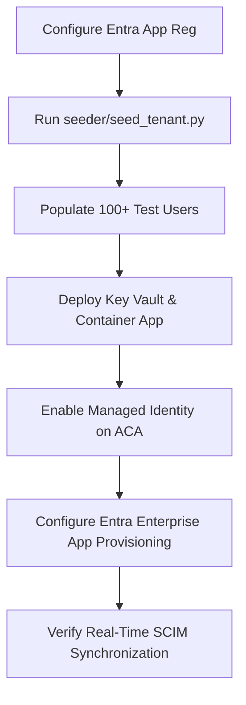

# Bootstrapping Your Identity Lab: Building an Automated Entra ID Seeder & Custom SCIM 2.0 Gateway in Python

**The Hook:** Setting up an identity lab often leaves you with a ghost town—an empty tenant with zero operational data. To properly master **AI-200** principles (zero-trust, secretless containerized compute, and user-context security pipelines), you need realistic directory infrastructure. This project shows you how to use the modern Microsoft Graph Python SDK to seed a blank tenant with enterprise data, and build an RFC-compliant SCIM 2.0 server deployed to Azure Container Apps (ACA) using Managed Identities and Azure Key Vault.

---

## Lab Setup & Azure Resources

To satisfy the cloud-native, zero-secret patterns stressed in the AI-200 syllabus, the environment is split into local execution (seeding) and containerized cloud hosting (SCIM gateway).

### 1. Entra ID Pre-requisites

* **A Blank Lab Tenant:** Microsoft 365 Developer Program tenant or a clean trial tenant.
* **App Registration (`App-Directory-Seeder`):** * Auth Type: Client Secrets (stored locally in `.env` *only* for the initial bootstrapping phase).
* API Permissions: `User.ReadWrite.All`, `Group.ReadWrite.All` (**Application Permissions**).

### 2. Azure Target Cloud Infrastructure

* **Azure Container Registry (ACR):** Securely builds and hosts the SCIM Gateway Docker image.
* **Azure Container Apps (ACA):** Hosts the FastAPI SCIM application with a public ingress endpoint.
* **Azure Key Vault (AKV):** Stores verification tokens required for Entra ID to authenticate against your SCIM server.
* **User-Assigned Managed Identity:** Attached to the Container App, granted `Key Vault Secrets User` RBAC rights to read configurations without hardcoded API keys.

---

## Project File Structure

```text
entra-scim-seeder/
│
├── .env.example
├── Dockerfile
├── requirements.txt
│
├── seeder/
│   ├── __init__.py
│   ├── auth.py            # MSAL client assertions & Graph SDK client initialization
│   ├── generator.py       # Deterministic user profile generation using Faker
│   └── seed_tenant.py     # Directory seeding pipeline engine
│
└── scim_gateway/
    ├── __init__.py
    ├── config.py          # Azure Key Vault / Environment integration via azure-identity
    ├── main.py            # FastAPI Application entry point
    ├── schemas.py         # SCIM 2.0 Pydantic core specifications (RFC 7643)
    └── routes/
        ├── __init__.py
        └── users.py       # SCIM User Endpoint CRUD engine
```

---

## File Blueprint: Functions & Contracts

### 1. The Seeder Module (`/seeder`)

#### `auth.py`

* **Function:** Uses the `msal` library to request an OAuth 2.0 access token via the Client Credentials flow, passing it into the Graph SDK client instance.
* **Contract / Return:** `msgraph.GraphServiceClient` authenticated for `https://graph.microsoft.com/.default`.

#### `generator.py`

* **Function:** Programmatically mocks realistic company departments, job roles, and user profiles.
* **Contract:** Returns a `list[dict]` conforming exactly to the Microsoft Graph `/users` creation payload structure.

```json
{
  "accountEnabled": true,
  "displayName": "Sarah Jenkins",
  "mailNickname": "sjenkins",
  "userPrincipalName": "sjenkins@yourdomain.onmicrosoft.com",
  "passwordProfile": { "forceChangePasswordNextSignIn": false, "password": "ComplexPassword123!" },
  "jobTitle": "Lead AI Engineer",
  "department": "Data Science"
}

```

`seed_tenant.py`

* **Function:** Loops through the generated payload, creates batches of users in parallel, generates specialized security groups (e.g., `Omit-AI-Access`), and assigns users to them.

1. **Create the Users:** Post payloads to `/users`. Capture the returned Entra Object ID (GUID) for each user.
2. **Create the Groups:** Post payloads to `/groups`. Capture the returned Group Object ID.
3. **Bind the Relationship:** Post to `/groups/{group-id}/members/$ref`. The body must contain the absolute OData reference URI of the target user.

`auth.py`

* **`get_graph_client() -> GraphServiceClient`**
* **Description:** Reads `TENANT_ID`, `CLIENT_ID`, and `CLIENT_SECRET` from the local environment. Instantiates a `ClientSecretCredential` from the `azure.identity` package and passes it into the Microsoft Graph SDK `GraphServiceClient`.

`generator.py`

* **`generate_synthetic_users(count: int) -> list[dict]`**
* **Description:** Uses `Faker` to generate clean dictionaries representing users.
* **Contract:** Returns a list of keys matching Graph expectations (`displayName`, `mailNickname`, `userPrincipalName`, `accountEnabled`, `passwordProfile`, `jobTitle`, `department`).

* **`generate_synthetic_groups() -> list[dict]`**
* **Description:** Returns a static array of standard operational security groups required for testing context (e.g., `App-AI-Standard`, `App-AI-Privileged`, `Omit-AI-Access`).

`seed_tenant.py`

* **`create_users_batch(client: GraphServiceClient, users: list[dict]) -> dict[str, str]`**
* **Description:** Iterates through the generated user list, executes creation calls against the graph endpoint, and logs successes.
* **Return:** A dictionary mapping `mailNickname` to the newly generated Entra User Object GUID: `{"sjenkins": "a1b2c3d4-..."}`.

* **`create_groups_batch(client: GraphServiceClient, groups: list[dict]) -> dict[str, str]`**
* **Description:** Provisions security groups inside Entra ID.
* **Return:** A dictionary mapping the group display name to the group GUID.

* **`assign_users_to_groups(client: GraphServiceClient, user_map: dict, group_map: dict) -> None`**
* **Description:** Implements the `$ref` binding logic. Reads the generated map outputs and assigns specific department groups based on user properties.

---

### 2. The SCIM Gateway Module (`/scim_gateway`)

#### How the SCIM Gateway Maintains State

Entra ID acts as the authoritative source of truth, but the SCIM Gateway must maintain its own local datastore to track resources, evaluate uniqueness constraints, and process structural modifications (`PATCH`).

For this project, the SCIM gateway uses an **SQLite database file (`scim_store.db`)** bundled within the persistent storage volume of your Azure Container App or run locally. It tracks Entra identity resource records using a mapping table.

`config.py`

* **Function:** Leverages `azure-identity` (`DefaultAzureCredential`) to securely pull runtime secrets from Azure Key Vault when deployed to ACA, falling back to local environment parsing during debugging.
* **Contract:** Exposes a production configuration object containing verification parameters.

`config.py`

* **`get_settings() -> BaseSettings`**
* **Description:** Leverages Pydantic settings management. If running in Azure, accesses `azure.identity.DefaultAzureCredential` to fetch the SCIM secret bearer token validation value directly out of Azure Key Vault.

`schemas.py`

* **Function:** Implements strict validation classes using `pydantic` to parse standard incoming SCIM 2.0 requests.
* **Core Contract Map (SCIM Core User Schema):**

```json
{
  "schemas": ["urn:ietf:params:scim:schemas:core:2.0:User"],
  "id": "external-uuid-string",
  "userName": "sjenkins@yourdomain.onmicrosoft.com",
  "name": { "formatted": "Sarah Jenkins", "familyName": "Jenkins", "givenName": "Sarah" },
  "active": true
}
```

`database.py`

* **`init_db() -> None`**
* **Description:** Bootstraps the local SQLite DB engine and initializes database schemas if they do not exist.

* **`get_db_session() -> Generator`**
* **Description:** Yields database connection context sessions to API endpoint operations, ensuring clean connection closures.

`models.py`

* **`class LocalUser(Base)`**
* **Description:** SQLAlchemy model tracking identity state.
* **Attributes:** `id` (Local Auto-increment Int), `entra_id` (String/GUID, indexed), `username` (String, unique), `given_name` (String), `family_name` (String), `active` (Boolean).

`routes/users.py`

* **Function:** Exposes the API endpoints required by the Entra ID provisioning engine.
* **API Contracts Matrix:**

| HTTP Method | Route PATH | Expected Query/Body | Target Action | Expected SCIM Return Status |
| --- | --- | --- | --- | --- |
| **GET** | `/Users` | `?filter=userName eq "..."` | Validate user presence before sync | `200 OK` (with ListResponse wrapper) |
| **POST** | `/Users` | SCIM JSON Body | Provision new inbound user | `21 Created` |
| **PATCH** | `/Users/{id}` | SCIM Patch Operation Body | Update state (e.g., Active -> False) | `204 No Content` or `200 OK` |
| **DELETE** | `/Users/{id}` | None | Deprovision/Remove user | `204 No Content` |

`routes/users.py`

* **`get_users(filter: str = None, db: Session) -> ListResponse`**
* **Description:** Handles directory queries. Must parse SCIM queries such as `userName eq "user@domain.com"`.

* **`get_user_by_id(id: str, db: Session) -> ScimUserResponse`**
* **Description:** Performs lookups by ID. Returns a single user object or a standard `404 Not Found` SCIM error block.

* **`create_user(user: ScimUserCreate, db: Session) -> ScimUserResponse`**
* **Description:** Commits a new user record to the internal SQLite database. Returns an HTTP `201 Created` status with the complete SCIM payload layout.

* **`patch_user(id: str, operations: dict, db: Session) -> ScimUserResponse`**
* **Description:** Parses inbound `PATCH` calls (e.g., updating user status or group state changes).

* **`delete_user(id: str, db: Session) -> Response`**
* **Description:** Drops user rows from the local database. Returns an empty HTTP `204 No Content` code.

---

## Step-by-Step Execution Plan



### Step 1: Populate the Tenant

Fill out the variables inside `/seeder/.env` and execute `seed_tenant.py`. This moves your tenant directory from empty to fully populated with realistic users categorized by active/inactive states and specific hierarchy.

### Step 2: Push the Compute Infrastructure

1. Build the root container: `az acr build --registry <your_acr> --image scim-gateway:v1 .`
2. Deploy the container to Azure Container Apps with target environment variables mapping to your Azure Key Vault URL.
3. Turn on the **System-Assigned Managed Identity** for the Container App, and assign it the `Key Vault Secrets User` role over the Key Vault resource instance.

### Step 3: Connect Entra Provisioning to the Gateway

1. Navigate to Entra ID -> **Enterprise Applications** -> **New Application** -> **Create your own application (Non-gallery)**.
2. Select **Provisioning** from the sidebar, set the Provisioning Mode to **Automatic**.
3. Set the **Tenant URL** to `https://<your-container-app-url>/scim/v2`.
4. Fetch the verification secret token out of your Azure Key Vault and place it into the **Secret Token** field. Click **Test Connection** to validate the pipeline flow.

az acr build --registry <your_acr> --image scim-gateway:v1 .
