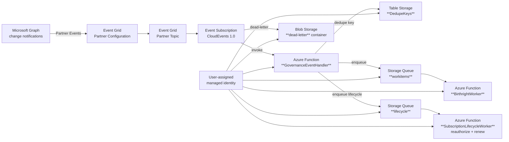

Microsoft Graph change notifications are a great building block, but the “classic” model (hosting a public HTTPS webhook) tends to get uncomfortable fast and won't make you any friends in the Cybersecurity or Networking/Gateway teams to manage the internet-exposed endpoint. 🤣

Microsoft Graph also supports delivering these change events _through Azure Event Grid_ (via **Event Grid Partner Events**). Instead of posting directly to your webhook, Graph publishes events into an Event Grid **partner topic** in your Azure subscription. From there, you use a normal Event Grid **event subscriptions** to route events to whatever you want 🎉 . You still need to handle at-least-once delivery and subscription lifecycle events, but you get Azure-native routing, filtering, monitoring, and dead-lettering without putting an HTTP endpoint on the public internet.

This project utilizes Microsoft Graph to deliver events into **Azure Event Grid Partner Events**, and from there I route them into **Azure Functions (PowerShell)** with proper buffering, idempotency, dead-lettering, and subscription lifecycle handling.

In this post I detail an identity governance scenario (joiner/mover/leaver-style signals on `users`), but the pattern is useful anywhere you want “near real-time” identity change pipelines: birthright automation, security reactions, audit/enrichment streams into SIEM, or ops workflows that open tickets and notify owners.

A side benefit of this design is that it removes the temptation to “paper over” eventual consistency and transient failures with arbitrary `Start-Sleep` calls and retry loops sprinkled throughout your business logic. Instead of making the application guess when Graph has “settled” (or how long downstream systems need), you let the platform absorb the timing variability: Event Grid provides durable at-least-once delivery, the Function handler turns each event into a queued work item, and workers process asynchronously with explicit retry and dead-letter semantics. If a dependency is temporarily unavailable (Graph throttling, directory propagation delays, downstream API outages), you can retry in a controlled way (with backoff, visibility timeouts, and poison-message handling) without blocking an HTTP request, holding open connections, or burning compute on sleeps.

Because events can be duplicated and delivered out of order, the pipeline also makes idempotency a first-class concern: a stable dedupe key is recorded once, and replays become a no-op instead of “retry storms” that require defensive delays. The result is fewer brittle timing hacks in the app, clearer operational behavior (you can see retries and failures as messages), and a system that degrades predictably when the real world is slow—without turning every caller into a hand-rolled queue processor.

This pattern is particularly well-suited to hybrid identity environments where you're waiting for on-prem changes to sync up to Entra ID via Entra Connect/Cloud Sync. By leveraging Event Grid's reliable delivery and Azure Functions' asynchronous processing, you can effectively manage the inherent delays in synchronization without complicating your application logic.

Other possible scenarios include:

- User risk event processing
- Privileged role assignment changes
- Group membership changes
- Application credential changes
- And more (whatever Entra publishes through Event Grid partners!)

## What about Entra ID Governance Lifecycle Workflows?

Compared to Entra ID Governance Lifecycle Workflows, this pattern trades “built-in product workflow” for “programmable event pipeline”: the big wins are flexibility (any Graph/API call or downstream integration), near real-time reactions (seconds/minutes instead of scheduled runs), richer idempotency/retry/dead-letter control, and easier extension beyond the lifecycle catalog (tickets, SIEM enrichment, custom audits); the downsides are you own more of the engineering surface area (deployments, monitoring, versioning, security reviews), you must correctly manage and periodically re-validate Graph permissions/consent, and you’re responsible for guardrails and supportability that Lifecycle Workflows provide out of the box (scoping, approvals/notifications, reporting, and “it’s supported by Microsoft” operational expectations).

## The Demo Environment

The promise is simple: I run one deployment script and end up with a working pipeline where Graph events land in my Function App reliably, with dead-lettering and lifecycle handling.

First the infrastructure is deployed using Bicep templates in `infra/`. The core resources are:

- **Azure Function App** (PowerShell) with managed identity
- **Storage Account** with queues (work items + lifecycle) and table (dedupe keys)
- **Event Grid Partner Configuration** authorizing Microsoft Graph
- **App Insights** for logging and monitoring

Next, the deployment scripts in `scripts/` wire everything up. They create and assign a user-assigned managed identity, assign Azure RBAC and Graph app roles, deploy the Bicep templates, zip-deploy the Function code, create the Graph subscription that delivers to Event Grid, activate the partner topic, and finally create the event subscription from the partner topic to the Function app using **CloudEvents 1.0** as the delivery schema.

Inside the Function App I treat incoming events as “messages,” not “requests”: I dedupe them using **Table Storage** (Entra ID auth, no keys) and buffer them through **Storage Queues** so downstream workers can run independently. Lifecycle events are handled too: the subscription gets reauthorized and renewed so the demo doesn’t silently die.

Finally, the event subscription is configured with **dead-lettering** to blob storage using a **user-assigned managed identity** (so there are no storage keys sitting in configuration).

## A guided tour of the architecture

Here’s the complete flow at a glance. I’ll walk it left-to-right in the next sections.



## Repo map (where to look first)

I split the repo into three chunks: infrastructure (`infra/`), orchestration scripts (`scripts/`), and the Function App (`src/FunctionApp/`). That mirrors how I think about the system: “build the platform”, “wire it up”, then “process events”.

And the directory structure looks like:

```text
project-eventgrid-partnerconfiguration
├── infra
│   ├── main.bicep
│   ├── link.bicep
│   └── parameters.dev.bicepparam
├── scripts
│   ├── Deploy-Infrastructure.ps1
│   ├── Deploy-FunctionCode.ps1
│   ├── New-GraphUsersSubscriptionToEventGrid.ps1
│   ├── Activate-EventGridPartnerTopic.ps1
│   ├── Grant-GraphAppRolesToManagedIdentity.ps1
│   └── Set-Policy.ps1
└── src
    └── FunctionApp
        ├── GovernanceEventHandler
        ├── BirthrightWorker
        ├── SubscriptionLifecycleWorker
        ├── Modules
        │   └── GovernanceAutomation
        │       ├── GovernanceAutomation.psm1
        │       └── GovernanceAutomation.psd1
        ├── policy
        │   └── policy.json
        ├── host.json
        ├── local.settings.example.json
        ├── profile.ps1
        └── requirements.psd1
```

## What’s where (and what it does)

### Infrastructure

I intentionally split IaC into two stages.

`infra/main.bicep` is “core infra only”: it creates the Function App, storage (queues + dedupe table), diagnostics, and the Event Grid partner configuration authorization. The Function runs under a **user-assigned managed identity (UAMI)**.

`infra/link.bicep` is the second stage that I run _after_ Graph has created the partner topic. It attaches the UAMI to the partner topic (while preserving the partner-provided `properties.source`), creates dead-letter storage + RBAC, and then creates the partner topic → Function event subscription using `CloudEventSchemaV1_0`.

`infra/parameters.dev.bicepparam` is just the “comfortable defaults” file for `main.bicep`.

### Scripts

The scripts are the glue that makes this feel like “one command deploy” instead of “seven manual steps.”

`scripts/Deploy-Infrastructure.ps1` is the main entry point: it creates/uses the UAMI, assigns Azure RBAC, assigns Graph **application** roles to the managed identity (defaults include `User.ReadWrite.All`, `Directory.Read.All`, and `Group.ReadWrite.All`), deploys `main.bicep`, deploys the function code, bootstraps Graph → Event Grid, activates the partner topic, and then deploys `link.bicep`. It also makes re-runs sane by picking a unique partner topic name when the deterministic name already exists.

If you want to focus on individual steps, `scripts/Deploy-FunctionCode.ps1` does the zip deploy for `src/FunctionApp`, `scripts/New-GraphUsersSubscriptionToEventGrid.ps1` creates the Graph subscription (and supports `-UseAzCliGraphToken` so you don’t need the Microsoft Graph PowerShell module), and `scripts/Activate-EventGridPartnerTopic.ps1` flips the partner topic into the active state so events will flow.

### Function code

I treat the Function App as a small event-processing system.

`src/FunctionApp/GovernanceEventHandler/run.ps1` is the Event Grid trigger. It normalizes the incoming payload (Graph partner events arrive as **CloudEvents 1.0**), generates a stable dedupe key, records idempotency in Table Storage (managed identity auth), and then enqueues a work item. Lifecycle notifications get routed to a dedicated queue.

The heavy lifting lives in `src/FunctionApp/Modules/GovernanceAutomation/GovernanceAutomation.psm1`: schema normalization, stable dedupe keys, Table Storage idempotency, and the Graph lifecycle calls (reauthorize + renew).

From there, `src/FunctionApp/SubscriptionLifecycleWorker/run.ps1` processes lifecycle messages and validates `clientState` (via `GRAPH_CLIENT_STATE`) before calling Graph, and `src/FunctionApp/BirthrightWorker/run.ps1` processes work items and applies birthright group assignments for **newly created users**.

Important Graph nuance: for `users` subscriptions, user creation shows up as an **`updated`** notification (Graph does not emit a `created` changeType for user resources). To avoid accidentally touching every user update, the birthright worker gates “new user” using `createdDateTime` proximity to the event time.

The policy itself is in `src/FunctionApp/policy/policy.json`.

#### How `policy.json` drives decisions

I wanted the “governance logic” to be editable without touching code, so the Function reads a JSON policy file and uses it to decide whether it should only _detect_ and log something, or whether it should eventually _remediate_.

At the top level, the policy has a `mode` (for example `detect`) and a `version`. In `detect` mode, the workers still process events and emit useful logs, but they’re intentionally conservative about making changes.

There are three main ideas inside the policy:

1. **Birthright assignments**

The `birthrights` block is how I model “when a user appears (or changes), what should they get by default?”

In the current policy file, `birthrights.mode` is set to `remediate`, and the default assignment matches `userType: "Member"` and adds the user to a specific Entra security group:

```json
"birthrights": {
  "enabled": true,
  "mode": "remediate",
  "assignments": [
    {
      "name": "Default-Birthright",
      "when": { "userType": "Member" },
      "addToGroups": ["928bd0ce-8abc-43dd-94a0-d350fe49e991"]
    }
  ]
}
```

The `BirthrightWorker` reads this policy and, for newly created users only, calls Microsoft Graph to add the user as a member of each configured group.

2. **Safety rails (break-glass + allow lists)**

The `breakGlass` section is where I list accounts that should be treated as special (for example, never auto-remove, never auto-disable). The `allowLists` section is the opposite: known-good groups/apps/roles that the automation can ignore or treat as explicitly permitted.

3. **Rules: match an event, then choose an action**

The `rules` array is the “if this, then that” part. Each rule has `criteria` that matches against the normalized work item (for example `eventTypeStartsWith`, `subjectContains`, and a higher-level `condition` like `UserDisabled`). When a rule matches, the `action` describes what to do. In the sample policy there’s a “leaver” style rule that, when a user is disabled, would run steps like `RevokeSessions` and `RemoveFromHighRiskGroups`.

The important part is that this policy file is read in the context of the event pipeline: Graph emits change events, the handler normalizes/dedupes/queues them, and the worker uses `policy.json` to decide what it would do next.

## Prerequisites

This is a PowerShell-first repo. I run it with PowerShell 7.4+ and Azure CLI (`az`) authenticated via `az login`. You also need enough Azure permissions to create resources in your target subscription/resource group.

On the Entra side, you need permission to create Microsoft Graph subscriptions (delegated), and admin consent permissions to assign Microsoft Graph application roles to the managed identity.

For birthright group assignment (adding users to groups), the managed identity needs (at minimum) a Graph application permission that can add group members:

- `GroupMember.ReadWrite.All` (least-privilege for add/remove members)

This repo’s deployment script uses `Group.ReadWrite.All` by default (broader, but simple) plus user/directory read permissions so the worker can query `createdDateTime` for the new-user gate.

---

## The one-command deployment

This is the command I use when I want complete setup without thinking too hard about the order of operations:

```powershell
pwsh ./scripts/Deploy-Infrastructure.ps1 `
  -SubscriptionId <sub> `
  -ResourceGroupName <rg> `
  -Location <location>
```

What it does (in order):

1. Creates (or reuses) a user-assigned managed identity (UAMI)
2. Assigns Azure RBAC on the resource group (so the deployment can create resources)
3. Assigns Graph app roles to that identity (defaults include `User.ReadWrite.All`, `Directory.Read.All`, and `Group.ReadWrite.All`)
4. Deploys `infra/main.bicep`
5. Zip deploys the Function code
6. Creates a Graph subscription that delivers to Event Grid (partner topic)
7. Activates the partner topic
8. Deploys `infra/link.bicep` to create the partner topic → function event subscription (with dead-lettering)

Notes for re-runs:

If the partner topic name already exists, the script automatically chooses a new unique one. If you want full control (for example, because you’re integrating into another environment), you can pass `-PartnerTopicName <partnerTopic>`.

Similarly, a new User-Assigned Managed Identity (UAMI) is created by default (each deployment). You can pass in `-BootstrapUserAssignedIdentityName '<name>'` to use an identity from a previous deployment (or one created outside this project).

## How I sanity-check it (events + dedupe + lifecycle)

To verify everything is working, create a new user in your Entra tenant. In the `GovernanceEventHandler` invocation logs you should see a received event with CloudEvents fields like `type`, `subject`, and `time`. You should also see a corresponding event in the `BirthrightWorker` logs showing the work item being dequeued with the same `correlationId` and event details.

For a newly created user (within the configured window), you should see a log like:

```text
Added newly created user to birthright group
```

For a normal user update event, you should see a log like:

```text
User event is not treated as newly created; no birthright changes applied
```

//insert images of logs here

If you replay the same event, you should see dedupe kick in. And when Graph sends lifecycle notifications, you'll see logs for reauthorization and renewal (for example, `Graph subscription reauthorized` and `Graph subscription renewed`).

---

## The bits worth stealing

The two-stage IaC split (`main.bicep` + `link.bicep`) is a useful pattern when working with Event Grid partner topics, because you often need to create the partner topic first (via Graph) before you can attach identities and event subscriptions.

I also like the security posture here. Dead-lettering uses `deadLetterWithResourceIdentity`, so there are no storage keys in app settings. For idempotency I store a hashed dedupe key in Table Storage using Entra auth and treat HTTP 409 as “already processed.” And because Graph partner events arrive as CloudEvents 1.0, I normalize them into a stable work-item shape before queuing.

Finally, the lifecycle worker is what makes this demo feel “production-ish”: it reauthorizes and renews subscriptions so the pipeline keeps working across longer-lived test runs.

---

## Lessons learned (so you don’t hit the same walls)

I tripped over a few sharp edges building this.

Partner topics are **partner-created**; if you try to “just create them in Bicep” without the partner metadata, it fails. Even when you’re updating a partner topic, you have to preserve partner-provided fields like `properties.source`.

I also hit an ARM circular dependency when I tried to “read the existing partner topic source” and “update partner topic identity” in the same template. The pragmatic fix was to pass `partnerTopicSource` in from the script.

Re-runs matter a lot for demos: if you re-run Graph bootstrap with the same partner topic name and it already exists, Graph can fail. Picking a unique name on re-run makes the whole thing repeatable.

On the Event Grid side, target validation happens up-front, so the Function needs to exist before creating the event subscription. And in Functions, PowerShell queue triggers can hand payloads in different shapes (string/base64/object), so defensive parsing is worth the effort.

Finally, RBAC is non-negotiable for the data plane: use **Storage Queue Data Contributor** for queues, I tried least-privilege roles like `Storage Queue Data Sender` and `Storage Queue Data Processor` but they fell short. Use **Storage Table Data Contributor** for tables, and **Storage Blob Data Contributor** for the dead-letter container.

On the Graph side, group membership writes require group permissions (`GroupMember.ReadWrite.All` or broader). A common failure mode is granting only user permissions (like `User.ReadWrite.All`) and then getting a 403 when trying to add the user to a group.

## Conclusion

Using Event Grid partner events to receive Microsoft Graph change notifications is a powerful pattern that avoids the need to host public webhooks. By combining Event Grid with Azure Functions, managed identities, and proper idempotency and lifecycle handling, you can build robust identity event pipelines that are secure and maintainable. This project provides a solid foundation to get started, and I encourage you to adapt and extend it for your own identity governance scenarios. 🚀

## References

- [Microsoft Graph API change events through Azure Event Grid overview](https://learn.microsoft.com/en-us/azure/event-grid/subscribe-to-graph-api-events?tabs=powershell)
- [Event Grid partner events documentation](https://learn.microsoft.com/en-us/azure/event-grid/partner-events-overview)
- [CloudEvents 1.0 schema reference for Event Grid](https://learn.microsoft.com/en-us/azure/event-grid/cloud-event-schema)
- [Use managed identities to access Azure Storage from Azure Event Grid](https://learn.microsoft.com/en-us/azure/event-grid/delivery-and-retry#use-managed-identities-to-access-azure-storage)
- [Microsoft Graph subscription lifecycle management](https://learn.microsoft.com/en-us/graph/webhooks-lifecycle)
- [Set dead-letter location and retry policy](https://learn.microsoft.com/en-us/azure/event-grid/manage-event-delivery)
- [Renew a Microsoft Graph API subscription](https://learn.microsoft.com/en-us/azure/event-grid/subscribe-to-graph-api-events?tabs=powershell#renew-a-microsoft-graph-api-subscription)
