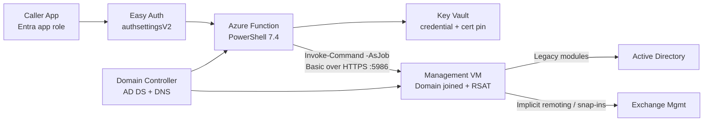

# Legacy PowerShell Jumpbox Function App

This project scaffolds a PowerShell 7.4 Azure Function that brokers legacy administrative commands through a domain-joined management VM. The pattern exists for workloads such as Active Directory and Exchange management where the required modules, remoting behavior, or Windows dependencies do not fit cleanly inside Azure Functions.

The starting point reuses the infrastructure shape from `project-functionapp-roles`: a Windows Elastic Premium Function App, VNet integration, Key Vault, and a lab domain controller. This project extends that baseline with a second Windows VM that acts as the management or jumpbox host.

## Architecture



## What This Scaffold Includes

- A new sibling project folder with repo-consistent `infra/`, `scripts/`, `FunctionApp/`, and `tests/` layout.
- Bicep adapted from `project-functionapp-roles` to provision:
  - a Windows Function App on Elastic Premium
  - a lab domain controller VM
  - a separate management VM intended for legacy remoting
  - Key Vault, storage, App Insights, and Log Analytics
- Deployment scripts that outline the full orchestration flow:
  - promote the domain controller
  - create the remoting service account
  - join the management VM to the domain
  - configure WinRM Basic over HTTPS and install RSAT
  - publish the jumpbox certificate to Key Vault
- A PowerShell 7.4 HTTP-trigger Azure Function that:
  - validates Easy Auth principal claims
  - loads a remoting credential and pinned certificate from Key Vault
  - validates the jumpbox TLS endpoint before session creation
  - sends a remote job to the management VM and returns serialized output

## Why A Jumpbox VM

Azure Functions can run PowerShell 7.4 well, but legacy administration stacks still create friction:

- the `ActiveDirectory` module is Windows-only and expects domain reachability
- Exchange management often relies on Windows remoting or legacy snap-ins
- some cmdlets expect an interactive Windows environment, RSAT, or domain join state

Instead of forcing those dependencies into the function host, the function becomes a narrow orchestration layer and the management VM becomes the execution boundary.

## TLS Validation Model

This scaffold intentionally does not rely on importing the jumpbox certificate into the function worker's OS trust stores.

The function instead:

1. Reads the expected WinRM HTTPS certificate from Key Vault.
2. Opens a raw TLS connection to the jumpbox on port `5986`.
3. Verifies that the remote certificate matches the expected thumbprint.
4. Verifies that the certificate DNS identity matches the configured host name.
5. Creates the PowerShell remoting session only after the preflight passes.

That lets the blog explain a concrete trust decision: the channel is still HTTPS, but trust is pinned in application logic instead of delegated to the machine certificate store.

## Remote Execution Model

The function accepts a script block payload as text, converts it to a script block on the remote machine, and invokes it via `Invoke-Command -AsJob`. The remote host runs the command with the installed Windows modules and returns serialized output to the function response.

For a production build, tighten this further by replacing free-form script text with an allow-listed command catalog.

## Project Layout

```text
project-functionapp-jumpbox/
├── README.md
├── blog.md
├── bicepconfig.json
├── FunctionApp/
│   ├── .funcignore
│   ├── host.json
│   ├── local.settings.sample.json
│   ├── profile.ps1
│   ├── requirements.psd1
│   └── InvokeLegacyCommand/
│       ├── function.json
│       ├── LegacyRemotingHelpers.psm1
│       └── run.ps1
├── infra/
│   ├── main.bicep
│   ├── parameters.dev.json
│   ├── parameters.test.json
│   └── parameters.prod.json
├── scripts/
│   ├── Bootstrap-ADDSDomain.ps1
│   ├── Configure-ADPostPromotion.ps1
│   ├── Join-ManagementVmToDomain.ps1
│   ├── Configure-ManagementWinRmHttps.ps1
│   ├── Deploy-Complete.ps1
│   ├── Deploy-FunctionApp.ps1
│   └── Deploy-Infrastructure.ps1
└── tests/
    └── Unit/
        └── LegacyRemotingHelpers.Tests.ps1
```

## Quick Start

Deploy the infrastructure scaffold:

```powershell
Connect-AzAccount

pwsh ./scripts/Deploy-Infrastructure.ps1 `
  -Environment dev `
  -ResourceGroupName rg-legacyjump-dev `
  -Location eastus
```

For the end-to-end lab path, use `Deploy-Complete.ps1`. That script now performs the full donor-style orchestration flow: infrastructure deployment, domain controller promotion, AD post-configuration, management VM domain join, WinRM HTTPS configuration, Key Vault certificate upload, and optional function publish.

## Real Deployment

Before running `Deploy-Complete.ps1`, make sure the parameter file for your target environment has real values for:

- `tenantId`
- `clientId`
- `domainName`
- `domainNetBiosName`

You must also provide non-placeholder secrets for:

- `vmAdminPassword`
- `serviceAccountPassword`

Those two passwords can come from either:

- the parameter file in `infra/parameters.<environment>.json`
- explicit command-line parameters to `Deploy-Complete.ps1`

`tenantId` and `clientId` can also come from either the parameter file or explicit command-line parameters. That lets you keep the checked-in parameter file on placeholder values in a public repo.

The exact invocation shape for a real deployment is:

```powershell
Connect-AzAccount

$vmAdminPassword = Read-Host 'VM admin password' -AsSecureString
$serviceAccountPassword = Read-Host 'Domain service account password' -AsSecureString

pwsh ./scripts/Deploy-Complete.ps1 `
  -Environment dev `
  -ResourceGroupName rg-legacyjump-dev `
  -Location eastus `
  -ParameterFile ./infra/parameters.dev.json `
  -TenantId '<entra-tenant-guid>' `
  -ClientId '<api-app-registration-client-id>' `
  -VmAdminUsername azureadmin `
  -VmAdminPassword $vmAdminPassword `
  -ServiceAccountName svc-legacyjump `
  -ServiceAccountPassword $serviceAccountPassword `
  -PublishFunctionApp
```

What that invocation expects:

- `tenantId` and `clientId` are supplied either in the parameter file or on the command line and point to the API app registration that Easy Auth should trust
- the caller has permission to deploy Azure resources, execute VM Run Command, and write secrets into the project Key Vault
- Azure Functions Core Tools is installed if `-PublishFunctionApp` is used
- the passwords meet Windows and domain policy requirements

If you do not want to pass secure strings on the command line, you can place real values in the parameter file and call:

```powershell
pwsh ./scripts/Deploy-Complete.ps1 `
  -Environment dev `
  -ResourceGroupName rg-legacyjump-dev `
  -Location eastus `
  -ParameterFile ./infra/parameters.dev.json `
  -PublishFunctionApp
```

In that mode, `Deploy-Complete.ps1` will read `vmAdminUsername`, `vmAdminPassword`, and `serviceAccountPassword` from the parameter file and stop if the file still contains placeholder values.

If you keep `tenantId` and `clientId` as placeholders in the parameter file, pass them explicitly to `Deploy-Complete.ps1` with `-TenantId` and `-ClientId`.

## JUMPBOX-WINRM-CERT-CER Flow

`JUMPBOX-WINRM-CERT-CER` is the public certificate used to pin trust for the management VM's WinRM HTTPS endpoint. It is not a client certificate and it is not imported into the Function App worker's machine trust store.

### 1. Certificate creation on the management VM

During end-to-end deployment, `Deploy-Complete.ps1` runs `Configure-ManagementWinRmHttps.ps1` on the management VM via Azure Run Command.

That script:

- checks the local machine certificate store for an existing certificate whose subject matches the management VM FQDN
- creates a new self-signed certificate in `Cert:\LocalMachine\My` if one does not already exist
- creates the WinRM HTTPS listener bound to that certificate thumbprint
- enables the firewall rule for TCP 5986
- exports the public certificate as `.cer` bytes and base64-encodes those bytes as `CertificateBase64`

### 2. Certificate deployment into Azure Key Vault

After the VM-side script returns, `Deploy-Complete.ps1` parses the JSON payload from Run Command and writes the base64-encoded public certificate into Key Vault as the secret named `JUMPBOX-WINRM-CERT-CER`.

That happens in the orchestration script, not in Bicep, because the certificate does not exist until the VM creates or discovers it.

The stored Key Vault value is therefore:

- the public certificate only
- encoded as base64 text
- stored as a secret so the Function App can fetch it at runtime with its managed identity

### 3. Certificate wiring into the Function App configuration

The Function App is configured with native App Service Key Vault references in the Bicep template:

- `MANAGEMENT_CREDENTIAL_JSON` points at the `LEGACY-JUMPBOX-CREDENTIAL` secret
- `WINRM_CERTIFICATE_BASE64` points at the `JUMPBOX-WINRM-CERT-CER` secret

The Function App managed identity resolves those references before the PowerShell worker reads them as environment variables. At runtime, `Get-FunctionJumpboxCertificate` reads `WINRM_CERTIFICATE_BASE64`, base64-decodes it, and creates an in-memory `X509Certificate2` object.

### 4. Certificate use in the Function App remoting flow

Before the function creates a PowerShell remoting session, it performs a TLS preflight against the management VM on port 5986.

The helper flow is:

1. Open a raw TLS socket to the management VM.
2. Capture the certificate actually presented by the remote host.
3. Compare that remote thumbprint to the thumbprint of the expected certificate loaded from `JUMPBOX-WINRM-CERT-CER`.
4. Check that the certificate DNS identity matches the configured management VM FQDN.
5. Only if both checks pass, create the WinRM HTTPS PSSession.

This is certificate pinning in application logic. The Function App does not trust the jumpbox because Windows says the issuer is trusted. It trusts the jumpbox because the presented certificate exactly matches the pinned public certificate retrieved from Key Vault.

### 5. Certificate use during remote command execution

Once the TLS preflight succeeds, the function creates the remote PowerShell session with:

- `UseSSL = $true`
- `Authentication = 'Basic'`
- the Key Vault-backed service credential

The certificate is therefore protecting the server side of the WinRM HTTPS channel. The function uses it to verify that it is really talking to the intended management VM before sending credentials and before sending the script block that will run remotely.

In practice, the end-to-end chain is:

1. The management VM creates or reuses its server certificate.
2. The orchestration script exports the public cert and stores it as `JUMPBOX-WINRM-CERT-CER` in Key Vault.
3. The Function App loads that public cert with managed identity.
4. The remoting helper pins the WinRM HTTPS server certificate against the Key Vault copy.
5. The function sends the remote job only after the TLS identity check passes.

## Notes

- The management VM is intentionally Windows-based so RSAT and legacy management tooling can be installed without containerizing unsupported dependencies.
- WinRM Basic authentication is enabled only over HTTPS in this design.
- The function app remains PowerShell 7.4 even though some remote commands will execute under Windows PowerShell-compatible modules on the jumpbox.

## Related Files

- Donor infra pattern: `../project-functionapp-roles/infra/main.bicep`
- Donor deployment orchestration: `../project-functionapp-roles/scripts/Deploy-Complete.ps1`
