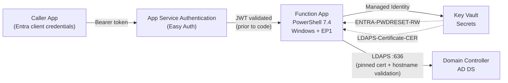

# Password Reset Function App

This repo deploys a PowerShell 7.4 Azure Function that performs one job: reset an Active Directory user password over LDAPS.

The function is designed to be called by an automated “caller app” (ITSM workflow, CI/CD job, internal portal) using Entra ID authentication, with authorization enforced by an app role claim.

## Architecture



### Current state highlights

- **Hosting**: Windows Function App on **Elastic Premium (EP1)** with VNet integration support.
- **Auth**: Easy Auth (`authsettingsV2`) validates JWTs and injects `X-MS-CLIENT-PRINCIPAL`; the PowerShell code does not validate JWT signatures.
- **Authorization**: The function checks a required app role claim (`REQUIRED_ROLE`, default `Role.PasswordReset`).
- **Secrets**: The function uses a **system-assigned managed identity** to read Key Vault secrets and caches them per runspace.
- **LDAPS security**: The client enforces **certificate pinning + hostname validation** during the TLS handshake. The design intentionally avoids writing to any OS certificate store.
- **Networking**: When deploying the lab DC, Bicep integrates the Function App into the VNet and sets:
  - `WEBSITE_VNET_ROUTE_ALL=1`
  - `WEBSITE_DNS_SERVER=10.0.1.4` (the DC)
  - the DC config script sets DNS forwarders to `168.63.129.16` so public name resolution still works.

## Repo layout

```text
FunctionApp/                      # Deployable function app code
  ResetUserPassword/              # HTTP endpoint
    run.ps1                       # Handler (authz + orchestration)
    PasswordResetHelpers.psm1     # Key Vault + LDAPS + helpers
infra/
  main.bicep                      # EP1 plan, Windows Function, VNet integration, Easy Auth, Key Vault
scripts/
  Deploy-Complete.ps1             # End-to-end deploy (optional DC + LDAPS cert lifecycle)
  Deploy-Infrastructure.ps1       # Infra-only deploy
  Deploy-FunctionApp.ps1          # Function deployment (zip or build/test)
  Configure-AppRegistration.ps1   # Creates/updates API app registration + app role
  Create-ClientAppRegistration.ps1# Creates a calling app registration
  Test-FunctionAppWithToken.ps1   # Client-credentials caller simulator
tests/
  Unit/                           # Pester tests for helper module
  Integration/                    # Pester tests for run.ps1 behavior
```

## Prerequisites

- Azure subscription rights to create resources in a resource group.
- PowerShell 7.4+: https://learn.microsoft.com/powershell/scripting/install/installing-powershell
- Az modules (deployment scripts): https://learn.microsoft.com/powershell/azure/overview?view=azps-latest
  - `Install-Module -Name Az -Scope CurrentUser -Repository PSGallery -Force`
- Bicep CLI: https://learn.microsoft.com/azure/azure-resource-manager/bicep/install
- Optional: Microsoft Graph PowerShell (for app registration scripts)
  - `Install-Module -Name Microsoft.Graph -Scope CurrentUser -Repository PSGallery -Force`
- Optional: Pester (tests)
  - `Install-Module -Name Pester -Scope CurrentUser -Repository PSGallery -Force`

## Quick start (recommended: self-contained demo)

This path deploys a disposable domain controller, generates an LDAPS certificate, publishes the public cert to Key Vault for pinning, configures Easy Auth, deploys the Function App, and creates test users.

```powershell
Connect-AzAccount

./scripts/Deploy-Complete.ps1 `
  -Environment dev `
  -ResourceGroupName rg-pwdreset-dev `
  -Location eastus `
  -DeployDomainController `
  -ConfigureAppRegistration
```

Notes:

- `-ConfigureAppRegistration` creates the API app registration (including the `Role.PasswordReset` role) and feeds its `clientId` into the Bicep deployment.
- If you want full non-interactive execution, add `-Confirm:$false` and provide explicit passwords.

## Using an existing Active Directory

You can deploy without the lab DC, but you must provide:

- **Network path** from the Function App to your DC (VNet integration / private connectivity)
- **DNS resolution** for the DC hostname from the Function App
- A Key Vault secret `LDAPS-Certificate-CER` containing the public certificate used by the DC for LDAPS

The Bicep template only auto-wires VNet integration and `WEBSITE_DNS_SERVER` when `deployDomainController` is enabled. For an existing AD, either:

- Update `infra/main.bicep` to integrate into your subnet, or
- Enable VNet integration after deploy and set `WEBSITE_DNS_SERVER` / routing settings yourself.

## Calling the API

Endpoint:

```text
POST https://<functionapp>.azurewebsites.net/api/ResetUserPassword
```

Headers:

```text
Authorization: Bearer <token>
Content-Type: application/json
```

Body:

```json
{ "samAccountName": "jdoe" }
```

The function accepts an optional `domainController` field (to override the configured DC hostname), but the normal path is to use the `DOMAIN_CONTROLLER_FQDN` app setting and DNS.

### Caller simulator

Use the client-credentials driver script:

```powershell
./scripts/Test-FunctionAppWithToken.ps1 `
  -ClientId "<caller-app-id>" `
  -ClientSecret "<caller-app-secret>" `
  -TenantId "<tenant-id>" `
  -ApiAppId "<api-app-id>" `
  -FunctionAppUrl "https://<functionapp>.azurewebsites.net" `
  -UserPrincipalName "testuser1@contoso.com" `
  -NewPassword "IgnoredByCurrentAPI123!"
```

## Testing

Run all tests:

```powershell
Invoke-Pester -Path ./tests
```

The unit tests validate principal decoding, role checks, password generation, certificate parsing/hostname matching helpers, and other pure logic. The integration tests execute `FunctionApp/ResetUserPassword/run.ps1` with mocks for Key Vault/LDAPS boundaries.

## Documentation

- Guided infra story: `blog-ad-infra.md`
- Guided function story: `blog-fna.md`
- Domain controller notes: `docs/DOMAIN-CONTROLLER-SETUP.md`

---

Built with PowerShell 7.4 • Azure Functions v4 • Easy Auth • Key Vault (Managed Identity) • LDAPS
