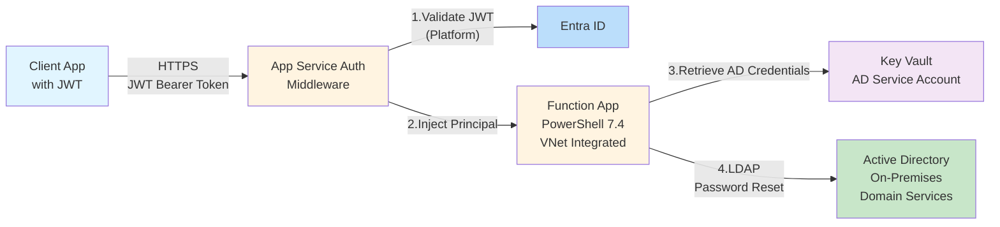

# Password Reset Function App

A secure, high-performance Azure Function App that enables password resets for on-premises Active Directory Domain Services (ADDS) users. The function uses Azure Functions built-in authentication (Easy Auth) with role-based access control and can handle tens of requests per second.

## 🏗️ Architecture



### Components

- **App Service Authentication**: Built-in middleware validates JWT tokens (signature, expiration, issuer, audience)
- **Azure Function App**: PowerShell 7.4 HTTP trigger on Linux Consumption plan with VNet Integration
- **Active Directory**: On-premises ADDS for user password resets
- **AD Service Account**: Domain account with delegated password reset permissions, credentials stored in Key Vault
- **Managed Identity**: Reads AD service account credentials from Key Vault
- **Key Vault**: Secure storage for AD service account credentials (secret: ENTRA-PWDRESET-RW)
- **Application Insights**: Monitoring, logging, and telemetry
- **Entra ID App Registration**: Token issuer with `Role.PasswordReset` app role

## 🚀 Features

- ✅ **Platform Authentication**: Azure Functions built-in authentication validates JWT tokens automatically
- ✅ **Role-Based Access Control**: Requires `Role.PasswordReset` claim
- ✅ **Secure Password Generation**: Creates complex passwords meeting Azure AD requirements (12-256 chars)
- ✅ **High Performance**: Configured for concurrency with 10 runspaces per worker, 2 workers
- ✅ **Comprehensive Testing**: >80% test coverage with Pester unit and integration tests
- ✅ **Infrastructure as Code**: Complete Bicep templates for repeatable deployments
- ✅ **Security Headers**: HSTS, X-Content-Type-Options, Cache-Control
- ✅ **Structured Logging**: Application Insights integration with sampling

## 📋 Prerequisites

- **Azure Subscription** with permissions to create resources
- **PowerShell 7.4+**: [Download](https://learn.microsoft.com/powershell/scripting/install/installing-powershell)
- **Azure PowerShell Modules**:
  ```powershell
  Install-Module -Name Az -Scope CurrentUser -Repository PSGallery -Force
  Install-Module -Name Microsoft.Graph -Scope CurrentUser -Repository PSGallery -Force
  Install-Module -Name Pester -Scope CurrentUser -Repository PSGallery -Force -SkipPublisherCheck
  ```
- **Azure Functions Core Tools**: [Download](https://learn.microsoft.com/azure/azure-functions/functions-run-local)
- **Bicep CLI**: [Install](https://learn.microsoft.com/azure/azure-resource-manager/bicep/install)
- **Permissions**:
  - Contributor on Azure subscription or resource group
  - Application Administrator or Global Administrator in Entra ID

## 🛠️ Setup Instructions

### Step 1: Clone and Navigate

```powershell
cd /home/ben/vsCode/project-functionapp-roles
```

### Step 2: Update Parameter Files

Edit `infra/parameters.dev.json` (or test/prod) with your values:

**For self-contained domain controller deployment (demo/dev)**:

```json
{
  "parameters": {
    "tenantId": {
      "value": "YOUR_TENANT_ID"
    },
    "clientId": {
      "value": "YOUR_APP_ID"
    },
    "deployDomainController": {
      "value": true
    },
    "domainName": {
      "value": "contoso.local"
    },
    "domainNetBiosName": {
      "value": "CONTOSO"
    }
  }
}
```

**For existing on-premises Active Directory**:

```json
{
  "parameters": {
    "tenantId": {
      "value": "YOUR_TENANT_ID"
    },
    "clientId": {
      "value": "YOUR_APP_ID"
    },
    "deployDomainController": {
      "value": false
    },
    "adServiceAccountUsername": {
      "value": "CONTOSO\\svc-pwdreset"
    },
    "adServiceAccountPassword": {
      "reference": {
        "keyVault": {
          "id": "/subscriptions/SUB-ID/resourceGroups/RG/providers/Microsoft.KeyVault/vaults/KV-NAME"
        },
        "secretName": "ad-service-account-password"
      }
    },
    "domainController": {
      "value": "dc01.contoso.local"
    }
  }
}
```

**Note**: When `deployDomainController: true`, the `adServiceAccountUsername` and `adServiceAccountPassword` are automatically generated as `{domainNetBiosName}\svc-functionapp` with the `serviceAccountPassword` value.

### Step 3: Deploy Infrastructure

```powershell
# Connect to Azure
Connect-AzAccount

# Deploy with existing AD (uses parameters file for credentials)
./scripts/Deploy-Infrastructure.ps1 `
    -Environment dev `
    -ResourceGroupName rg-pwdreset-dev `
    -Location eastus

# OR deploy with self-contained domain controller (auto-generates strong passwords)
./scripts/Deploy-Complete.ps1 \
  -Environment dev \
  -ResourceGroupName rg-pwdreset-dev \
  -Location eastus \
  -DeployDomainController

# Optionally override usernames and/or passwords
./scripts/Deploy-Complete.ps1 \
  -Environment dev \
  -ResourceGroupName rg-pwdreset-dev \
  -Location eastus \
  -DeployDomainController \
  -VmAdminUsername azureadmin \
  -VmAdminPassword (ConvertTo-SecureString 'YourVmP@ssw0rd!' -AsPlainText -Force) \
  -ServiceAccountUsername 'svc-functionapp' \
  -ServiceAccountPassword (ConvertTo-SecureString 'YourSvcP@ssw0rd!' -AsPlainText -Force)
```

**Outputs**:

- Function App name
- Managed Identity Principal ID
- Key Vault URI
- Application Insights connection string

### Step 4: Configure Entra ID App Registration

Create a new app registration:

```powershell
# Connect to Microsoft Graph
Connect-MgGraph -Scopes 'Application.ReadWrite.All'

# Create app registration with Role.PasswordReset app role
./scripts/Configure-AppRegistration.ps1 `
    -DisplayName "Password Reset API" `
    -CreateNew
```

**Or** update an existing app registration:

```powershell
./scripts/Configure-AppRegistration.ps1 `
    -AppId 12345678-1234-1234-1234-123456789abc
```

**Outputs**:

- Application ID
- App ID URI (use for `expectedAudience` parameter)

### Step 5: Configure Network Connectivity

**Option 1: Deploy Self-Contained Domain Controller (Recommended for Demos)**

The solution includes optional domain controller resources for creating a complete demo environment. See [Domain Controller Setup Guide](docs/DOMAIN-CONTROLLER-SETUP.md) for detailed instructions.

To deploy with a domain controller, set `deployDomainController: true` in your parameters file:

```json
{
  "deployDomainController": {
    "value": true
  },
  "vmAdminUsername": {
    "value": "azureadmin"
  },
  "vmAdminPassword": {
    "value": "SECURE_VM_PASSWORD"
  },
  "serviceAccountPassword": {
    "value": "SECURE_SERVICE_ACCOUNT_PASSWORD"
  },
  "domainName": {
    "value": "contoso.local"
  },
  "domainNetBiosName": {
    "value": "CONTOSO"
  }
}
```

This creates a Windows Server 2022 VM with AD DS, service account (`CONTOSO\svc-functionapp`), and test users automatically.

**Important**: When deploying a domain controller, you do NOT need to specify `adServiceAccountUsername` or `adServiceAccountPassword` - these are automatically generated as `{domainNetBiosName}\svc-functionapp` using the `serviceAccountPassword` value.
In addition, when using `./scripts/Deploy-Complete.ps1 -DeployDomainController` without overrides, the script will auto-generate strong random passwords for both the VM admin and the service account and pass them to Bicep, which stores the service account credentials in Key Vault during deployment.

**Option 2: VNet Integration (Recommended for Production)**

1. Create or identify a VNet with connectivity to your Domain Controllers
2. Enable VNet Integration on the Function App:
   ```powershell
   az functionapp vnet-integration add `
       --name <FUNCTION_APP_NAME> `
       --resource-group rg-pwdreset-dev `
       --vnet <VNET_NAME> `
       --subnet <SUBNET_NAME>
   ```

**Option 3: Hybrid Connection or ExpressRoute**

Configure according to your organization's network architecture.

**Verify Connectivity**:

```powershell
# Test from Function App Console (portal)
Test-NetConnection -ComputerName dc01.contoso.local -Port 389
```

### Step 6: Deploy Function App Code

```powershell
# Deploy with tests
./scripts/Deploy-FunctionApp.ps1 `
    -FunctionAppName <FUNCTION_APP_NAME_FROM_STEP_3>

# Or deploy without tests using zip
./scripts/Deploy-FunctionApp.ps1 `
    -FunctionAppName <FUNCTION_APP_NAME> `
    -ResourceGroupName rg-pwdreset-dev `
    -ZipDeploy `
    -RunTests $false
```

### Step 7: Assign Role to Users/Applications

In the Azure Portal, assign the `Role.PasswordReset` role to users or service principals:

1. Navigate to **Entra ID** → **App registrations** → Your app
2. Go to **Enterprise applications** → Find your app
3. **Users and groups** → **Add user/group**
4. Select role: **Password Reset Administrator**

## 🔧 Local Development

### Configure Local Settings

Create or update `local.settings.json`:

```json
{
  "IsEncrypted": false,
  "Values": {
    "AzureWebJobsStorage": "UseDevelopmentStorage=true",
    "FUNCTIONS_WORKER_RUNTIME": "powershell",
    "FUNCTIONS_WORKER_RUNTIME_VERSION": "7.4",
    "TENANT_ID": "YOUR_TENANT_ID",
    "EXPECTED_AUDIENCE": "api://YOUR_APP_ID",
    "EXPECTED_ISSUER": "https://sts.windows.net/YOUR_TENANT_ID/",
    "REQUIRED_ROLE": "Role.PasswordReset",
    "KEY_VAULT_URI": "https://your-keyvault.vault.azure.net/",
    "AD_SERVICE_USERNAME": "CONTOSO\\svc-pwdreset",
    "AD_SERVICE_PASSWORD": "YourPasswordHere",
    "DOMAIN_CONTROLLER": "dc01.contoso.local"
  }
}
```

### Run Locally

```powershell
# Install dependencies (first time only)
func extensions install

# Start function
func start
```

The function will be available at: `http://localhost:7071/api/ResetUserPassword`

### Run Tests

```powershell
# Run all tests
Invoke-Pester -Path ./tests

# Run unit tests only
Invoke-Pester -Path ./tests/Unit

# Run with code coverage
Invoke-Pester -Path ./tests -CodeCoverage ./Modules/**/*.psm1,./ResetUserPassword/run.ps1
```

## 📡 API Usage

### Endpoint

```
POST https://<function-app-name>.azurewebsites.net/api/ResetUserPassword
```

### Request Headers

```http
Authorization: Bearer <JWT_TOKEN>
Content-Type: application/json
```

**Note**: The Authorization header is validated by App Service Authentication middleware before reaching the function code. The function receives a decoded `X-MS-CLIENT-PRINCIPAL` header containing the authenticated user's claims.

### Request Body

```json
{
  "samAccountName": "jdoe",
  "domainController": "dc01.contoso.local"
}
```

Note: `domainController` is optional. If not provided, Active Directory will use DNS to locate a domain controller.

### Success Response (200 OK)

```json
{
  "samAccountName": "jdoe",
  "password": "GeneratedPassword123!",
  "resetTime": "2024-01-15T14:30:00Z",
  "status": "success"
}
```

### Error Responses

| Code | Description                                                                                  |
| ---- | -------------------------------------------------------------------------------------------- |
| 400  | Bad Request - Missing samAccountName or invalid format                                       |
| 401  | Unauthorized - Missing, invalid, or expired JWT token (validated by platform)                |
| 403  | Forbidden - Missing Role.PasswordReset claim                                                 |
| 404  | Not Found - User does not exist in Active Directory                                          |
| 500  | Internal Server Error - Active Directory error, access denied, or network connectivity issue |

## 🔐 Security Considerations

### Authentication

Authentication is handled by **Azure Functions built-in authentication** (App Service Authentication / Easy Auth):

1. **Platform Validation**: App Service middleware validates JWT signature, expiration, issuer, and audience
2. **Principal Injection**: Middleware injects `X-MS-CLIENT-PRINCIPAL` header with decoded claims
3. **Function Code**: Decodes principal and checks for `Role.PasswordReset` claim

**Benefits of delegated authentication**:

- Microsoft-maintained validation logic reduces security risk
- Automatic signing key rotation via OpenID Connect metadata
- Centralized authentication policy (Conditional Access, MFA)
- Simplified code - no manual cryptography required

**Configuration**: Set in `infra/main.bicep` via `authsettingsV2` resource

### Active Directory Service Account

- **Secure Credential Storage**: AD credentials stored in Key Vault, retrieved via Managed Identity
- **Delegated Permissions**: Service account has only password reset delegation on specific OUs
- **Least Privilege**: Cannot modify accounts in Admin OUs or with protected group membership
- **RBAC**: Key Vault Secrets User role for Managed Identity to access AD credentials

### Password Security

- **Complexity**: Minimum 12 characters, includes uppercase, lowercase, digits, special characters
- **Uniqueness**: Cryptographically secure random generation
- **No Logging**: Passwords never written to logs or Application Insights

### Network Security

- **HTTPS Only**: TLS 1.2+ enforced
- **Security Headers**: HSTS, X-Content-Type-Options
- **CORS**: Configure via Azure Portal if needed

## 📊 Monitoring

### Application Insights

View telemetry in the Azure Portal:

```powershell
# Get App Insights connection string
az functionapp config appsettings list `
    --name <function-app-name> `
    --resource-group <resource-group> `
    --query "[?name=='APPLICATIONINSIGHTS_CONNECTION_STRING'].value" -o tsv
```

### Key Metrics

- **Request Rate**: Requests per second
- **Response Time**: P50, P95, P99 latencies
- **Error Rate**: 4xx and 5xx responses
- **Dependencies**: Microsoft Graph API call duration and failures

### Log Queries (KQL)

```kusto
// Recent password reset requests
requests
| where name == "ResetUserPassword"
| where timestamp > ago(1h)
| project timestamp, resultCode, duration, customDimensions.samAccountName

// Failed authentication attempts
traces
| where message contains "X-MS-CLIENT-PRINCIPAL" or message contains "Role check failed"
| where timestamp > ago(1h)
| summarize count() by bin(timestamp, 5m)

// Active Directory errors
traces
| where message contains "Cannot find an object" or message contains "Access is denied"
| where timestamp > ago(1h)
| project timestamp, message, severityLevel
```

## 🧪 Testing

### Test Structure

```
tests/
├── Unit/
│   └── PasswordResetHelpers.Tests.ps1    # Module function tests
└── Integration/
    └── ResetUserPassword.Tests.ps1       # HTTP function tests
```

### Test Coverage

- **Module Load**: Verifies 4 exported functions
- **Get-ClientPrincipal**: 6 test cases (null, empty, invalid base64, valid decoding, multiple claims)
- **Test-RoleClaim**: 5 test cases (null principal, role exists, doesn't exist, no roles, case sensitivity)
- **New-SecurePassword**: 11 test cases (length validation, complexity requirements, uniqueness)
- **Set-UserPassword**: 8 test cases (parameter validation, Update-MgUser invocation, WhatIf support)
- **HTTP Function**: 10 integration test cases (request validation, JWT validation, role authorization, password operations)

**Total**: 40+ test cases with >80% code coverage

### Running Tests

```powershell
# All tests with coverage report
$config = New-PesterConfiguration
$config.Run.Path = './tests'
$config.CodeCoverage.Enabled = $true
$config.CodeCoverage.Path = './Modules/**/*.psm1', './ResetUserPassword/run.ps1'
$config.CodeCoverage.OutputFormat = 'JaCoCo'
$config.CodeCoverage.OutputPath = './coverage.xml'
Invoke-Pester -Configuration $config
```

## 🔍 Troubleshooting

### Common Issues

#### 1. "Authentication required" or 401 errors

**Cause**: App Service Authentication not configured, token expired, invalid signature, or wrong issuer/audience

**Solution**:

1. Verify App Service Authentication is enabled:

   ```powershell
   az functionapp auth show --name <function-app-name> --resource-group <rg>
   ```

2. Check authentication settings in Azure Portal:

   - Navigate to Function App → Authentication
   - Verify Azure Active Directory provider is configured
   - Check Client ID matches your App Registration
   - Ensure "Require authentication" is enabled

3. Test token locally:
   ```powershell
   # Decode token to inspect claims (without validation)
   $token = "YOUR_TOKEN"
   $parts = $token.Split('.')
   $payload = [System.Text.Encoding]::UTF8.GetString([System.Convert]::FromBase64String($parts[1]))
   $payload | ConvertFrom-Json | Format-List
   ```

Check:

- `exp` (expiration) is in the future
- `iss` (issuer) matches your tenant
- `aud` (audience) matches `api://<clientId>`

#### 2. "Role check failed: Role.PasswordReset not found"

**Cause**: Missing role assignment or incorrect claim name

**Solution**:

- Verify app role is assigned to user/service principal in Entra ID
- Check JWT token contains 'roles' or 'role' claim with 'Role.PasswordReset' value

#### 3. "Access is denied"

**Cause**: AD service account missing password reset permissions

**Solution**:

```powershell
# Verify service account has delegated permissions
# In Active Directory Users and Computers:
# 1. Right-click target OU → Delegate Control
# 2. Add service account
# 3. Grant "Reset user passwords and force password change at next logon"
```

#### 4. "Cannot find an object with identity: 'username'"

**Cause**: User doesn't exist in Active Directory or wrong samAccountName

**Solution**:

```powershell
# Verify user exists in AD
Get-ADUser -Identity "jdoe" -Server dc01.contoso.local
```

#### 5. "Unable to contact the server"

**Cause**: Network connectivity issue between Function App and Domain Controller

**Solution**:

- Verify VNet Integration is configured
- Test connectivity from Function App console (Azure Portal):
  ```powershell
  Test-NetConnection -ComputerName dc01.contoso.local -Port 389
  ```
- Check NSG rules allow LDAP traffic (TCP 389/636)

#### 5. Function app not responding

**Cause**: Cold start, deployment issue, or runtime error

**Solution**:

```powershell
# Check function app logs
func azure functionapp logstream <function-app-name>

# Or view in Application Insights
# Navigate to: Function App → Monitor → Logs
```

### Debug Mode

Enable detailed logging by setting log level in `host.json`:

```json
{
  "logging": {
    "logLevel": {
      "default": "Debug"
    }
  }
}
```

## 📚 Additional Resources

### PowerShell 7.4

- [PowerShell Documentation](https://learn.microsoft.com/powershell/scripting/overview?view=powershell-7.4)
- [About Functions Advanced](https://learn.microsoft.com/powershell/module/microsoft.powershell.core/about/about_functions_advanced?view=powershell-7.4)

### Azure Functions

- [PowerShell Developer Guide](https://learn.microsoft.com/azure/azure-functions/functions-reference-powershell)
- [HTTP Trigger Reference](https://learn.microsoft.com/azure/azure-functions/functions-bindings-http-webhook-trigger)
- [Best Practices](https://learn.microsoft.com/azure/azure-functions/functions-best-practices)

### Active Directory

- [Set-ADAccountPassword](https://learn.microsoft.com/powershell/module/activedirectory/set-adaccountpassword)
- [Set-ADUser](https://learn.microsoft.com/powershell/module/activedirectory/set-aduser)
- [Active Directory Module](https://learn.microsoft.com/powershell/module/activedirectory)

### Managed Identities

- [Overview](https://learn.microsoft.com/azure/active-directory/managed-identities-azure-resources/overview)
- [Using with Azure Functions](https://learn.microsoft.com/azure/app-service/overview-managed-identity)

### Bicep

- [Bicep Documentation](https://learn.microsoft.com/azure/azure-resource-manager/bicep/overview)
- [Best Practices](https://learn.microsoft.com/azure/azure-resource-manager/bicep/best-practices)

## 📄 License

This project is provided as-is for educational and reference purposes.

## 🤝 Contributing

Contributions are welcome! Please ensure:

- All Pester tests pass
- Code follows PowerShell best practices
- New features include comprehensive tests
- Documentation is updated

## 📧 Support

For issues or questions:

1. Check the [Troubleshooting](#-troubleshooting) section
2. Review Application Insights logs
3. Consult Microsoft Learn documentation links provided throughout

---

**Built with PowerShell 7.4 | Azure Functions v4 | Active Directory Domain Services**
