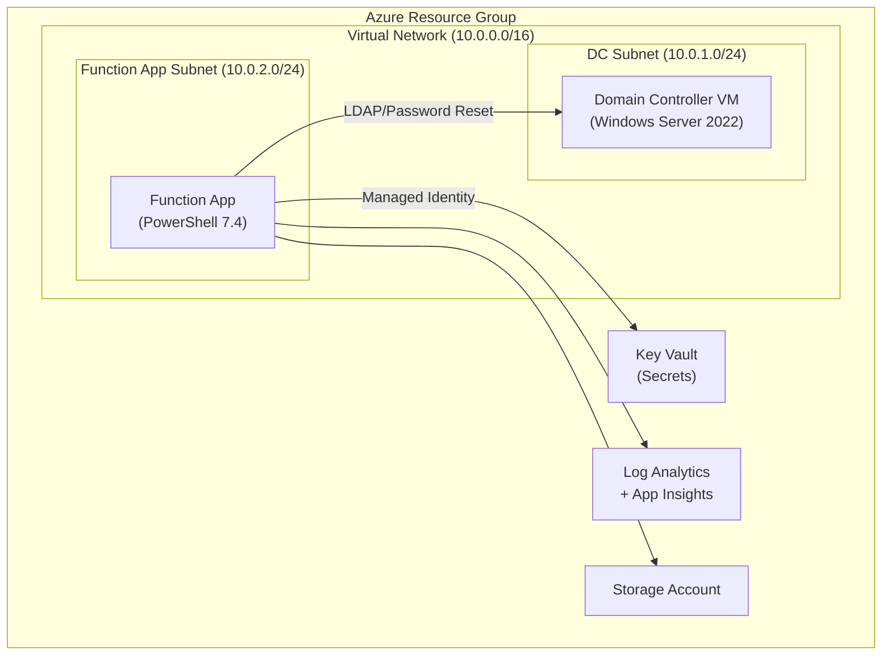

# Zero-to-DC: Building a Disposable Active Directory Lab in Azure with Bicep and PowerShell

## Introduction

This all started from a very practical problem: I wanted a **disposable, repeatable Active Directory lab** I could spin up for demos, tutorials, and future blog posts (stay tuned). I needed something I could tear down and rebuild without fear—no hand-configured servers, no “click-next-until-it-works” wizards.

The goal was simple: run one command, get a fully functional AD domain in Azure; run another, and everything disappears again. Under the hood, though, that meant solving some surprisingly gnarly problems: secure credential handling, domain controller promotion across reboots, post-configuration of service accounts and test users, and enough logging that I could actually debug it at 2 a.m. when something went sideways. 🤣

This post walks through how that infrastructure works: the **Bicep template** that defines the environment, the **`Deploy-Complete.ps1`** script that orchestrates it, and the **PowerShell that runs inside the VM** to actually stand up and configure the domain controller.

## Architecture at a Glance

Before diving into the code, here's a bird's-eye view of what gets deployed:



The domain controller sits in its own subnet, the function app in another. Key Vault holds the service account credentials, and everything feeds telemetry into Log Analytics. Simple, but it took some iteration to get the automation right.

One of those iterations was networking. The Function App isn’t automatically “in your VNet,” and for this scenario that matters: the API needs a private path to the DC (LDAPS on 636) and it needs to resolve the DC’s internal name reliably.

So the infrastructure doesn’t just deploy a VNet—it makes the Function App a first-class citizen inside it: a delegated subnet for VNet integration, routing that keeps traffic on the private path, and DNS that intentionally points the function at the domain controller.

## Prerequisites

Before you can deploy this lab, make sure you have:

- An **Azure subscription** with at least Contributor rights on the target resource group
- **PowerShell 7.4+** installed locally (the deployment script requires it)
- The **Az PowerShell module** (`Install-Module Az -Scope CurrentUser`)
- The **Bicep CLI** ([install instructions](https://learn.microsoft.com/azure/azure-resource-manager/bicep/install))
- A clone of the repo with the parameter files configured for your environment

With those in place, you're ready to go.

## The Blueprint: Bicep as Our Architect

I started with Bicep, Azure's declarative language for infrastructure. Instead of clicking through endless Azure Portal screens, I wrote a template that describes everything:

- The domain controller VM, with spot pricing for cost savings (because why pay more for test/dev?)
- A dedicated VNet, subnets, and NSGs to keep traffic locked down
- Key Vault for secrets, Log Analytics for diagnostics, and all the glue that ties it together

The core of the VM definition in `infra/main.bicep` looks like this:

```bicep
resource dcVm 'Microsoft.Compute/virtualMachines@2025-04-01' = if (deployDomainController) {
	name: dcVmName
	location: location
	tags: tags
	properties: {
		hardwareProfile: {
			vmSize: 'Standard_D2s_v3'
		}
		priority: 'Spot'
		evictionPolicy: 'Deallocate'
		billingProfile: {
			maxPrice: -1
		}
		osProfile: {
			computerName: take(dcVmName, 15)
			adminUsername: vmAdminUsername
			adminPassword: vmAdminPassword
			windowsConfiguration: {
				enableAutomaticUpdates: true
				provisionVMAgent: true
				timeZone: 'UTC'
			}
		}
		// ... storageProfile, networkProfile, diagnosticsProfile ...
	}
}
```

The `priority: 'Spot'` and `evictionPolicy: 'Deallocate'` combination gives me a cost‑effective lab that can be evicted without data loss, because the actual AD database lives on a managed data disk. The `maxPrice: -1` setting tells Azure “go up to the regular pay‑as‑you‑go price if needed,” which keeps the lab resilient without me micromanaging spot pricing.

Around that VM, the Bicep file provisions:

- A VNet with separate subnets for the domain controller and the function app
- A Network Security Group that allows the handful of ports AD really needs
- A Key Vault with a JSON secret that stores the service account credentials
- A Log Analytics workspace and Application Insights for observability

And because the function app needs to reach the DC over the VNet, the template also bakes in a couple of important network choices:

- The Function App runs on **Elastic Premium (EP1)** (Consumption can’t do VNet integration)
- The Function App is integrated with the `FunctionAppSubnet` and configured to route outbound traffic via the VNet
- DNS for the Function App is pointed at the domain controller, so `dcname.contoso.local` resolves the same way it would from a domain-joined machine

Every parameter—domain name, NetBIOS name, admin credentials—can be set at deploy time. If you want to change the environment from dev to prod, it’s just a flag. The Bicep file is our single source of truth, and it’s versioned right alongside the rest of the repo.

If you want to go deeper on Bicep itself, the official docs are here:

- Azure Bicep overview: https://learn.microsoft.com/azure/azure-resource-manager/bicep/overview
- Bicep deployment with CLI/PowerShell: https://learn.microsoft.com/azure/azure-resource-manager/bicep/deploy-cli

## Orchestration: Deploy-Complete.ps1, the Maestro

Once the infrastructure is described, I need to bring it to life. That's where `scripts/Deploy-Complete.ps1` comes in. This PowerShell script isn’t just a wrapper—it’s the conductor of our deployment symphony.

At the top, it does some basic but important hygiene:

```powershell
#!/usr/bin/env pwsh
#Requires -Version 7.4

Set-StrictMode -Version Latest
$ErrorActionPreference = 'Stop'
```

`Set-StrictMode` and `$ErrorActionPreference = 'Stop'` ensure that typos and unexpected errors don’t silently slip by—exactly what you want in an automation script that’s going to manipulate infrastructure. From there, it validates prerequisites (Az module, Bicep CLI, parameter files) and makes sure you’re logged in with `Connect-AzAccount`.

The real fun starts when you enable the domain controller flag. The script wires up **secure parameters** for the VM admin and service account passwords, then calls into Bicep using `New-AzResourceGroupDeployment`:

```powershell
$deployment = New-AzResourceGroupDeployment @{
	ResourceGroupName     = $ResourceGroupName
	TemplateFile          = $bicepFile
	TemplateParameterFile = $parametersFile
	vmAdminPassword       = $VmAdminPassword
	serviceAccountPassword = $ServiceAccountPassword
}
```

Once the infrastructure is laid down, `Deploy-Complete.ps1` moves into a second phase: in‑guest configuration. If you’ve asked for a domain controller, the script waits for the VM to be running, then uses **Azure VM Run Command** to invoke `Bootstrap-ADDSDomain.ps1` on the VM itself:

```powershell
$bootstrapScript = Get-Content (Join-Path $scriptDir 'Bootstrap-ADDSDomain.ps1') -Raw
$plainPassword   = [System.Net.NetworkCredential]::new('', $VmAdminPassword).Password
$passwordBase64  = [Convert]::ToBase64String([System.Text.Encoding]::UTF8.GetBytes($plainPassword))

$null = Invoke-AzVMRunCommand -AsJob `
	-ResourceGroupName $ResourceGroupName `
	-VMName            $VmName `
	-CommandId         'RunPowerShellScript' `
	-ScriptString      $bootstrapScript `
	-Parameter         @{
		DomainName                  = $DomainName
		DomainNetBiosName           = $DomainNetBiosName
		SafeModeAdminPasswordBase64 = $passwordBase64
	}
```

The important detail here is the **Base64 encoding** of the Safe Mode password. Passing `SecureString` values across the Run Command boundary can lead to mangled data; by converting to UTF‑8 bytes, then to Base64, then reversing that inside the VM, I keep the password intact without logging it or exposing it in plain text outside controlled boundaries.

Azure Run Command docs if you want to explore this pattern yourself: https://learn.microsoft.com/azure/virtual-machines/run-command

## The Heartbeat: Domain Controller Promotion

Promoting a Windows Server to a domain controller is a delicate dance. The script inside the VM, `scripts/Bootstrap-ADDSDomain.ps1`, handles the choreography.

First, it formats the attached data disk and mounts it to a stable drive letter so the AD database and SYSVOL have a predictable home. Then it installs the **Active Directory Domain Services** role and related management tools. Only after that does it generate the actual promotion script.

The interesting bit is how the promotion is launched:

```powershell
$promotionScript = @'
Start-Transcript -Path "C:\temp\Promote-ADDSForest-Transcript.log" -Append

Import-Module ADDSDeployment -ErrorAction Stop

$passwordPlain = [System.Text.Encoding]::UTF8.GetString([Convert]::FromBase64String('$SafeModeAdminPasswordBase64'))
$passwordSec   = ConvertTo-SecureString -String $passwordPlain -AsPlainText -Force

Install-ADDSForest -DomainName '$DomainName' -DomainNetbiosName '$DomainNetBiosName' `
	-SafeModeAdministratorPassword $passwordSec -Force:$true -NoRebootOnCompletion:$false

Stop-Transcript
'@

Set-Content -Path 'C:\temp\Promote-ADDSForest.ps1' -Value $promotionScript -Encoding UTF8
Start-Process -FilePath 'powershell.exe' -ArgumentList '-NoProfile','-ExecutionPolicy','Bypass','-File','C:\temp\Promote-ADDSForest.ps1' -WindowStyle Hidden
```

Two key design choices here:

1. The promotion runs in a **detached Windows PowerShell 5.1 process**. That means when the VM reboots, Azure Run Command doesn’t get “stuck” waiting on a process that no longer exists.
2. The Safe Mode password is reconstructed from Base64 and converted to `SecureString` **inside** the VM, which avoids all the strange quoting and whitespace issues you get when trying to pass complex strings across layers.

If you’re curious about the cmdlet doing the heavy lifting, `Install-ADDSForest` is documented here: https://learn.microsoft.com/powershell/module/addsdeployment/install-addsforest

## Detecting the Reboot: Smarter Than PowerState

After the promotion, the VM reboots. But how do I know when it's back and ready? Early on, I tried watching the VM's **PowerState**, and it worked—until it didn't. There were edge cases where the VM reported `running` but AD services weren't ready yet.

The final approach lives in `Invoke-DomainControllerPostConfig` inside `Deploy-Complete.ps1`. It asks the VM for its boot time via CIM and watches for that value to change:

```powershell
$bootTimeScript = 'Get-CimInstance -ClassName Win32_OperatingSystem | Select-Object -ExpandProperty LastBootUpTime'
$bootResult     = Invoke-AzVMRunCommand -ResourceGroupName $ResourceGroupName -VMName $VmName -CommandId 'RunPowerShellScript' -ScriptString $bootTimeScript

$initialBootTime = [DateTime]::Parse(($bootResult.Value[0].Message).Trim())

while ($elapsed -lt $timeout) {
	$currentBootResult = Invoke-AzVMRunCommand -ResourceGroupName $ResourceGroupName -VMName $VmName -CommandId 'RunPowerShellScript' -ScriptString $bootTimeScript -ErrorAction SilentlyContinue

	if (-not $currentBootResult) {
		$rebootWindowObserved = $true
	}
	else {
		$currentBootTime = [DateTime]::Parse(($currentBootResult.Value[0].Message).Trim())

		if ($initialBootTime -and $currentBootTime -and ($currentBootTime -ne $initialBootTime)) {
			$rebootDetected = $true
		}
		elseif ($rebootWindowObserved -and $currentBootTime) {
			$rebootDetected = $true
		}
	}

	if ($rebootDetected) { break }
	Start-Sleep -Seconds $checkInterval
}
```

Only after a reboot is confidently detected does the script run a second health check:

```powershell
$testScript = 'try { Import-Module ActiveDirectory -ErrorAction Stop; Get-ADDomain -ErrorAction Stop | Out-Null; exit 0 } catch { exit 1 }'
$testResult = Invoke-AzVMRunCommand -ResourceGroupName $ResourceGroupName -VMName $VmName -CommandId 'RunPowerShellScript' -ScriptString $testScript -ErrorAction SilentlyContinue
```

When `Get-ADDomain` finally succeeds, I know that AD Web Services are up and the domain controller is genuinely ready for the next phase.

## Post-Configuration: Making AD Useful

With the domain up, I run another script, `scripts/Configure-ADPostPromotion.ps1`, via Run Command. This is where the environment turns from “just a domain” into something that’s actually useful.

The script waits for AD Web Services to be available, then creates an **Organizational Unit** and a **service account** that will later be used by a function app. It also creates a handful of test users so you can validate the end‑to‑end reset flow.

And because the whole point of this lab is “real-world enough to be interesting,” it also wires up **LDAPS** on the domain controller. That ended up being one of the most important (and most finicky) pieces of the entire build.

The heart of the service account creation looks like this:

```powershell
$serviceAccountPasswordSecure = ConvertTo-SecureString -String $ServiceAccountPassword -AsPlainText -Force

$serviceAccountParams = @{
	Name                 = $ServiceAccountName
	SamAccountName       = $ServiceAccountName
	UserPrincipalName    = "$ServiceAccountName@$DomainName"
	AccountPassword      = $serviceAccountPasswordSecure
	Enabled              = $true
	PasswordNeverExpires = $true
	CannotChangePassword = $true
	Path                 = $ouPath
	Description          = 'Service account for Azure Function App password reset operations'
}

New-ADUser @serviceAccountParams
```

If the account already exists, the script switches to an update path:

```powershell
Set-ADAccountPassword -Identity $ServiceAccountName -NewPassword $serviceAccountPasswordSecure -Reset
```

Finally, it grants the service account **reset password rights** at the domain level by editing the ACL and adding an access rule for the “Reset Password” extended right. This lines up perfectly with the least‑privilege expectations of the function app.

### Networking: Getting the Function App to “See” the DC

Once the pieces were in place, the actual connectivity requirement was simple: the Function App must be able to reach the DC’s private IP on the right ports, and it must be able to resolve internal AD DNS names.

The part that surprised me was how much of that comes down to DNS behavior.

In `infra/main.bicep`, the Function App is integrated into the VNet subnet and configured with a couple of app settings that make it behave like a VNet-attached workload:

- `WEBSITE_VNET_ROUTE_ALL = 1` routes outbound traffic through the VNet (so LDAPS to the DC stays on the private path).
- `WEBSITE_DNS_SERVER = 10.0.1.4` points the Function App at the DC for DNS, so it can resolve the AD domain and the DC’s FQDN.

But if the Function App uses the DC for DNS, the DC now has to resolve public names too—especially during authentication flows where it may need to reach Entra ID endpoints.

That’s why `Configure-ADPostPromotion.ps1` configures DNS forwarders on the DC. The default is Azure’s VNet DNS forwarder `168.63.129.16`, which keeps internal resolution authoritative while still allowing lookups for everything else.

### LDAPS: Giving the DC a Real TLS Identity

LDAP over SSL (port 636) isn’t something you “turn on” with a checkbox. On Windows Server, AD DS will only present LDAPS if the DC has a usable certificate in the **Local Machine Personal** store.

Here’s the pattern that ended up being reliable and repeatable:

1. **Generate a self-signed LDAPS certificate during deployment**
	- `Deploy-Complete.ps1` generates a cert using OpenSSL with the right constraints:
	  - `extendedKeyUsage = serverAuth`
	  - SANs for the DC FQDN (and a wildcard for the domain)
	- It exports two forms:
	  - a **PFX** (private key included) for the domain controller
	  - a **DER `.cer`** (public key only) that’s easy for clients to parse

2. **Install the PFX on the domain controller**
	- `Configure-ADPostPromotion.ps1` imports the PFX into `Cert:\LocalMachine\My`.
	- It performs basic sanity checks (private key present + “Server Authentication” EKU) and then does a quick `Test-NetConnection localhost -Port 636` to see if LDAPS is listening.

3. **Publish the public cert for the client to pin**
	- The public `.cer` is stored in Key Vault as `LDAPS-Certificate-CER`.
	- The Function App retrieves this value at runtime and uses it for **strict certificate pinning + hostname validation**.

That last step is the key architectural shift: rather than trying to “teach” the Function App host to trust a private PKI (which is often blocked in sandboxed hosting), the function validates the server cert directly during the LDAPS handshake. No hostname bypass, no trust-store hacks—just strict TLS with a pinned identity.

If you want to see the building blocks behind these cmdlets, the official docs are a great reference:

- `New-ADUser`: https://learn.microsoft.com/powershell/module/activedirectory/new-aduser
- `New-ADOrganizationalUnit`: https://learn.microsoft.com/powershell/module/activedirectory/new-adorganizationalunit
- `Set-ADAccountPassword`: https://learn.microsoft.com/powershell/module/activedirectory/set-adaccountpassword

## Lessons Learned (and a Few Battle Scars)

I didn't get it right the first time. Not even close. Here are some of the detours I took along the way.

### The SecureString Saga

My first attempt passed `SecureString` values directly through Azure Run Command parameters. That worked fine locally, but when the script ran inside the VM, the password came out garbled—random whitespace, truncated characters, the works. After way too much debugging, I landed on the Base64 approach: convert the password to UTF-8 bytes, encode as Base64, pass that string, then decode and convert back to `SecureString` inside the VM. It's an extra step, but it's reliable across every boundary.

### Scheduled Tasks: A Dead End

Originally, the promotion script created a Windows Scheduled Task to run `Install-ADDSForest`. The idea was that the task would survive the reboot and finish the job. In practice, it was flaky—sometimes the task fired, sometimes it didn't, and debugging was a nightmare. Switching to a detached `powershell.exe` process (launched via `Start-Process`) was simpler and worked every time. The promotion runs, the VM reboots, and Run Command just times out gracefully while the real work continues in the background.

### PowerState Lies (Sometimes)

I wasted hours watching the VM's `PowerState` flip to `running` and assuming AD was ready. It wasn't. The VM was up, but AD Web Services were still initializing. The fix was to query the VM's **boot time** via CIM and wait for it to actually change after the reboot. Even better, I treat Run Command failures during the reboot window as a signal that the VM is mid-restart. Once boot time updates and `Get-ADDomain` succeeds, I know the domain is genuinely online.

### Log Everything to Disk

This sounds obvious, but it saved me more than once. Every script writes progress and errors to `C:\temp`. When something breaks, I can RDP in, open the logs, and see exactly where the process stopped. Transcripts, timestamps, and descriptive messages—don't skip them.

### LDAPS Certificates Are Picky (and Schannel Will Tell You)

The fastest way to lose an afternoon is to generate a certificate that looks “fine” but isn’t usable by Schannel. If the certificate doesn’t have a private key, doesn’t include the right EKU, or doesn’t match the hostname the client is connecting to, LDAPS can fail with confusing symptoms.

The fix was to treat the certificate like a real production TLS credential: SANs, proper EKU, and a private key that actually imports correctly. Once that’s in place, LDAPS becomes boring—in the best way.

## The End Result: Automated, Auditable, and Secure

Now, spinning up a new AD environment is as simple as running a script. Every step is automated, every credential is handled securely, and every log is there if you need it. The infrastructure is ready for my password reset API, and I can redeploy, tear down, or troubleshoot with confidence.

If you’re building hybrid cloud solutions, don’t underestimate the value of good orchestration and clear logging. It’s the difference between a fragile demo and a production-ready system.

## How the Pieces Fit Together in the Repo

If you want to explore or reuse this setup, here’s the key structure of the repo:

```text
project-functionapp-roles/
	FunctionApp/                  # Deployable function app code (ready to deploy as-is)
		ResetUserPassword/          # Password reset function endpoint
		host.json
		profile.ps1
		requirements.psd1
	infra/
		main.bicep                  # All Azure resources, including the domain controller VM
        parameters.dev.json         # Parameter file for deployments
	scripts/
		Deploy-Complete.ps1         # Orchestrates deployment, promotion, and post-config
		Deploy-FunctionApp.ps1      # Deploys the function app code
		Bootstrap-ADDSDomain.ps1    # Runs inside the VM to install AD DS and promote to DC
		Configure-ADPostPromotion.ps1 # Creates OU, service account, and test users
	tests/                        # Pester tests for the function app
```

You can clone the repo, tweak the parameters, and use it as your own disposable AD lab.

Azure PowerShell docs for some of the commands used here:

- `New-AzResourceGroupDeployment`: https://learn.microsoft.com/powershell/module/az.resources/new-azresourcegroupdeployment
- `Get-AzVM` and `Invoke-AzVMRunCommand`: https://learn.microsoft.com/powershell/module/az.compute/invoke-azvmruncommand

## Tearing It All Down

The whole point of a disposable lab is that you can throw it away when you're done. Since everything lives in a single resource group, cleanup is one command:

```powershell
Remove-AzResourceGroup -Name rg-pwdreset-dev -Force
```

That deletes the VM, disks, VNet, Key Vault, and everything else in one shot. No orphaned resources, no lingering costs. If you're doing iterative development or writing your own blog posts, this is the reset button.

## Conclusion

At the end of the day, this whole setup is about confidence. I can spin up a full AD lab, break it in interesting ways, write about what I learned, and then throw it away—all without touching a production environment or repeating the same manual steps.

If you want to follow along or adapt it for your own scenarios, all of the code in this post lives in my GitHub repository:

- GitHub repo: https://github.com/broberts23/vsCode/project-functionapp-roles

Clone it, customize the parameters, and you’ve got your own disposable AD playground ready for experiments, demos, and (in future posts) the password reset API that sits on top of it.

---

**Built with**: Bicep • PowerShell 7.4 & 5.1 • Azure Run Command • Key Vault • Log Analytics

**Ready for**: Real-world hybrid deployments, not just lab experiments.
