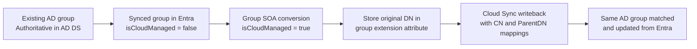

# Microsoft Entra Group Source of Authority (SOA) Conversion with Cloud Sync Writeback

This post covers a specific hybrid identity scenario: taking a group synchronized from Active Directory Domain Services (AD DS), changing its Source of Authority (SOA) to Microsoft Entra, and then using Microsoft Entra Cloud Sync to write the group back to AD DS. The critical requirement in this pattern is configuring the writeback to reconnect to the original AD group rather than creating a duplicate object in a default Organization Unit (OU).

The standard capability to convert SOA for a group is well-documented, but combining it with Cloud Sync customized attribute mapping to seamlessly overwrite the existing AD group requires bringing together several different configuration concepts.

This post assumes that fundamental hybrid infrastructure is already established. AD DS, Microsoft Entra ID, identity synchronization, and Cloud Sync are deployed and functioning. The target group must already exist in AD and synchronize to Microsoft Entra.

## Scenarios / use cases

Below are practical reasons why organizations utilize this conversion pattern:

- **Legacy application authorization:** On-premises applications that rely on LDAP queries or Kerberos tokens require security groups to remain in AD DS.
- **Modernizing access governance:** By changing the group's source of authority to Entra, administrators can utilize Entra ID Governance (like access packages and access reviews) and self-service management, which are difficult or impossible to perform efficiently in AD DS.
- **Shifting the management plane:** Rebuilding permission models across legacy applications is often not feasible. By transitioning group SOA to the cloud and mirroring the result backward, Entra becomes the control plane, while AD functions merely as a projection layer.

It is important to note that this is not a dual-write sync. Once a group's source of authority is moved to the cloud, any direct modifications to the on-premises AD group are treated as temporary and overwritten during the next provisioning cycle.

## Prerequisites

Before converting the source of authority, ensure the following requirements are met:

- **Supported sync client versions:** Ensure Entra Connect Sync is running version 2.5.76.0 or later, and Cloud Sync is running version 1.1.1370.0 or later. For group writeback to AD DS, the Cloud Sync provisioning agent must be at version 1.1.3730.0 or later.
- **Active Directory schema validation:** The AD schema requires the `msDS-ExternalDirectoryObjectId` attribute, which is included by default in Windows Server 2016 and newer.
- **Microsoft Graph permissions:** Changing the group's source of authority requires the `Group-OnPremisesSyncBehavior.ReadWrite.All` permission. For delegated workflows, the least-privileged administrative role required is Hybrid Identity Administrator.
- **Universal group scope:** The existing AD group should be set to Universal scope before the conversion.

## Preserving the existing AD identity

Since the goal is to map the cloud-managed group back to its original AD location, preservation steps must happen prior to the conversion. The existing distinguished name (DN) of the AD group must be mapped into Entra.

This is typically accomplished by creating a tenant-scoped directory extension on group objects. Microsoft utilizes a specific Cloud Sync custom extensions application named `CloudSyncCustomExtensionsApp`. An extension property (e.g., `GroupDN` or `GroupDistinguishedName`) must be provisioned on this application.

The following Microsoft Graph PowerShell example demonstrates configuring this extension:

```powershell
$tenantId = (Get-MgOrganization).Id
$app = Get-MgApplication -Filter "identifierUris/any(uri:uri eq 'API://$tenantId/CloudSyncCustomExtensionsApp')"
if (-not $app) {
    $app = New-MgApplication -DisplayName "CloudSyncCustomExtensionsApp" -IdentifierUris "API://$tenantId/CloudSyncCustomExtensionsApp"
}

$sp = Get-MgServicePrincipal -Filter "AppId eq '$($app.AppId)'"
if (-not $sp) {
    $sp = New-MgServicePrincipal -AppId $app.AppId
}

New-MgApplicationExtensionProperty -ApplicationId $app.Id -Name "GroupDN" -DataType "String" -TargetObjects Group
```

After creating the extension, the next step is to populate it. In practice, this is done in the inbound synchronization path so the on-premises value for the group's distinguished name flows into the Entra group object before the SOA change. The exact implementation depends on whether the tenant is still using Entra Connect Sync for the inbound path or has already moved that path to Cloud Sync, but the objective is the same: take the current AD distinguished name and copy it into the new extension attribute on the synchronized group.

A practical workflow looks like this:

- Add or confirm an inbound attribute mapping for the group object that sources the AD distinguished name.
- Target the tenant-scoped extension attribute created on `CloudSyncCustomExtensionsApp`, such as `extension_<appIdWithoutHyphens>_GroupDN`.
- Run a sync cycle and wait for the group object in Entra to update.
- Confirm the value on the target group before changing `isCloudManaged`.

Validation matters here because the writeback configuration later depends on this value being correct. A simple validation approach is to query the group through Microsoft Graph and confirm the extension property contains the full original DN, for example `CN=Finance-App-Access,OU=Groups,DC=contoso,DC=com`. If the value is missing, truncated, or reflects a stale OU path, Cloud Sync will not have enough information to match the original object reliably.

For example, after the inbound mapping runs, retrieve the group and inspect the extension property:

```http
GET https://graph.microsoft.com/v1.0/groups/{groupId}?$select=id,displayName&$expand=extensions
```

Depending on the client you use, it can be easier to request the specific extension property directly through Microsoft Graph PowerShell or Graph Explorer and verify that the stored DN exactly matches the current on-premises group DN. That one check establishes that Entra now has a durable copy of the AD location data needed for the later `ParentDistinguishedName` and `CN` mappings.

## Converting Source of Authority

The source-of-authority switch is performed against the Microsoft Graph API.

First, retrieve the current synchronization state:

```http
GET https://graph.microsoft.com/v1.0/groups/{groupId}/onPremisesSyncBehavior?$select=isCloudManaged
```

For standard synced AD groups, the `isCloudManaged` property will evaluate to `false`. Next, issue a `PATCH` request to flip management to the cloud:

```http
PATCH https://graph.microsoft.com/v1.0/groups/{groupId}/onPremisesSyncBehavior
Content-Type: application/json

{
  "isCloudManaged": true
}
```

Subsequent `GET` requests will show `isCloudManaged` as `true` and `onPremisesSyncEnabled` as `null`. At this operational boundary, the group becomes fully editable within Microsoft Entra. However, the legacy application integration depends on completing the writeback setup.

## Configuring Cloud Sync Writeback

The final component uses the preserved DN established in the prerequisites for the Entra-to-AD provisioning job.

In the Cloud Sync attribute mapping for groups, expression-based mappings must be configured for the `ParentDistinguishedName` and `CN` target attributes. The mapping definitions strip the `CN=` portion to identify the parent OU path for the `ParentDistinguishedName`, while separately extracting the `CN` string to specify the target group name.

Microsoft's documented pattern uses an extension name such as `extension_<AppIdWithoutHyphens>_GroupDistinguishedName`. If you created the shorter `GroupDN` property shown earlier in this post, substitute that exact generated extension attribute name in the expressions below. The key point is that both expressions must reference the same stored DN value.

Use the following expression for `ParentDistinguishedName`:

```text
IIF(
  IsPresent([extension_<AppIdWithoutHyphens>_GroupDistinguishedName]),
  Replace(
    Mid(
      Mid(
        Replace([extension_<AppIdWithoutHyphens>_GroupDistinguishedName], "\,", , , "\2C", , ),
        InStr(Replace([extension_<AppIdWithoutHyphens>_GroupDistinguishedName], "\,", , , "\2C", , ), ",", , ),
        9999
      ),
      2,
      9999
    ),
    "\2C", , , ",", ,
  ),
  "<Existing ParentDistinguishedName>"
)
```

This expression does two things. If the extension is populated, it removes the leading `CN=` segment and returns only the parent DN path. If the extension is empty, it falls back to the default target OU that you specify in the mapping.

Use the following expression for `CN`:

```text
IIF(
  IsPresent([extension_<AppIdWithoutHyphens>_GroupDistinguishedName]),
  Replace(
    Replace(
      Replace(
        Word(Replace([extension_<AppIdWithoutHyphens>_GroupDistinguishedName], "\,", , , "\2C", , ), 1, ","),
        "CN=", , , "", ,
      ),
      "cn=", , , "", ,
    ),
    "\2C", , , ",", ,
  ),
  Append(Append(Left(Trim([displayName]), 51), "_"), Mid([objectId], 25, 12))
)
```

This expression extracts the first DN component, removes the `CN=` prefix, and restores any escaped commas that were temporarily converted during parsing. If the extension is not present, the fallback generates a deterministic CN from the group display name and part of the object ID.

Worked example:

- Stored extension value: `CN=Finance-App-Access,OU=Groups,DC=contoso,DC=com`
- Resolved `ParentDistinguishedName`: `OU=Groups,DC=contoso,DC=com`
- Resolved `CN`: `Finance-App-Access`

This is the intended outcome of the two mappings together. The first expression removes the leading common name component and preserves the remaining OU and domain path. The second expression extracts only the common name so Cloud Sync can target the original group name in the original container.

This ensures Cloud Sync derives the proper container and naming convention to match the original AD object path, rather than generating an arbitrary object. When properly scoped and configured, the provisioning logs should indicate a match and update against the pre-existing target group, confirming the behavior framework.

## Important caveats and limitations

- **Mail-enabled groups and writeback:** While Mail-Enabled Security Groups (MESGs) and Distribution Lists (DLs) can have their Source of Authority converted to the cloud (for management via Exchange Online), they are not supported for Cloud Sync group writeback to AD DS. The writeback pattern detailed in this post applies only to standard Security Groups.
- **Nested groups:** Group SOA does not apply recursively. For nested synced groups to transition to cloud management, administrators must convert them iteratively, typically beginning at the lowest level of the hierarchy.
- **Cloud-only users:** Group provisioning to AD DS handles only member references with valid on-premises identity anchors. For hybrid groups containing both cloud-only and synchronized user accounts, Cloud Sync writes back the synchronized identities and skips cloud-only references.
- **Prohibited local modifications:** Post-conversion, the on-premises copy is no longer the source of truth. Any direct changes made against AD DS will be overwritten silently when the background provisioning system next executes.
- **Scale constraints:** For the Cloud Sync group provisioning job, `Selected security groups` is the recommended scope. There are scale boundaries documented regarding maximum groups, total processing memberships, and maximum membership per individual group (capped at 50,000 users).
- **Rollback operations:** Source of authority can be reverted by running a `PATCH` request setting `isCloudManaged` to `false`. However, the rollback process completes only when the directory sync client evaluates and reassumes ownership on the next iteration. It is critical to sever cloud reference dependencies, such as clearing cloud-only members or removing associated Access Packages, prior to initiating a rollback.

## Architecture

The following diagram illustrates the complete logical workflow.



## Conclusion

Converting a group's Source of Authority from Active Directory to Microsoft Entra, combined with Cloud Sync writeback mapping, provides a precise bridge between overlapping architectures. Administrators can transition group management, approvals, and dynamic requirements to Entra ID while safely preserving the exact group structure that existing LDAP or Kerberos applications rely on.

Once you have validated the core pipeline of storing the `GroupDN` and applying custom Cloud Sync expressions, there are several ways to scale or apply this model:

- **Connect Group SOA to Access Packages:** With management shifted to Entra ID, these groups are eligible for Microsoft Entra ID Governance. This means you can wrap the group in an Access Package, enabling self-service requests and automated access reviews for legacy apps without writing custom code or deploying complex on-premises identity managers.
- **Implement AD DS Minimization:** Evaluate whether certain applications have modernized entirely to SAML or OpenID Connect. If they no longer require the AD group for authorization, you can flip their group SOA to the cloud and simply skip the Cloud Sync writeback step. Over time, this steadily reduces reliance on AD DS.
- **Address Exchange Dependencies:** Distribution Lists (DL) and Mail-Enabled Security Groups (MESG) synced from on-premises Exchange can also have their SOA converted. While these cannot be directly managed by Microsoft Graph, converting them enables management through Exchange Online PowerShell. From there, you can upgrade non-nested DLs into modern Microsoft 365 Groups for richer collaboration.
- **Convert Groups Systematically:** For nested groups, begin converting from the lowest level of the hierarchy, as the SOA switch does not apply recursively.

## References

1. [Guidance for using Group Source of Authority (SOA)](https://learn.microsoft.com/en-us/entra/identity/hybrid/concept-group-source-of-authority-guidance)
2. [Configure Group Source of Authority (SOA)](https://learn.microsoft.com/en-us/entra/identity/hybrid/how-to-group-source-of-authority-configure)
3. [Embrace cloud-first posture: Convert Group Source of Authority to the cloud](https://learn.microsoft.com/en-us/entra/identity/hybrid/concept-source-of-authority-overview)
4. [Tutorial - Provision groups to Active Directory Domain Services by using Microsoft Entra Cloud Sync](https://learn.microsoft.com/en-us/entra/identity/hybrid/cloud-sync/tutorial-group-provisioning)
5. [Group writeback with Microsoft Entra Cloud Sync](https://learn.microsoft.com/en-us/entra/identity/hybrid/group-writeback-cloud-sync)
6. [Cloud sync directory extensions and custom attribute mapping](https://learn.microsoft.com/en-us/entra/identity/hybrid/cloud-sync/custom-attribute-mapping)
7. [Attribute mapping - Active Directory to Microsoft Entra ID](https://learn.microsoft.com/en-us/entra/identity/hybrid/cloud-sync/how-to-attribute-mapping)
8. [Writing expressions for attribute mappings in Microsoft Entra ID](https://learn.microsoft.com/en-us/entra/identity/hybrid/cloud-sync/reference-expressions)
9. [Expression builder with cloud sync](https://learn.microsoft.com/en-us/entra/identity/hybrid/cloud-sync/how-to-expression-builder)
10. [onPremisesSyncBehavior resource type](https://learn.microsoft.com/en-us/graph/api/resources/onpremisessyncbehavior)
11. [Get onPremisesSyncBehavior](https://learn.microsoft.com/en-us/graph/api/onpremisessyncbehavior-get)
12. [Update onPremisesSyncBehavior](https://learn.microsoft.com/en-us/graph/api/onpremisessyncbehavior-update)
