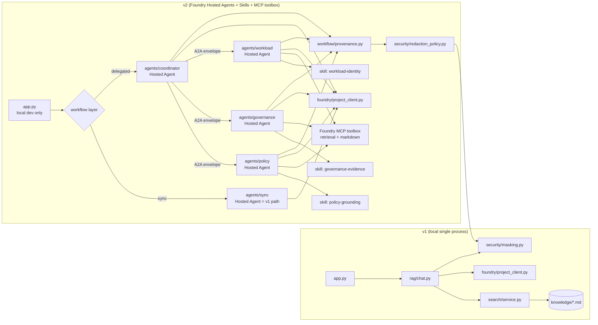

# Identity Security Copilot v2 — Project Outline

> Version 2 is the natural evolution of the `project-identity-security-copilot` v1 reference. It keeps the v1 spine (Foundry project, AI Search grounding, typed config, deterministic citation block, output masking) and layers on the three ideas called out in `scratch.md` A2A/MCP extension block:
>
> 1. A coordinator agent that routes policy, governance, and workload identity questions to specialist agents using explicit agent-to-agent handoff payloads.
> 2. MCP servers (retrieval, markdown, configuration) that re-export v1's helpers as governed tools, exposed through a Foundry toolbox.
> 3. A comparison harness that runs the same scenarios synchronously and via delegated agent workflows so the trade-offs are visible.
>
> The v1 project shipped as a collection of local Python scripts driven by hand-written PowerShell. **v2 must not be a local-only Python project.** Every agent, every skill, and every MCP server in v2 is a **Microsoft Foundry Hosted Agent**, deployed through the **Foundry Toolkit for Visual Studio Code** extension and the **Azure Developer CLI (azd)** with the `microsoft.foundry` and `azure.ai.skills` extensions. The repository is the source of truth, but the runtime is Foundry.
>
> This file is the contract. It defines the modules, the data shapes, the boundary between sync and delegated execution, what we will prove before we declare v2 done, **and the full end-to-end development journey** from `azd ai agent init` through `azd deploy` to status polling and agent invocation. No implementation code is written yet.

---

## 1. What we are evolving

v1 ships a single-process copilot: `app.py` → `rag/chat.py` → `search/service.py` → Foundry model, with a tool-calling loop and a final masking pass. Deployment is via hand-written PowerShell scripts. It is intentionally small.

v2 preserves every one of those layers and reorganises the orchestration around Foundry-hosted agents, the Foundry Skills API, and Foundry-hosted MCP toolboxes. The things that **do not change**:

- The Foundry project endpoint and the chat / summary model deployments.
- The Azure AI Search index, the markdown knowledge base, and the deterministic citation block.
- The typed `AppConfig` contract and the `mask_answer` final pass.
- The single-intent vs multi-intent routing decision at the top of the request lifecycle.

The things that **are new**:

- A multi-agent topology of **Foundry Hosted Agents**: one coordinator and three specialists, each with its own `agent.manifest.yaml`, deployed as separate container code units.
- A **Foundry Skills** library (versioned `SKILL.md` files) that encode the identity-security behavioural guidelines once and are attached to the agents that need them.
- A **Foundry MCP toolbox** that exposes the retrieval, markdown, and configuration helpers as governed tools, referenced by every specialist that needs them.
- A comparison harness that runs the same scenario either synchronously (single hosted agent, in-process) or by delegating to one or more specialist agents, with metrics that make the cost / latency / observability differences visible.
- A **full azd-driven developer journey** — `azd ai agent init` → `azd provision` → `azd ai agent run` + `azd ai agent invoke --local` → `azd deploy` → `azd ai agent show` (poll) → `azd ai agent invoke` — captured as section 9 and reflected in the README and blog.
- A **Foundry Toolkit for VS Code** workflow that mirrors the azd flow for engineers who prefer the IDE.

---

## 2. Repository layout (scaffold, no code yet)

```text
project-identity-security-copilot-v2/
├── OUTLINE.md                         # this file
├── README.md                          # quick orientation + the azd + VS Code journey
├── blog.md                            # narrative walk-through of the v1 -> v2 evolution,
│                                      # including the full azd journey, not just the final state
├── PYTHON-FOR-POWERSHELL.md           # v2 patterns (adds azd, hosted agents, skills)
├── azure.yaml                         # azd project manifest (services + skills + toolbox refs)
├── requirements.txt                   # v1 deps + agent-framework + azure-ai-projects + mcp
├── .gitignore
├── .agents/                           # downloaded skills land here at build time
├── docs/
│   ├── azd-journey.md                 # end-to-end azd commands and what each one does
│   ├── a2a-handoff.md                 # A2A payload schema and examples
│   ├── mcp-toolbox.md                 # how the Foundry MCP toolbox is wired
│   ├── skills.md                      # SKILL.md authoring guide + version model
│   └── sync-vs-delegated.md           # the comparison harness contract
├── infra/
│   ├── main.bicep                     # v1 bicep + additions for MCP host and A2A tracing
│   └── parameters.dev.json
├── knowledge/
│   ├── access-reviews.md              # carried over from v1
│   ├── conditional-access.md          # carried over from v1
│   ├── workload-identities.md         # carried over from v1
│   ├── governance-evidence.md         # NEW: governance evidence catalog for the governance agent
│   └── handoff-examples.md            # NEW: example A2A handoff payloads
├── skills/                            # NEW: SKILL.md files shipped with this project
│   ├── policy-grounding/SKILL.md
│   ├── governance-evidence/SKILL.md
│   ├── workload-identity/SKILL.md
│   └── redactor/SKILL.md
├── agents/                            # NEW: one folder per Foundry Hosted Agent
│   ├── coordinator/
│   │   ├── agent.manifest.yaml
│   │   ├── agent.yaml
│   │   ├── main.py
│   │   └── requirements.txt
│   ├── policy/
│   │   ├── agent.manifest.yaml
│   │   ├── agent.yaml
│   │   ├── main.py
│   │   └── requirements.txt
│   ├── governance/
│   │   ├── agent.manifest.yaml
│   │   ├── agent.yaml
│   │   ├── main.py
│   │   └── requirements.txt
│   ├── workload/
│   │   ├── agent.manifest.yaml
│   │   ├── agent.yaml
│   │   ├── main.py
│   │   └── requirements.txt
│   └── sync/                          # the v1 path, now a hosted agent for parity
│       ├── agent.manifest.yaml
│       ├── agent.yaml
│       ├── main.py
│       └── requirements.txt
├── mcp/                               # NEW: Foundry MCP toolbox source
│   ├── retrieval/
│   │   ├── manifest.json
│   │   └── tools/
│   ├── markdown/
│   │   ├── manifest.json
│   │   └── tools/
│   └── config/
│       ├── manifest.json
│       └── tools/
├── src/                               # shared library code, imported by every agent
│   ├── __init__.py
│   ├── app.py                         # thin CLI for ad-hoc local invocations
│   ├── config.py                      # AppConfig (unchanged from v1)
│   ├── requirements.txt
│   ├── rag/                           # carried over from v1, slightly trimmed
│   │   ├── __init__.py
│   │   └── chat.py
│   ├── search/                        # carried over from v1 unchanged
│   │   ├── __init__.py
│   │   ├── service.py
│   │   ├── build_index.py
│   │   └── load_documents.py
│   ├── content/                       # carried over from v1 unchanged
│   │   ├── __init__.py
│   │   └── markdown_loader.py
│   ├── foundry/                       # carried over from v1 unchanged
│   │   ├── __init__.py
│   │   └── project_client.py
│   ├── security/                      # carried over from v1 unchanged
│   │   ├── __init__.py
│   │   ├── masking.py
│   │   └── redaction_policy.py        # NEW: redaction rules applied to A2A handoffs
│   └── workflow/                      # NEW: shared workflow helpers
│       ├── __init__.py
│       ├── provenance.py              # handoff / tool-call / model-response recorder
│       └── compare.py                 # side-by-side runner used by the comparison harness
└── tests/
    ├── __init__.py
    ├── test_markdown_loader.py        # carried over from v1
    ├── test_chat_routing.py           # carried over from v1
    ├── test_a2a_handoff.py            # NEW: envelope round-trip + dispatch keys
    ├── test_sync_vs_delegated.py      # NEW: same input, both runners, equivalence of citations
    ├── test_mcp_tool_contracts.py     # NEW: tool schemas and error envelopes
    └── test_skill_versions.py         # NEW: SKILL.md front matter validation
```

Every `__init__.py`, `main.py`, `SKILL.md`, and `agent.manifest.yaml` is a placeholder in this scaffold pass. The implementation is the next step. The deployment journey in §9 is the contract for how the scaffold becomes a running system.

---

## 3. The v1 -> v2 evolution in one diagram



The architectural claim of v2: **the sync path is the v1 path, hosted on Foundry as its own agent.** We do not duplicate retrieval logic. We do not introduce a second chat model configuration. The specialists only exist to make the delegated path's handoffs explicit; the v1 path remains the cheapest way to answer a question. Both paths are now **runtime-equivalent** — they are both Foundry Hosted Agents, and the comparison harness in §7 exercises them as peers.

---

## 4. A2A (agent-to-agent) handoff design

### 4.1 Handoff envelope (carried in `agents/coordinator/main.py` and shared via `src/workflow/provenance.py`)

Every handoff is a typed dict (and a `@dataclass`) that contains:

- `handoff_id` — uuid, stable across retries.
- `correlation_id` — uuid, stable across the whole request lifecycle (sync or delegated).
- `from_agent` and `to_agent` — names from a fixed set: `coordinator`, `policy`, `governance`, `workload`.
- `intent` — one of `policy_question`, `governance_evidence`, `workload_identity_question`, `summarize`.
- `question` — the user-visible prompt or a refined sub-question.
- `context_blocks` — list of grounded evidence blocks with stable `document_id` references (same shape as v1).
- `tool_calls` — list of MCP tool invocations already performed, with their results.
- `requires_approval` — bool. Set by the coordinator when the intent maps to a write or governance action.
- `deadline_ms` — int. Soft deadline budgeted from the top-level request.

The envelope serialises to JSON for transport between agents. Because each agent is a separate Foundry Hosted Agent, transport is the agent endpoint, not an in-process function call. The provenance recorder writes one envelope per handoff.

### 4.2 Coordinator behaviour

- The coordinator receives the user prompt and the top-level `correlation_id`.
- It runs a lightweight intent classifier (the same deployment used for chat, but with a constrained system prompt and the `policy-grounding` skill attached for routing rules).
- For the three core intents it constructs a handoff envelope and dispatches to the matching specialist via the specialist's hosted-agent endpoint.
- If the classifier is not confident, it falls back to the v1 sync hosted agent and records a `fallback_to_sync` provenance event.
- The coordinator is the only agent allowed to set `requires_approval = true`.

### 4.3 Specialist behaviour

- Each specialist is its own Foundry Hosted Agent with its own `agent.manifest.yaml` and `main.py`.
- It receives exactly one envelope (the body of the request to its endpoint).
- It may issue tool calls via the MCP toolbox it has access to (see §6) and append results to `context_blocks`.
- It may return a handoff to the coordinator (for example, `governance` discovers it needs `policy` clarification) or terminate with a final answer.
- No specialist calls another specialist directly. All cross-specialist traffic flows back through the coordinator. This keeps the handoff graph a tree and the provenance log linear.

### 4.4 Approval and audit boundary

`requires_approval = true` halts the delegated path at the coordinator and writes a `pending_approval` provenance event. v2's first iteration will not implement the approval UX; it will emit the event and return a structured `pending_approval` result so the harness can exercise the boundary. A later iteration can wire an approval agent, mirroring the extension idea in `scratch.md` A2A/MCP block for the privileged access topic.

---

## 5. Skills design (Foundry Skills API)

Skills encode the **behavioural guidelines** that the agents should follow, decoupled from agent code, versioned centrally, and attached where needed. The pattern is taken directly from the [Use skills with Microsoft Foundry agents](https://learn.microsoft.com/en-us/azure/foundry/agents/how-to/tools/skills?pivots=python) guidance.

### 5.1 Skill catalog (shipped in `skills/`)

| Skill | Used by | Purpose |
| --- | --- | --- |
| `policy-grounding` | coordinator, policy | Routing rules, citation format, when to refuse |
| `governance-evidence` | governance | What counts as evidence, how to cite access reviews |
| `workload-identity` | workload | Workload identity baselines and approval escalation |
| `redactor` | coordinator, all specialists | Output redaction rules (the "last line of defence" before `mask_answer`) |

Each skill is a folder under `skills/<name>/` containing a `SKILL.md` whose YAML front matter has unquoted `name:` and `description:` fields, per the Foundry Skills spec.

### 5.2 Versioning and promotion

Every skill is uploaded to Foundry as a `SkillVersion` (an immutable snapshot). The parent `Skill` tracks `default_version`. To change behaviour, author a new `SKILL.md`, upload it (which mints a new version), test it against the harness, then promote it to `default_version`. Agent code never changes. The same flow runs through `azd ai skill update` (imperative) or a `skills:` block in `azure.yaml` (declarative).

### 5.3 Two delivery modes

- **Toolbox attachment** — the skill is referenced from the MCP toolbox manifest and any agent (or external MCP client) that connects to the toolbox can discover it as an MCP Resource.
- **Direct injection** — the skill is downloaded into the agent project's local `skills/<name>/` folder at build time and injected into each session's system prompt. This is the path used by the Hosted Agents in `agents/policy/`, `agents/governance/`, `agents/workload/`, and `agents/coordinator/` so each agent starts up with its own pinned version.

---

## 6. MCP server design (Foundry MCP toolbox)

### 6.1 Toolbox topology

Three MCP tool surfaces, one per concern, hosted as a single Foundry MCP toolbox, following the [MCP toolbox guidance](https://learn.microsoft.com/en-us/azure/foundry/agents/quickstarts/quickstart-hosted-agent?pivots=azd) and the [Skills extension for MCP (SEP-2640)](https://github.com/modelcontextprotocol/modelcontextprotocol/pull/2640):

| Server | Backs onto v1 module | Tools exposed |
| --- | --- | --- |
| `retrieval/` | `src/search/service.py`, `src/rag/chat.py` | `search_identity_knowledge`, `summarise_evidence` |
| `markdown/` | `src/content/markdown_loader.py` | `list_knowledge_files`, `get_markdown_section` |
| `config/` | `src/config.py` + App Configuration | `get_setting`, `list_settings_prefix` |

Each surface is a folder under `mcp/` containing a `manifest.json` (tool schemas) and a `tools/` folder (implementations). The three surfaces are bundled into one Foundry MCP toolbox via the `toolbox` block in `azure.yaml`, then attached to whichever agent needs them.

### 6.2 Why one toolbox, three surfaces

- **Least privilege per surface.** The retrieval surface holds the search index grant. The config surface holds the App Configuration grant. The markdown surface holds the blob/storage grant. Splitting surfaces keeps each grant narrow.
- **Skills ride along.** The `redactor` skill is attached to the toolbox so any MCP client (Copilot, Claude, our own agents) can discover it as a resource.
- **One endpoint, three concerns.** Specialists only need to know one toolbox endpoint URL, not three.

### 6.3 Specialist wiring (least privilege per agent)

- `policy` — retrieval + markdown
- `governance` — retrieval + markdown
- `workload` — retrieval + config
- `coordinator` — no direct toolbox access; routes to specialists
- `sync` — no toolbox access; calls v1 helpers directly (it is the v1 path)

---

## 7. Sync vs delegated comparison

### 7.1 The two runners — now both Hosted Agents

- `agents/sync/` is the v1 path, packaged as a Foundry Hosted Agent that exposes the same `answer_question` and `summarise_evidence` entry points. Internally it calls `src/rag/chat.py` and `src/search/service.py` exactly as v1 did.
- `agents/coordinator/` + `agents/policy/` + `agents/governance/` + `agents/workload/` are the v2 path: coordinator -> one or more specialists -> coordinator synthesis -> final masking.

Both runners take the same user prompt and produce a `WorkflowResult` with the same shape so the comparison harness can diff them. The harness in `src/workflow/compare.py` invokes the sync agent endpoint and the coordinator agent endpoint, then prints:

- End-to-end latency.
- Foundry token usage.
- Number of handoffs (always zero for sync, one or more for delegated).
- Number of MCP tool calls.
- The final answer and its citation list (compared for equivalence).
- The provenance log path (delegated only).

The default in `src/app.py` is `auto`: simple questions stay on sync, multi-intent questions get delegated. The decision is logged in the provenance record.

### 7.2 Equivalence contract

For any prompt that the sync agent answers, the delegated path returns the same citations and a non-empty answer. This is enforced by `tests/test_sync_vs_delegated.py` and exercised end-to-end by `docs/azd-journey.md` step 6.

---

## 8. Observability, security, and provenance

- **Tracing.** The provenance recorder emits one structured log line per handoff, tool call, and final response, with `correlation_id` and `handoff_id` for join keys. Application Insights (provisioned by `azd`) picks these up via OpenTelemetry and makes them queryable from the Foundry portal.
- **App Insights.** The `infra/main.bicep` and the azd provisioning both wire an `agentRuns` custom event table backed by Application Insights, populated by the provenance recorder.
- **Redaction.** `src/security/redaction_policy.py` applies a stricter version of v1's masking pass to every handoff envelope, every tool-call result, and every specialist response before it crosses an agent boundary. v1's `mask_answer` is kept as the final egress filter on the coordinator's response.
- **RBAC.** Each Foundry Hosted Agent runs under its own platform-assigned managed identity. `azd` and the Foundry Toolkit for VS Code auto-grant the **Foundry User** role to the agent identity on the Foundry project; the MCP toolbox identity is granted only the search index reader role, never write.
- **Skill RBAC.** Skills attached to the toolbox are visible only to agents and MCP clients that connect to that toolbox endpoint. Cross-project skill references are not allowed by the Skills API.

---

## 9. The full end-to-end development journey (azd + Foundry Toolkit for VS Code)

This section is the contract for **how** the v2 project is built, deployed, and verified. It is not a marketing checklist — every step is a command the developer runs and an artifact the harness checks. The blog and the README both walk this journey, including the commands, the expected output, and the failure modes.

The journey is aligned with the [Quickstart: Deploy your first hosted agent](https://learn.microsoft.com/en-us/azure/foundry/agents/quickstarts/quickstart-hosted-agent?pivots=azd) and the [Deploy a hosted agent from source code](https://learn.microsoft.com/en-us/azure/foundry/agents/how-to/deploy-hosted-agent-code?tabs=python) reference, applied to the multi-agent topology in §4.

### 9.1 Prerequisites (one-time per machine)

- Python 3.13 or later.
- Azure CLI 2.80 or later, signed in: `az login`.
- Azure Developer CLI 1.25.3 or later: `azd version`.
- The `azd microsoft.foundry` extension (preview, 0.1.27 or later):
  - `azd ext install microsoft.foundry`
- The `azd azure.ai.skills` extension (preview) for skill CRUD from the CLI:
  - `azd ext install azure.ai.skills`
- **Foundry Project Manager** role at project scope, plus **Owner** or **User Access Administrator** at subscription scope (so `azd` can grant the per-agent identities their roles automatically).
- (Optional, IDE path) **Microsoft Foundry Toolkit for Visual Studio Code** from the VS Code Marketplace, switched to the **Pre-release** channel.
- (Optional) **GitHub Copilot for Azure** plugin, which includes agent skills for creating, testing, and deploying hosted agents.

### 9.2 Step 1 — Scaffold the project (`azd ai agent init`)

Initialize the project from the Agent Framework Responses sample manifest, then customise:

```pwsh
azd ai agent init `
  -m "https://github.com/microsoft-foundry/foundry-samples/blob/main/samples/python/hosted-agents/agent-framework/responses/01-basic/agent.manifest.yaml"

# Or, non-interactive (CI / coding agent friendly):
azd ai agent init -m "<manifest-url>" --no-prompt
```

The interactive flow prompts for the agent name, Foundry project, tenant, subscription, location, model, model SKU, and deployment capacity. For v2, the `azd ai agent init` command is run once per agent in `agents/coordinator/`, `agents/policy/`, `agents/governance/`, `agents/workload/`, and `agents/sync/`. The `azure.yaml` at the repo root is the union of those five `agent.yaml` files plus a `toolbox:` block and a `skills:` block (see step 4).

Set the subscription and region explicitly (so the rest of the journey is deterministic):

```pwsh
azd env set AZURE_SUBSCRIPTION_ID <subscription-id>
azd env set AZURE_LOCATION <region>
```

Verify:

```pwsh
azd env get-values
```

Expected: the variables above are present, plus the agent names and the model deployment name.

### 9.3 Step 2 — Provision Azure resources (`azd provision`)

```pwsh
azd provision
```

This step takes a few minutes and creates:

- The resource group (if it doesn't exist).
- The model deployment (chat + summary, as configured in `azure.yaml`).
- The Foundry project.
- The Azure Container Registry used to store agent container images.
- The Log Analytics workspace and Application Insights instance.
- The per-agent managed identities, with the **Foundry User** role granted at project scope.

`azd up` is an acceptable shortcut for "provision and then deploy", but for the v2 journey we keep them separate so each step is independently observable.

### 9.4 Step 3 — Author and upload skills (`azd ai skill ...`)

The skills in `skills/` are uploaded to the Foundry project so the agents and the MCP toolbox can reference them.

```pwsh
# One skill per folder. The name is the positional argument and must equal the SKILL.md front matter `name:`.
azd ai skill create policy-grounding --file ./skills/policy-grounding/SKILL.md --no-prompt -o json
azd ai skill create governance-evidence --file ./skills/governance-evidence/SKILL.md --no-prompt -o json
azd ai skill create workload-identity --file ./skills/workload-identity/SKILL.md --no-prompt -o json
azd ai skill create redactor --file ./skills/redactor/SKILL.md --no-prompt -o json
```

Verify:

```pwsh
azd ai skill list -o table
```

Expected: four rows, each with a `default_version` of `v1`.

Promote a new version (after editing a `SKILL.md`):

```pwsh
azd ai skill update policy-grounding --file ./skills/policy-grounding/SKILL.md --no-prompt -o json
# Or, metadata-only promotion of an existing version:
azd ai skill update policy-grounding --set-default-version v2 --no-prompt -o json
```

### 9.5 Step 4 — Build the MCP toolbox (`mcp/` + `azure.yaml`)

The three MCP surfaces in `mcp/retrieval/`, `mcp/markdown/`, and `mcp/config/` are declared in `azure.yaml` under a `toolbox:` block. The `redactor` skill is attached to the toolbox so it is discoverable as an MCP Resource.

`azd provision` re-runs (the toolbox is provisioned as part of the same environment), and `azd ai toolbox publish` is the explicit cut-over for a new toolbox version:

```pwsh
azd provision
azd ai toolbox publish
```

### 9.6 Step 5 — Test the agents locally

Each agent is a `main.py` that starts a Foundry hosting server on `http://localhost:8088/`. The two ways to run them:

**CLI path (azd):**

```pwsh
# In one terminal per agent, e.g. for the coordinator:
azd ai agent run --no-inspector

# In a second terminal, send a test prompt to the local agent:
azd ai agent invoke --local "Which Conditional Access policies protect break-glass accounts?"
```

**IDE path (Foundry Toolkit for VS Code):**

- Press **F5** in the agent's folder. The Foundry Toolkit Agent Inspector opens for interactive testing, breakpoints are supported.
- Or run `python main.py` and POST to `http://localhost:8088/responses`:

  ```pwsh
  curl -sS -H "Content-Type: application/json" -X POST http://localhost:8088/responses `
    -d '{"input": "Which Conditional Access policies protect break-glass accounts?", "stream": false}'
  ```

The local test exercises the sync agent, the coordinator agent, and each specialist agent against the same prompt set, with citations verified against the search index. Failures here are caught before any cloud deployment.

### 9.7 Step 6 — Deploy to Foundry Agent Service (`azd deploy`)

```pwsh
azd deploy
```

This builds the container image for every service declared in `azure.yaml` (the five agents), pushes them to the Azure Container Registry, creates or updates the hosted agent versions on the Foundry project, and configures role-based access control.

Expected output (truncated):

```text
Deploying services (azd deploy)

  Done: Deploying service coordinator
  - Agent playground (portal): https://ai.azure.com/.../build/agents/coordinator/build?version=1
  - Agent endpoint: https://ai-account-<name>.services.ai.azure.com/api/projects/<project>/agents/coordinator/versions/1

  Done: Deploying service policy
  ...

  Done: Deploying service sync
  ...
```

For **source-code** deployment (the path v2 prefers for fast iteration), the agents are packaged as zips and uploaded by `azd` automatically — no local container build. The `code_configuration` block in each `agent.manifest.yaml` declares `runtime: python_3_13`, `entry_point: ["python", "main.py"]`, and `dependency_resolution: remote_build`. To switch the whole project to source-code mode non-interactively:

```pwsh
azd ai agent init --no-prompt --project-id "<project-resource-id>" `
  --deploy-mode code --runtime python_3_13 --entry-point main.py
```

### 9.8 Step 7 — Poll agent status (`azd ai agent show`)

Hosted agents go through `creating` → `active` (or `failed`). The status must be `active` before any invocation will succeed.

```pwsh
azd ai agent show
```

Expected: each agent in the table reports `Status: active`. If any agent reports `failed`, the `error.code` and `error.message` fields describe the cause (for `remote_build`, the final pip error line, exit code, and an `aka.ms` troubleshooting link). The `azd ai agent monitor --follow` command streams container logs while the deploy is still in progress and during subsequent invocations.

A typical polling loop in Python (used by `src/workflow/compare.py` and the smoke tests):

```python
import time
from azure.ai.projects import AIProjectClient

project = AIProjectClient(endpoint=PROJECT_ENDPOINT, credential=credential)
while True:
    version = project.agents.get_version(agent_name=AGENT_NAME, agent_version="1")
    if version["status"] == "active":
        break
    if version["status"] == "failed":
        raise RuntimeError(version.get("error"))
    time.sleep(5)
```

### 9.9 Step 8 — Invoke the deployed agents (`azd ai agent invoke`)

```pwsh
# Invoke the sync agent (the v1 path, hosted):
azd ai agent invoke "Which workload identities need stronger controls?"

# Invoke the coordinator agent (the v2 delegated path):
azd ai agent invoke "Which Conditional Access policies protect break-glass accounts, and how do the related access reviews look?"

# Stream container logs while interacting:
azd ai agent monitor --follow
```

A response should arrive within seconds. The response body carries the `id` (for example, `caresp_<random>`) which is the join key into Application Insights traces.

### 9.10 Step 9 — Verify in the Foundry portal

Open <https://ai.azure.com>, sign in, and:

1. Pick the project under **Recent projects** or **All projects**.
2. In the left navigation, choose **Build** > **Agents**.
3. Select each agent and choose **Open in playground** to confirm it answers correctly.
4. Under **Investigate** > **Transaction search** (Application Insights), confirm that the `agentRuns` custom events are present and joined by `correlation_id`.

### 9.11 Step 10 — Tear down (`azd down`)

```pwsh
azd down
```

This deletes the resource group, the Foundry project, every model deployment, the Container Registry, Application Insights, the Log Analytics workspace, and every hosted agent. `azd` lists the resources it intends to delete and asks for confirmation. Expected: 2–5 minutes for full teardown.

### 9.12 IDE parity (Foundry Toolkit for VS Code)

The same journey runs through the VS Code extension. The Command Palette entries are:

- **Foundry Toolkit: Create Project** (equivalent to step 1's project selection).
- **Foundry Toolkit: Create new Hosted Agent** (equivalent to step 1's per-agent scaffold).
- **Foundry Toolkit: Deploy Hosted Agent** (equivalent to step 6's `azd deploy`).
- **Foundry Toolkit: Open Model Catalog** (model deployment).
- The **Hosted Agents (Preview)** explorer view shows the deployment status from step 7 and offers a **Playground** tab that mirrors step 9.

If the CLI path is the contract, the IDE path is the same contract with a different surface. The README documents both side by side; the blog narrates the journey on the CLI path (because the commands are easier to capture verbatim) and references the IDE path at each step.

### 9.13 Failure modes the harness covers

The journey above is mirrored by `tests/test_azd_journey.py` (a recorded-mode integration test, opt-in) and the `docs/azd-journey.md` troubleshooting table covers:

- `SubscriptionNotRegistered` → register `Microsoft.CognitiveServices`.
- `AuthorizationFailed` during provision → request **Contributor** at the resource group.
- `AuthenticationError` / `DefaultAzureCredential` failure → `azd auth logout && azd auth login`.
- `AcrPullUnauthorized` → grant **AcrPull** to the project managed identity on the Container Registry.
- Agent version stuck in `creating` for >10 minutes → switch to `dependency_resolution: bundled` and prebuild Linux wheels locally.
- Agent version `failed` → read `error.message` (it includes the final pip error line and a troubleshooting link).

---

## 10. Implementation phases (when we start writing code)

The scaffold is the deliverable for this turn. Implementation will follow this order so the system is testable at each step, and so the azd journey in §9 can be exercised end-to-end as soon as possible.

1. **Phase 0 — Carryover.** Move `config.py`, `foundry/`, `search/`, `content/`, `rag/chat.py`, and `security/masking.py` from v1 into `src/`. Confirm the v1 `app.py` still works locally against the v2 layout.
2. **Phase 1 — `agents/sync` as a hosted agent.** Scaffold the sync agent with `azd ai agent init` against the basic sample, replace the sample `main.py` with the v1 chat loop, run the journey in §9 end-to-end against this one agent. `azd deploy` lands a Foundry Hosted Agent that is behaviourally identical to v1.
3. **Phase 2 — MCP toolbox.** Implement the three MCP surfaces in `mcp/`, declare them in `azure.yaml` under `toolbox:`, and attach the `redactor` skill. The toolbox is exercised directly (without specialist agents) via `azd ai toolbox publish` + an MCP client.
4. **Phase 3 — Skills.** Author the four `SKILL.md` files, upload them with `azd ai skill create`, and verify them with `azd ai skill list`. No agent code changes yet.
5. **Phase 4 — Coordinator + handoff.** Add `src/workflow/provenance.py` and the handoff envelope (as a `shared.py` inside `src/`). Scaffold `agents/coordinator` with `azd ai agent init`, wire it to the sync agent's endpoint, and exercise the auto-fallback path against the journey in §9.
6. **Phase 5 — Specialists.** Scaffold `agents/policy`, `agents/governance`, `agents/workload` with `azd ai agent init`. Each one is wired to a subset of the MCP toolbox per §6.3 and has its own skill injected at startup.
7. **Phase 6 — Comparison harness.** Add `src/workflow/compare.py` and the smoke test in `docs/azd-journey.md` step 6. Add `tests/test_a2a_handoff.py`, `tests/test_sync_vs_delegated.py`, `tests/test_mcp_tool_contracts.py`, and `tests/test_skill_versions.py`.
8. **Phase 7 — Infrastructure parity.** Extend `infra/main.bicep` for the resources that `azd provision` does not own (for example, App Configuration, the dedicated Foundry project link). Keep `Deploy-Infrastructure.ps1` as a thin wrapper for engineers who want the Bicep path.
9. **Phase 8 — Blog + docs.** Publish `blog.md` (narrative that walks the journey in §9 verbatim, with screenshots and observed output) and the four `docs/` files. The blog must document the **journey**, not just the final architecture — the §9 steps, the commands run, the output observed, the failures hit and how they were resolved.

---

## 11. Definition of done for v2

v2 is complete when all of the following hold against a live Foundry project, AI Search index, MCP toolbox, and the four Hosted Agents:

- The journey in §9 runs end-to-end on a clean machine: `azd ai agent init` (×5) → `azd ext install` → `azd provision` → skill uploads → `azd ai agent run` + `azd ai agent invoke --local` → `azd deploy` → `azd ai agent show` reports `active` for all five agents → `azd ai agent invoke` returns grounded answers for the prompt set in `docs/sync-vs-delegated.md`.
- The same journey runs end-to-end through the **Foundry Toolkit for VS Code** extension.
- `pytest` passes locally for `test_a2a_handoff`, `test_sync_vs_delegated`, `test_mcp_tool_contracts`, `test_skill_versions`, plus the carried-over v1 tests.
- The provenance log for a delegated run is human-readable and contains one entry per handoff, tool call, and final response, all joined by `correlation_id`, and is queryable in Application Insights.
- `src/app.py --mode auto` routes a single-intent question to the sync agent and a multi-intent question to the coordinator agent, with the routing decision visible in the provenance log.
- No specialist has direct access to the search index; all grounding flows through the retrieval MCP toolbox surface.
- The `security/redaction_policy.py` pass redacts predictable secrets from every envelope, tool result, and specialist response before egress, and the `redactor` skill is attached to the MCP toolbox.
- `azd down` cleanly tears down every resource, and a fresh `azd provision && azd deploy` reproduces the working system.

---

## 12. Out of scope for v2

These are intentionally deferred. Listing them keeps the v2 scope honest.

- An approval agent and the human-in-the-loop UX. The boundary is in place; the UX is not.
- Vector search, embeddings, and Foundry evaluations. v1 was deliberately semantic-only; v2 keeps that choice.
- A web UI. The CLI (and the Foundry playground) are the only entry points.
- Cross-tenant or multi-project topologies. v2 still assumes one Foundry project per environment.
- Streaming responses via Server-Sent Events from the agent endpoints. The journey uses `stream: false` invocations; streaming is a follow-up.
- **Image-based container deployment of the agents.** Source-code (`code_configuration`) deployment is the chosen path; container-based deployment is a fallback for cases where the source build fails.
