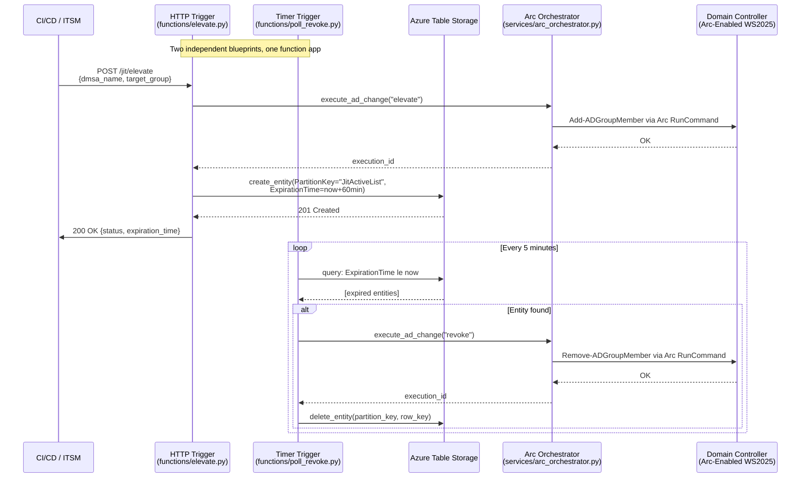

# Serverless, Passwordless Just-In-Time Privilege Elevation for Windows Server 2025 dMSAs

We have all lived through the incident. A critical production deployment goes sideways, the platform engineering team scrambles, they hit the JIT access portal, swipe through MFA, and within thirty seconds they have temporary admin rights to the affected servers. Sixty minutes later, the clock runs out and those rights evaporate. That is Zero Standing Privilege applied to people, and it works.

But here is the uncomfortable truth the industry does not talk about enough: while we have spent a decade hardening human access paths, the machine identities running our infrastructure retain permanent, 24/7 administrator rights. Legacy service accounts sit in memory on application servers, their credentials harvestable by anyone who lands a foothold. We built a fortress around the front door and left the service entrance wide open.

Windows Server 2025 introduced delegated Managed Service Accounts (dMSAs) to solve the credential theft half of that problem. A dMSA binds its identity to a specific machine, exposes no readable password anywhere in the directory, and cannot be dumped from LSASS. But a dMSA with permanent group memberships still represents standing privilege. If the host is compromised, the attacker inherits that membership. The account cannot be stolen, but it can still be *used*.

This is where we close the loop. What follows is a production-grade JIT bridge that gives a Windows Server 2025 dMSA temporary administrative access — elevated on demand, automatically revoked after sixty minutes — using nothing but an Azure Python Function App, Azure Table Storage, and the passwordless Azure Arc control plane. No inbound firewall ports. No stored admin credentials. No standing anything.

## The Architecture at a Glance

Before we dive into individual files, here is how the three runtime components connect. The HTTP trigger handles the elevation request, writes state, and returns immediately. A completely separate timer trigger runs independently on a five-minute cadence, querying that same state table for expired grants and issuing revocations. The Arc orchestrator is the shared muscle both triggers call to push PowerShell down to the domain controller.



The sequence tells the full story. An elevation request flows through four services and returns in seconds. The revocation loop runs unattended, retrying failures until each expired entity is cleaned up. There is no orchestrator sitting in the middle coordinating these two triggers — they share a Table Storage table as their contract, and nothing else.

## Project Layout: Blueprint-Driven Modularity

The Azure Functions Python V2 programming model supports `Blueprint` objects, which let you split a function app into independently developed and tested modules. This project uses exactly two blueprints registered through a three-line entry point:

```python
import azure.functions as func

from functions.elevate import bp as jit_elevate_access_bp
from functions.poll_revoke import bp as poll_and_revoke_trigger_bp

app = func.FunctionApp(http_auth_level=func.AuthLevel.FUNCTION)
app.register_functions(poll_and_revoke_trigger_bp)
app.register_functions(jit_elevate_access_bp)
```

That is the entire `function_app.py`. The first blueprint mounts an HTTP endpoint. The second registers a timer-triggered function. The file tree gives each component its own home:

```text
jit_elevation_bridge/
│
├── function_app.py               # Blueprint registration (the thin entry point)
├── host.json                     # Azure Functions extension bundle config
├── local.settings.json           # Local debug environment
├── requirements.txt              # Dependencies
│
├── clients/
│   ├── __init__.py
│   └── table.py                  # Azure Table Storage client factory
│
├── functions/
│   ├── __init__.py
│   ├── elevate.py                # HTTP-triggered JIT elevation blueprint
│   └── poll_revoke.py            # Timer-triggered sweep-and-revoke blueprint
│
└── services/
    ├── __init__.py
    └── arc_orchestrator.py       # Azure Arc SDK orchestration layer
```

## The Elevate Endpoint: Parse, Execute, Persist, Respond

The HTTP trigger lives in `functions/elevate.py`. It accepts exactly two fields — `dmsa_name` and `target_group` — and responds with a `200 OK` only after two things succeed: the Arc elevation command on the domain controller, and the state write to Table Storage.

```python
@bp.route(route="jit/elevate", methods=["POST"])
def jit_elevate_access(req: func.HttpRequest) -> func.HttpResponse:
    logging.info("Processing JIT elevation request.")

    try:
        req_body = req.get_json()
    except ValueError:
        return func.HttpResponse(
            json.dumps({"status": "error", "error_code": "BAD_REQUEST",
                       "details": "Invalid JSON payload format."}),
            status_code=400,
            mimetype="application/json"
        )
    dmsa_name = req_body.get('dmsa_name')
    target_group = req_body.get('target_group')
    if not dmsa_name or not target_group:
        return func.HttpResponse(
            json.dumps({"status": "error", "error_code": "MISSING_FIELDS",
                       "details": "dmsa_name and target_group are mandatory fields."}),
            status_code=400,
            mimetype="application/json"
        )
```

Once the validation clears, the function calls the Arc orchestrator to push a PowerShell command down to the on-premises domain controller:

```python
    try:
        execution_id = orchestrator.execute_ad_change(
            dmsa_name, target_group, "elevate")
        response_data = {
            "status": "success",
            "message": f"Elevation request for {dmsa_name} to {target_group} has been processed.",
            "execution_id": execution_id
        }
    except Exception as e:
        logging.error(f"Failed to execute Azure Arc deployment task: {str(e)}")
        return func.HttpResponse(
            json.dumps(
                {"status": "error", "error_code": "EXECUTION_FAILURE", "details": str(e)}),
            status_code=500,
            mimetype="application/json"
        )
```

Immediately after the Arc command succeeds, the function writes a state record to Azure Table Storage with a 60-minute expiration window:

```python
    try:
        expiration_time = datetime.now(timezone.utc) + timedelta(minutes=60)
        jit_entity = {
            "PartitionKey": "JitActiveList",
            "RowKey": f"{dmsa_name}_{target_group}",
            "DmsaName": dmsa_name,
            "TargetGroup": target_group,
            "Action": "elevate",
            "GrantedAt": datetime.now(timezone.utc).isoformat(),
            "ExpirationTime": expiration_time.isoformat()
        }
        table_client.create_entity(entity=jit_entity)

        return func.HttpResponse(
            json.dumps({
                "status": "success",
                "message": f"Elevation request for {dmsa_name} to {target_group} has been logged.",
                "expiration_time": expiration_time.isoformat()
            }),
            status_code=200,
            mimetype="application/json"
        )
```

The function returns a `200 OK` the instant the table write completes. It does not hang around. It does not sleep for sixty minutes. It acknowledges the grant, stamps the expiry, and terminates. You pay for milliseconds of execution, not an hour of idle compute.

## The Arc Orchestrator: Passwordless, Inboundless, and Full of Gotchas

The orchestration layer in `services/arc_orchestrator.py` is where the real plumbing lives. It uses `DefaultAzureCredential`, which resolves to a Managed Identity when deployed and to your local `az login` session when debugging. No secrets in connection strings, no certificates to rotate.

```python
class ArcOrchestrator:
    def __init__(self):
        self.credential = DefaultAzureCredential()
        self.subscription_id = os.environ["AZURE_SUBSCRIPTION_ID"]
        self.resource_group = os.environ["AZURE_RESOURCE_GROUP"]
        self.machine_name = os.environ["ARC_MACHINE_NAME"]

        self.client = HybridComputeManagementClient(
            self.credential, self.subscription_id, api_version="2026-06-16-preview")
```

That `api_version` parameter is not optional. The default API version on the `HybridComputeManagementClient` constructor will fail with a `400 Bad Request` when you try to invoke `runCommand` because Azure Arc run commands are currently in preview. The `2026-06-16-preview` API version is the first that supports the `MachineRunCommand` resource type on Azure ARM API. This is the kind of detail that costs you hours of debugging if you skim the docs. 🫤

The `execute_ad_change` method builds a minimal PowerShell script and pushes it down through the Arc control plane:

```python
    def execute_ad_change(self, dmsa_name: str, target_group: str, action: str) -> str:
        if action == "elevate":
            ps_script = f"Add-ADGroupMember -Identity '{target_group}' -Members '{dmsa_name}$'"
        else:
            ps_script = f"Remove-ADGroupMember -Identity '{target_group}' -Members '{dmsa_name}$' -Confirm:$false"

        run_command_payload = MachineRunCommand(
            location=self.client.machines.get(
                self.resource_group, self.machine_name).location,
            source={"script": ps_script}
        )

        poller = self.client.machine_run_commands.begin_create_or_update(
            resource_group_name=self.resource_group,
            machine_name=self.machine_name,
            run_command_name=f"JIT-{action.upper()}",
            run_command_properties=run_command_payload
        )

        result = poller.result()
        return result.name
```

Notice the `$` appended to the dMSA name. In Active Directory, a service account name is stored with a trailing dollar sign (`dmsa_deploy_prod$`), mirroring the machine account convention. Forget that character and `Add-ADGroupMember` will silently fail to resolve the account.

In my lab this command runs on the domain controller under the local `NT AUTHORITY\SYSTEM` context because the Azure Connected Machine Agent executes commands at that integrity level. The machine account of the domain controller must have delegated permissions to modify the target group's membership. If you skip that delegation, the PowerShell will execute successfully from Arc's perspective and silently do nothing on the AD side.

## The Timer Sweep: Why State Storage Is Not Optional

Here is where the architecture earns its keep. A second blueprint in `functions/poll_revoke.py` runs on a five-minute cron schedule:

```python
@bp.timer_trigger(arg_name="mytimer", schedule="0 */5 * * * *", run_on_startup=False)
def poll_and_revoke_trigger(mytimer: func.TimerRequest) -> None:
    logging.info("Running cleanup of expired JIT requests.")
    current_time = datetime.now(timezone.utc)
    query = f"PartitionKey eq 'JitActiveList' and ExpirationTime le '{current_time.isoformat()}'"
```

It queries Table Storage for every entity whose `ExpirationTime` has passed. For each expired record, it calls the Arc orchestrator with `action="revoke"` and then deletes the entity:

```python
    try:
        entities = table_client.query_entities(query_filter=query)
        for entity in entities:
            expiration_time_str = entity.get("ExpirationTime")
            dmsa_name = entity.get("DmsaName")
            target_group = entity.get("TargetGroup")

            logging.info(
                f"Revoking access for {dmsa_name} to {target_group} due to expiration at {expiration_time_str}.")

            try:
                orchestrator.execute_ad_change(
                    dmsa_name, target_group, "revoke")
                table_client.delete_entity(
                    partition_key=entity["PartitionKey"], row_key=entity["RowKey"])
                logging.info(
                    f"Successfully revoked access and removed database state for {dmsa_name}.")
            except Exception as e:
                logging.error(
                    f"Failed to revoke access for {dmsa_name} to {target_group}: {str(e)}")
    except Exception as e:
        logging.error(f"Failed to cleanup expired JIT requests: {str(e)}")
```

The Table Storage client itself is initialized through a factory module in `clients/table.py`:

```python
def get_table_client() -> TableClient:
    table_client = TableClient.from_connection_string(
        conn_str=STORAGE_CONNECTION_STRING, table_name=TABLE_NAME)
    return table_client


def get_table_service_client() -> TableServiceClient:
    table_service_client = TableServiceClient.from_connection_string(
        conn_str=STORAGE_CONNECTION_STRING, table_name=TABLE_NAME)

    try:
        table_service_client.create_table_if_not_exists(table_name=TABLE_NAME)
    except Exception as e:
        logging.info(
            f"Table '{TABLE_NAME}' could not be created: {str(e)}")

    return table_service_client
```

The table name is configurable through the `TABLE_NAME` environment variable, defaulting to `jitaccesslogs`. This keeps the function portable across environments without re-deploying.

## Why the Table-State Pattern Survives What In-Memory Timers Cannot

If you have built serverless scheduling before, you know the failure modes. A timer function fires, tries to revoke, hits a transient network error to the Arc control plane, and throws an exception. With an in-memory approach or a raw queue message, that revocation is gone. The dMSA keeps its elevated access forever.

With Table Storage as the source of truth, the entity stays in the table until the revocation succeeds and the delete completes. The next sweep cycle, five minutes later, finds the same expired record and retries. The Arc SDK's `begin_create_or_update` call is idempotent — running `Remove-ADGroupMember` on a member that was already removed produces a benign warning, not a failure. This convergence loop is the difference between a demo and a production system.

The same table doubles as an audit trail. Every elevation request leaves a record with `GrantedAt`, `ExpirationTime`, and the `DmsaName` and `TargetGroup` fields. Security teams can query `JitActiveList` at any time to see which service accounts currently hold elevated access and exactly when that access expires. Historical data persists if you configure a Table Storage retention policy or offload completed records to a separate archive table.

## The Full Lifecycle, End to End

A CI/CD runner or ITSM tool sends a single POST to the function endpoint:

```json
{
  "dmsa_name": "dmsa_deploy_prod",
  "target_group": "JIT_AppAdmins",
  "action": "elevate"
}
```

The function validates the payload, calls the Azure Arc RunCommand API, and pushes this PowerShell snippet to the domain controller:

```powershell
Add-ADGroupMember -Identity 'JIT_AppAdmins' -Members 'dmsa_deploy_prod$'
```

The command executes on the domain controller under the SYSTEM account, which has been delegated the necessary AD permissions. The dMSA `dmsa_deploy_prod$` is now a member of `JIT_AppAdmins` and inherits whatever administrative rights that group conveys.

The function writes an entity to Table Storage:

```json
{
  "PartitionKey": "JitActiveList",
  "RowKey": "dmsa_deploy_prod_JIT_AppAdmins",
  "DmsaName": "dmsa_deploy_prod",
  "TargetGroup": "JIT_AppAdmins",
  "Action": "elevate",
  "GrantedAt": "2026-07-12T02:51:00+00:00",
  "ExpirationTime": "2026-07-12T03:51:00+00:00"
}
```

The function returns a `200 OK` response. The deployment runs.

Sixty minutes pass. The timer trigger fires, queries for expired records, finds `dmsa_deploy_prod_JIT_AppAdmins`, and pushes the revocation command:

```powershell
Remove-ADGroupMember -Identity 'JIT_AppAdmins' -Members 'dmsa_deploy_prod$' -Confirm:$false
```

The domain controller removes the dMSA from the group. The timer function deletes the entity from Table Storage. The next sweep finds nothing. The cycle is complete.

If the revocation command fails — the domain controller is unreachable, the network has a hiccup, Azure Arc is throttling — the entity stays in the table. The timer retries on its next cycle. The dMSA does not retain permanent access because the function kept trying.

## What This Actually Requires in Your Lab

Before you can deploy this, the Azure Arc agent must be installed on the Windows Server 2025 domain controller and the machine must be registered as a `Microsoft.HybridCompute/machines` resource. The Function App's system-assigned Managed Identity needs the `Hybrid Compute Resource Administrator` role (or a custom role with `Microsoft.HybridCompute/machines/runCommands/action`) scoped to that Arc machine resource.

On the Active Directory side, the Windows Server machine account needs delegated permissions to modify membership of the target group. Without that delegation, the SYSTEM-context PowerShell commands from Arc will execute successfully and have zero effect on the directory.

The `HybridComputeManagementClient` constructor must explicitly pass `api_version="2026-06-16-preview"`. The default version bundled with the SDK will produce a `400 Bad Request` on any `runCommand` operation. This is the single most common failure point in the entire setup.

The Azure WebJobs Storage connection string must point to a storage account that supports Table Storage. The `azure-data-tables` package is required in `requirements.txt` alongside `azure-identity`, `azure-mgmt-hybridcompute`, and `azure-functions`.

If you're using modern Azure RBAC authentication instead of Access Keys, the Function App's Managed Identity must be granted `Storage Account Contributor` or a custom role with `Microsoft.Storage/storageAccounts/tableServices/tables/*` permissions on the storage account.

## Closing the Last Standing Privilege Gap

The industry has done an admirable job locking down human access. We have JIT portals, approval workflows, session recording, and automatic revocation baked into every major PAM product. But the machine identities that run our deployments, our backups, our monitoring, and our configuration management still rely on an implicit trust model. Once they have rights, they keep them.

Windows Server 2025 dMSAs eliminate credential theft, but they do not eliminate standing privilege. Pairing them with a serverless, state-backed JIT bridge over Azure Arc closes that final gap. The dMSA lives its life with no group membership at all — a harmless, unprivileged identity waiting in the directory. It gains power only when a verified caller requests it, and loses that power exactly sixty minutes later whether the caller remembers to clean up or not.

No inbound firewall rules. No admin passwords in cloud storage. No standing privilege. Just a short PowerShell command, a managed identity, and a table that never forgets to follow up. 🚀

## References

- [Azure Arc run command](https://learn.microsoft.com/en-us/azure/azure-arc/servers/run-command?tabs=azure-powershell)
- [Azure Functions Python V2 programming model](https://learn.microsoft.com/en-us/azure/azure-functions/functions-reference-python?tabs=asgi%2Capplication-level#v2-programming-model)
- [Python Azure SDK for Hybrid Compute](https://learn.microsoft.com/en-us/python/api/overview/azure/mgmt-hybridcompute-readme?view=azure-python)
- [Azure Table Storage Python SDK](https://learn.microsoft.com/en-us/python/api/azure-data-tables/azure.data.tables.tableclient?view=azure-python)
- [Windows Server 2025 dMSA documentation](https://learn.microsoft.com/en-us/windows-server/identity/ad-ds/manage/component-updates/delegated-managed-service-accounts)
- [My Repo on GitHub](https://github.com/yourusername/yourrepo)
